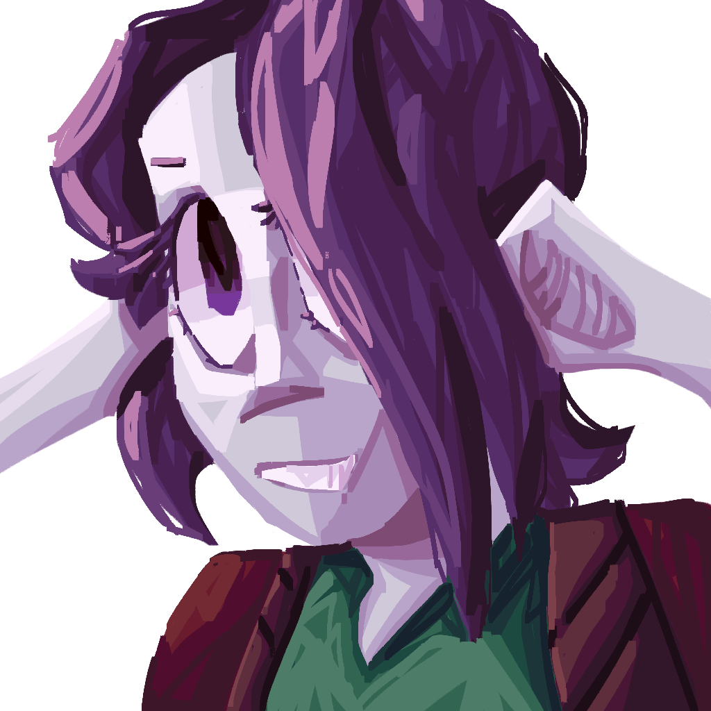
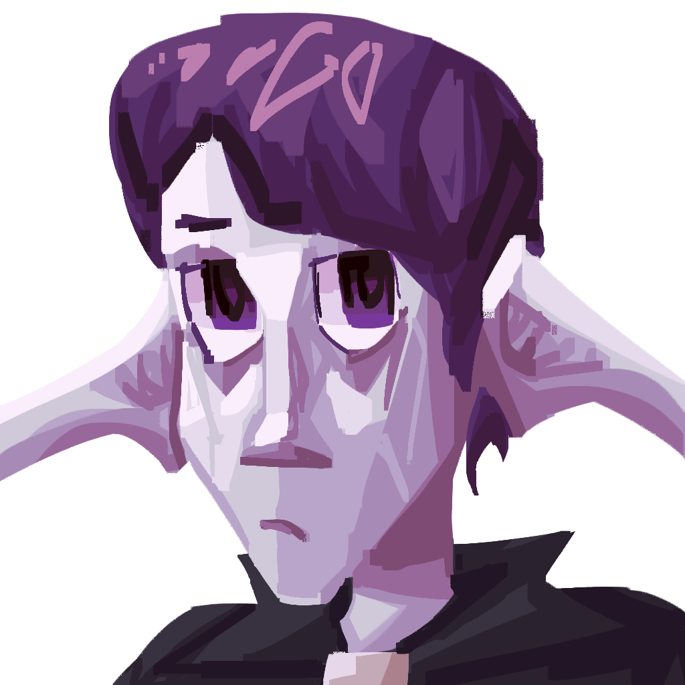
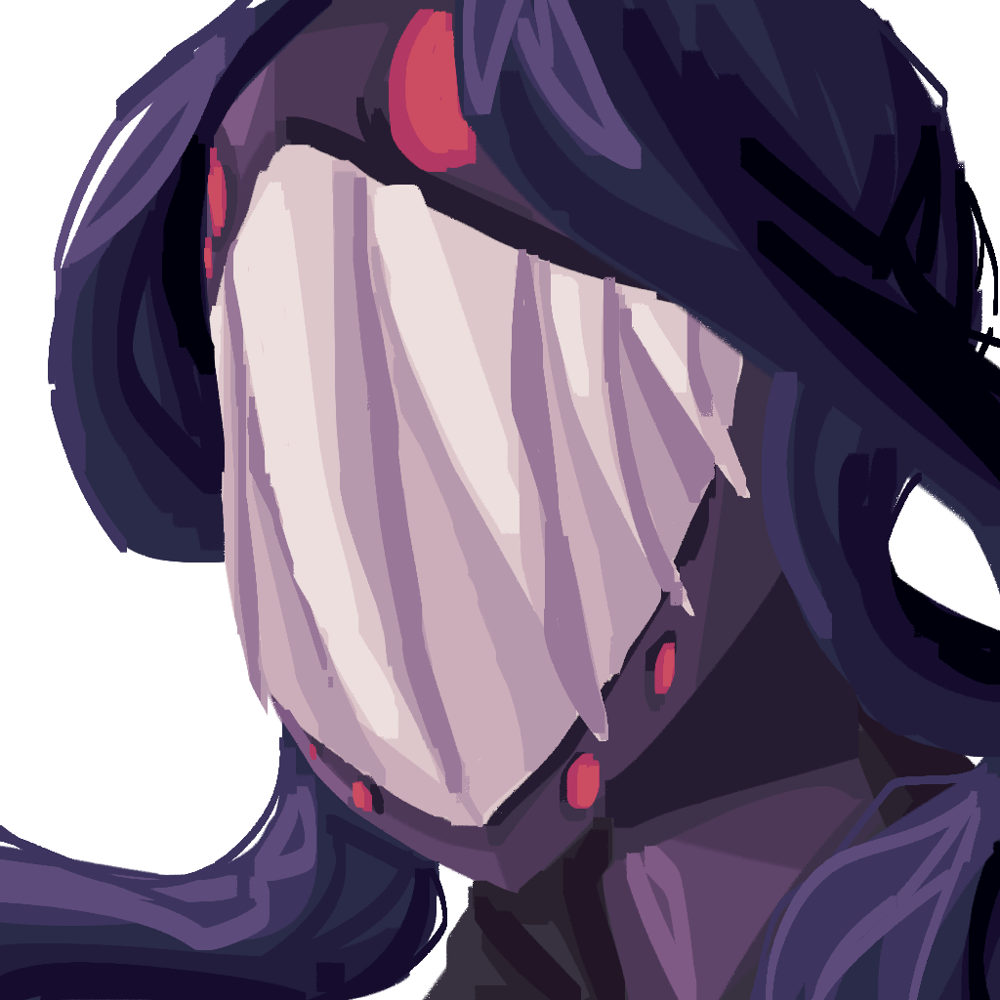
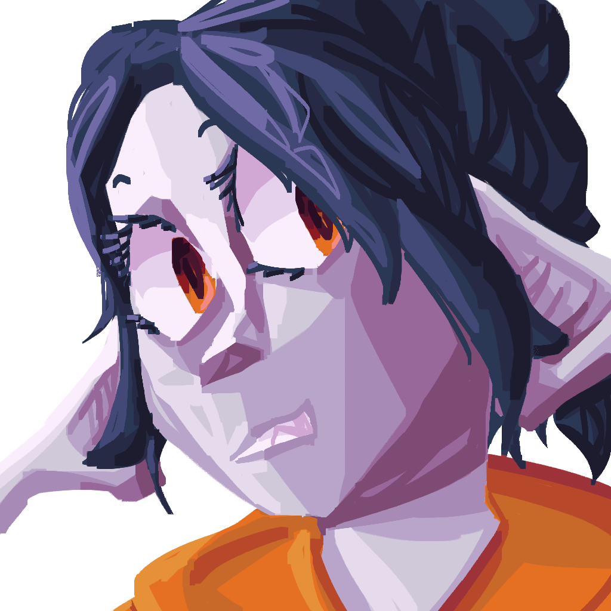

# Characters

Character stuff.

## References

### Ari

???+ info

    :octicons-unverified-16: :material-crop-landscape: :material-check-all:
    
    For reference on what these symbols mean, see the [art index](../index.md)

### Castell

???+ info

    :octicons-unverified-16: :material-crop-landscape: :material-check-all:
    
    For reference on what these symbols mean, see the [art index](../index.md)

### Halos

???+ info

    :octicons-unverified-16: :material-crop-landscape: :material-check-all:
    
    For reference on what these symbols mean, see the [art index](../index.md)

## Portraits

### Ari v2

???+ info

    :octicons-unverified-16: :material-crop-landscape: :material-check-all:
    
    For reference on what these symbols mean, see the [art index](../index.md)

### Ari v1

???+ info

    :octicons-unverified-16: :material-crop-landscape: :material-trash-16:
    
    For reference on what these symbols mean, see the [art index](../index.md)

### Bia

???+ info

    :octicons-unverified-16: :material-crop-landscape: :material-check-all:
    
    For reference on what these symbols mean, see the [art index](../index.md)

### Castell

???+ info

    :octicons-unverified-16: :material-crop-landscape: :material-check-all:
    
    For reference on what these symbols mean, see the [art index](../index.md)

### Dan

???+ info

    :octicons-unverified-16: :material-crop-landscape: :material-check-all:
    
    For reference on what these symbols mean, see the [art index](../index.md)

### Duskir

???+ info

    :octicons-unverified-16: :material-crop-landscape: :material-check-all:
    
    For reference on what these symbols mean, see the [art index](../index.md)

### Faelorn

???+ info

    :octicons-unverified-16: :material-crop-landscape: :material-check-all:
    
    For reference on what these symbols mean, see the [art index](../index.md)

### Grim

???+ info

    :octicons-unverified-16: :material-crop-landscape: :material-check-all:
    
    For reference on what these symbols mean, see the [art index](../index.md)

### Hailon

???+ info

    :octicons-unverified-16: :material-crop-landscape: :material-check-all:
    
    For reference on what these symbols mean, see the [art index](../index.md)

### Halos v2

???+ info

    :octicons-unverified-16: :material-crop-landscape: :material-check-all:
    
    For reference on what these symbols mean, see the [art index](../index.md)

### Halos v1

???+ info

    :octicons-unverified-16: :material-crop-landscape: :material-trash-16:
    
    For reference on what these symbols mean, see the [art index](../index.md)

### idi0cy

???+ info

    :octicons-unverified-16: :material-crop-landscape: :material-check-all:
    
    For reference on what these symbols mean, see the [art index](../index.md)

### Krath

???+ info

    :octicons-unverified-16: :material-crop-landscape: :material-check-all:
    
    For reference on what these symbols mean, see the [art index](../index.md)

### Lloyd

???+ info

    :octicons-unverified-16: :material-crop-landscape: :material-check-all:
    
    For reference on what these symbols mean, see the [art index](../index.md)

### Raelia

???+ info

    :octicons-unverified-16: :material-crop-landscape: :material-check-all:
    
    For reference on what these symbols mean, see the [art index](../index.md)

### Ramuj

???+ info

    :octicons-unverified-16: :material-crop-landscape: :material-check-all:
    
    For reference on what these symbols mean, see the [art index](../index.md)

### Rosa

???+ info

    :octicons-unverified-16: :material-crop-landscape: :material-check-all:
    
    For reference on what these symbols mean, see the [art index](../index.md)

