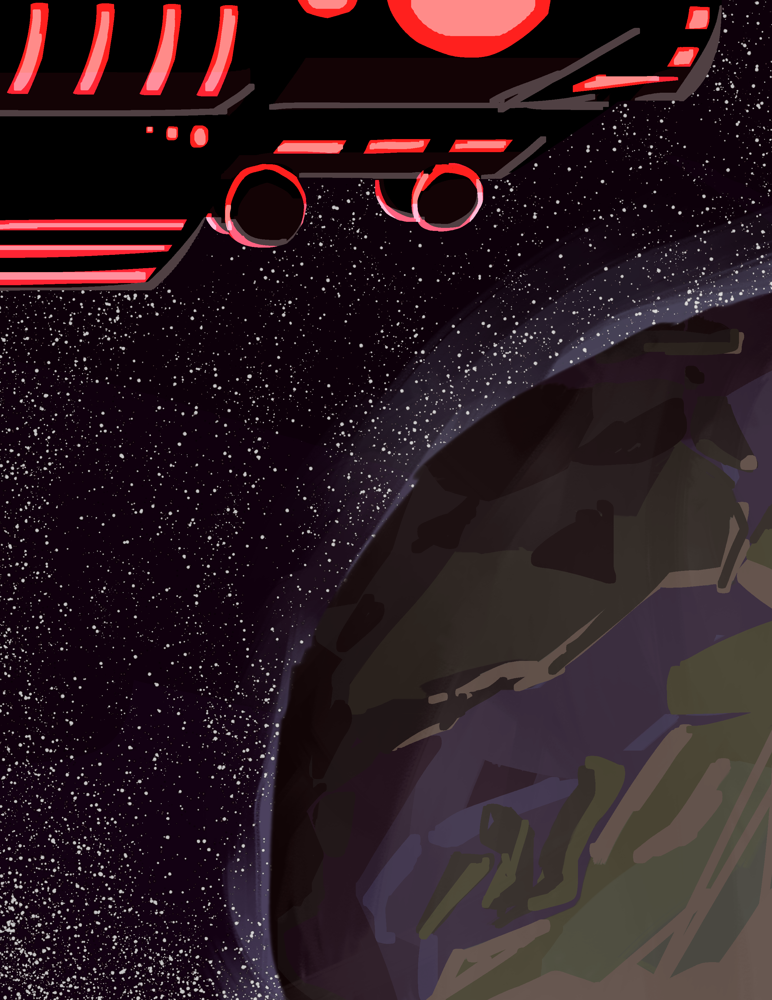
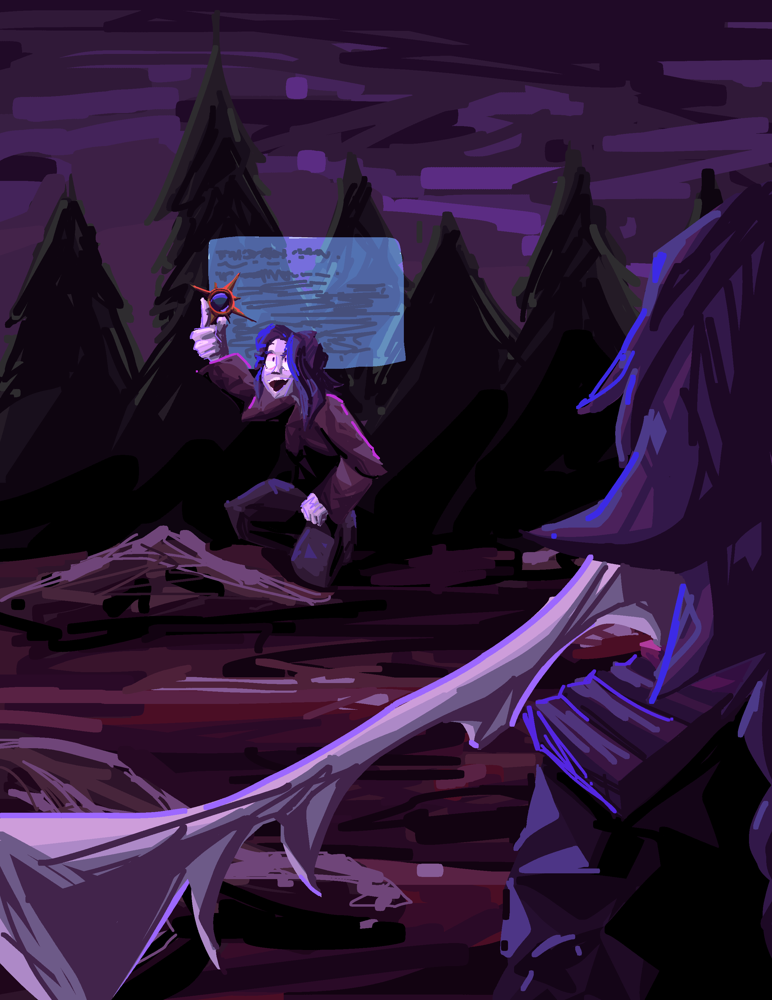
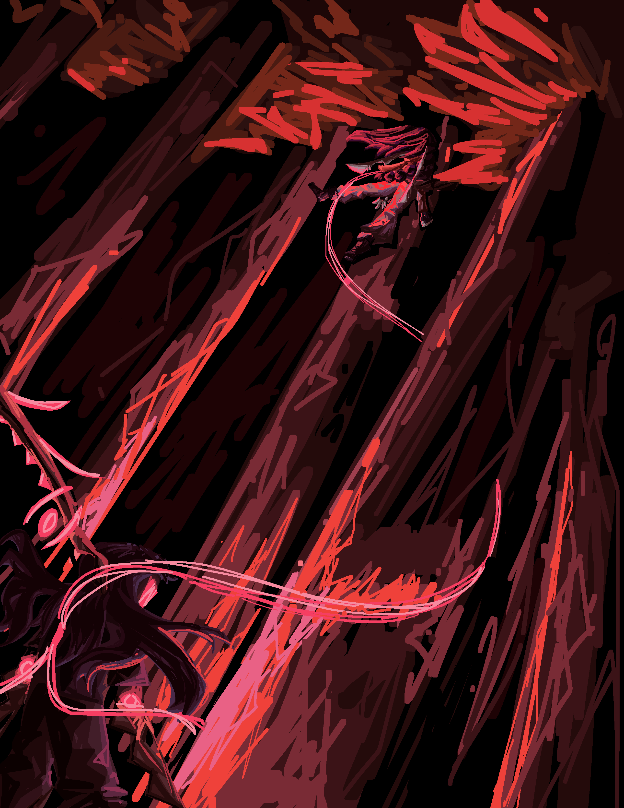
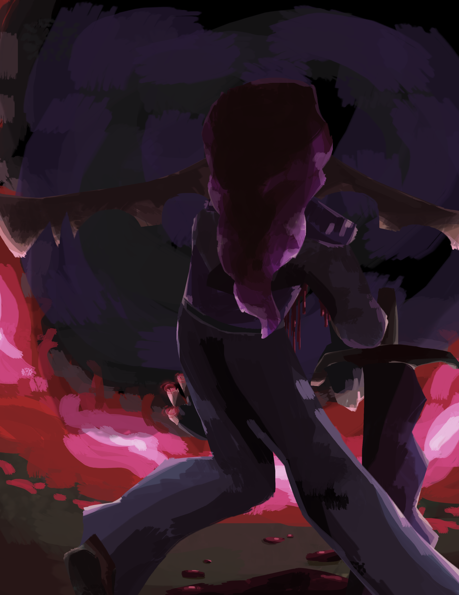
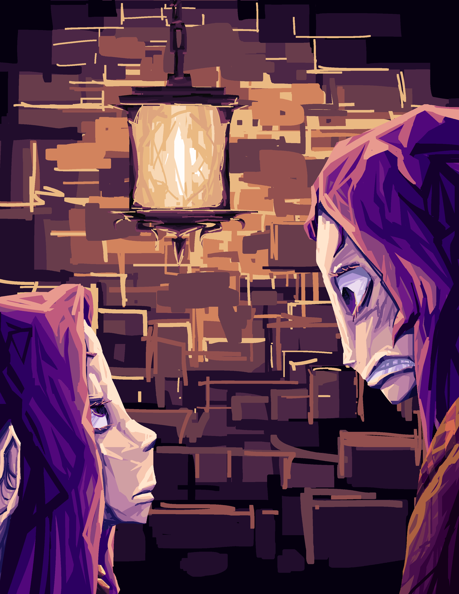
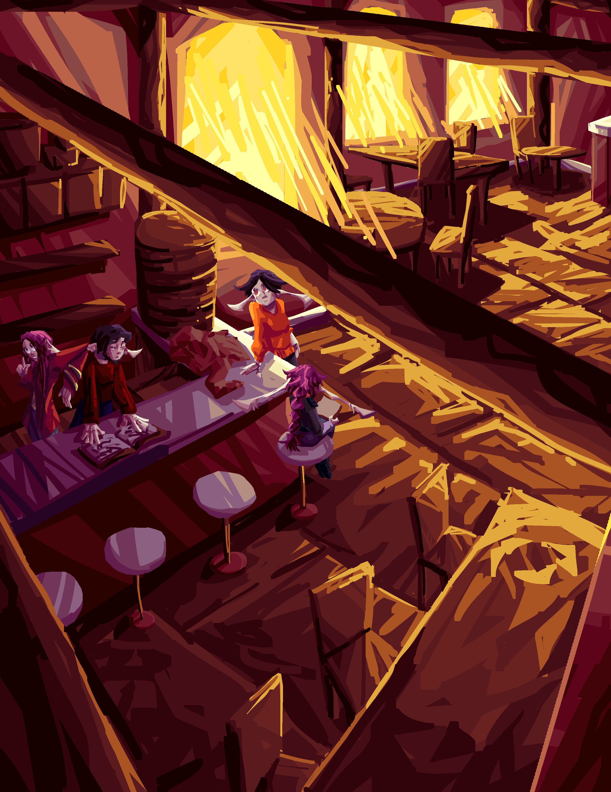
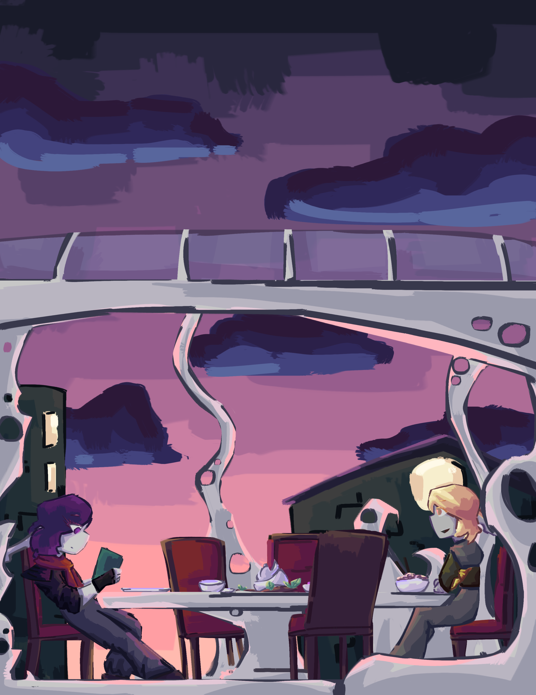
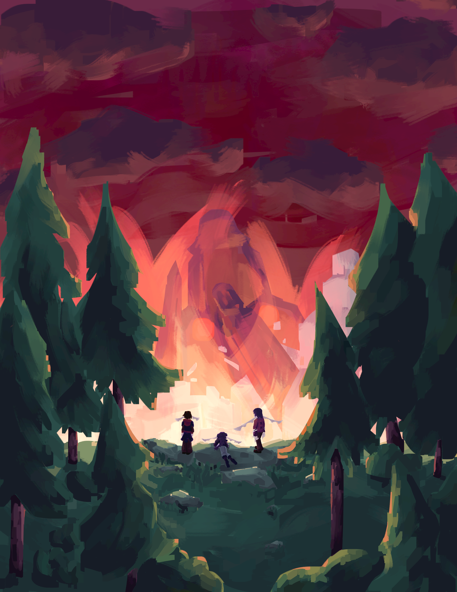

# Illustrations

Illustrations used in the mainline and short stories.

## Advent of the Haelborne

### Prologue: Eating New People

#### Prologue-1 v3
???+ info

    :octicons-verified-16: :material-star-three-points-outline: :material-check-all:
    
    For reference on what these symbols mean, see the [art index](../index.md)

#### Prologue-1 v2
???+ info

    :octicons-verified-16: :material-star-three-points-outline: :octicons-trash-16:
    
    For reference on what these symbols mean, see the [art index](../index.md)

#### Prologue-1 v1
???+ info

    :octicons-verified-16: :material-star-three-points-outline: :octicons-trash-16:
    
    For reference on what these symbols mean, see the [art index](../index.md)

### Chapter I: Everything Stops

#### Ch1-1 v2
???+ info

    :octicons-verified-16: :material-star-three-points-outline: :material-check-all:
    
    For reference on what these symbols mean, see the [art index](../index.md)

#### Ch1-1 v1
???+ info

    :octicons-verified-16: :material-star-three-points-outline: :octicons-trash-16:
    
    For reference on what these symbols mean, see the [art index](../index.md)

#### Ch1-2 v3
???+ info

    :octicons-verified-16: :material-star-three-points-outline: :material-check-all:
    
    For reference on what these symbols mean, see the [art index](../index.md)

#### Ch1-2 v2
???+ info

    :octicons-verified-16: :material-star-three-points-outline: :octicons-trash-16:
    
    For reference on what these symbols mean, see the [art index](../index.md)

#### Ch1-2 v1
???+ info

    :octicons-verified-16: :material-star-three-points-outline: :octicons-trash-16:
    
    For reference on what these symbols mean, see the [art index](../index.md)

#### Ch1-3 v2
???+ info

    :octicons-verified-16: :material-star-three-points-outline: :material-check-all:
    
    For reference on what these symbols mean, see the [art index](../index.md)

#### Ch1-3 v1
???+ info

    :octicons-verified-16: :material-star-three-points-outline: :octicons-trash-16:
    
    For reference on what these symbols mean, see the [art index](../index.md)

### Chapter II: Vacation...?

#### Ch2-1 v2 
???+ info

    :octicons-verified-16: :material-star-three-points-outline: :material-check-all:
    
    For reference on what these symbols mean, see the [art index](../index.md)

#### Ch2-1 v1
???+ info

    :octicons-verified-16: :material-star-three-points-outline: :octicons-trash-16:
    
    For reference on what these symbols mean, see the [art index](../index.md)

#### Ch2-2 v2 
???+ info

    :octicons-verified-16: :material-star-three-points-outline: :material-check-all:
    
    For reference on what these symbols mean, see the [art index](../index.md)

#### Ch2-2 v1
???+ info

    :octicons-verified-16: :material-star-three-points-outline: :octicons-trash-16:
    
    For reference on what these symbols mean, see the [art index](../index.md)

#### Ch2-3 v2
???+ info

    :octicons-verified-16: :material-star-three-points-outline: :material-check-all:
    
    For reference on what these symbols mean, see the [art index](../index.md)

#### Ch2-3 v1
???+ info

    :octicons-verified-16: :material-star-three-points-outline: :octicons-trash-16:
    
    For reference on what these symbols mean, see the [art index](../index.md)

### Chapter III: Crab Rider

#### Ch3-3
???+ info

    :octicons-verified-16: :material-star-three-points-outline: :octicons-trash-16:
    
    For reference on what these symbols mean, see the [art index](../index.md)

### Chapter X: You Know That Lying Thing I Do?

#### Ch10-3
???+ info

    :octicons-verified-16: :material-star-three-points-outline: :octicons-trash-16:
    
    For reference on what these symbols mean, see the [art index](../index.md)

