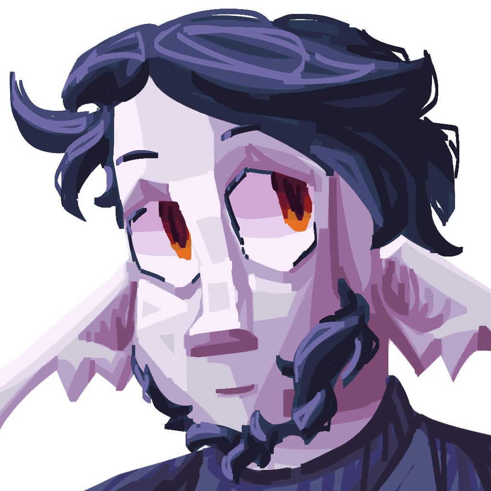
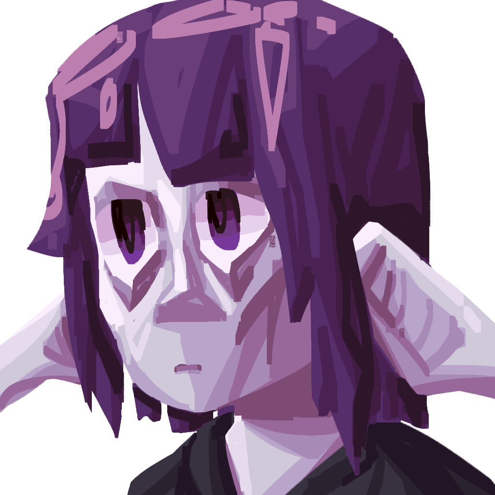
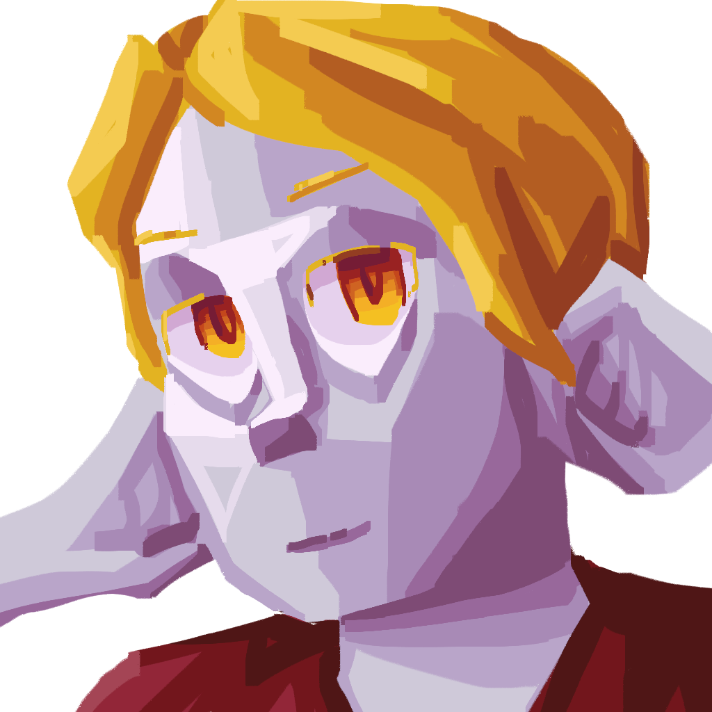
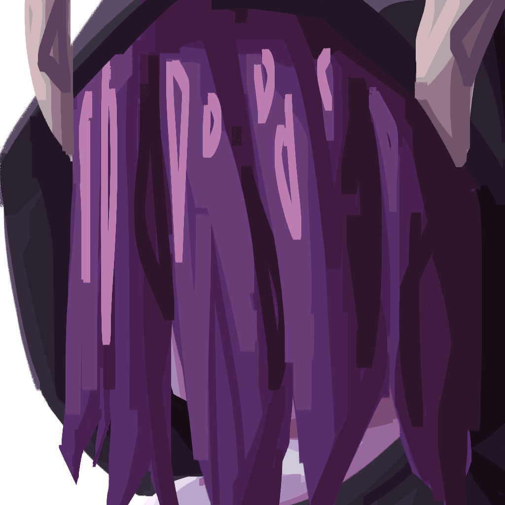

# Misc

Miscellaneous art pieces.

### Cover Art

???+ info

    :octicons-unverified-16: :material-crop-landscape: :material-check-all:
    
    For reference on what these symbols mean, see the [art index](../index.md)

### Banner

???+ info

    :material-star-four-points-outline: :material-crop-landscape: :material-check-all:
    
    For reference on what these symbols mean, see the [art index](../index.md)

### Another banner

???+ info

    :material-star-four-points-outline: :material-crop-landscape: :material-check-all:
    
    For reference on what these symbols mean, see the [art index](../index.md)

### Portrait of Ari

???+ info

    :octicons-unverified-16: :material-crop-landscape: :material-check-all:
    
    For reference on what these symbols mean, see the [art index](../index.md)

### Portrait of Bia

???+ info

    :octicons-unverified-16: :material-crop-landscape: :material-check-all:
    
    For reference on what these symbols mean, see the [art index](../index.md)

### Portrait of Dan

???+ info

    :octicons-unverified-16: :material-crop-landscape: :material-check-all:
    
    For reference on what these symbols mean, see the [art index](../index.md)

### Portrait of Duskir

???+ info

    :octicons-unverified-16: :material-crop-landscape: :material-check-all:
    
    For reference on what these symbols mean, see the [art index](../index.md)

### Portrait of Faelorn

???+ info

    :octicons-unverified-16: :material-crop-landscape: :material-check-all:
    
    For reference on what these symbols mean, see the [art index](../index.md)

### Portrait of the Great Inventor

???+ info

    :octicons-unverified-16: :material-crop-landscape: :material-check-all:
    
    For reference on what these symbols mean, see the [art index](../index.md)

### Portrait of Grim

???+ info

    :octicons-unverified-16: :material-crop-landscape: :material-check-all:
    
    For reference on what these symbols mean, see the [art index](../index.md)

### Portrait of idi0cy

???+ info

    :octicons-unverified-16: :material-crop-landscape: :material-check-all:
    
    For reference on what these symbols mean, see the [art index](../index.md)

### Portrait of Krath

???+ info

    :octicons-unverified-16: :material-crop-landscape: :material-check-all:
    
    For reference on what these symbols mean, see the [art index](../index.md)

### Portrait of Lloyd

???+ info

    :octicons-unverified-16: :material-crop-landscape: :material-check-all:
    
    For reference on what these symbols mean, see the [art index](../index.md)

### Portrait of the Narrator

???+ info

    :octicons-unverified-16: :material-crop-landscape: :material-check-all:
    
    For reference on what these symbols mean, see the [art index](../index.md)

### Portrait of Raelia

???+ info

    :octicons-unverified-16: :material-crop-landscape: :material-check-all:
    
    For reference on what these symbols mean, see the [art index](../index.md)

### Portrait of Ramuj

???+ info

    :octicons-unverified-16: :material-crop-landscape: :material-check-all:
    
    For reference on what these symbols mean, see the [art index](../index.md)

### Portrait of Rosa

???+ info

    :octicons-unverified-16: :material-crop-landscape: :material-check-all:
    
    For reference on what these symbols mean, see the [art index](../index.md)

