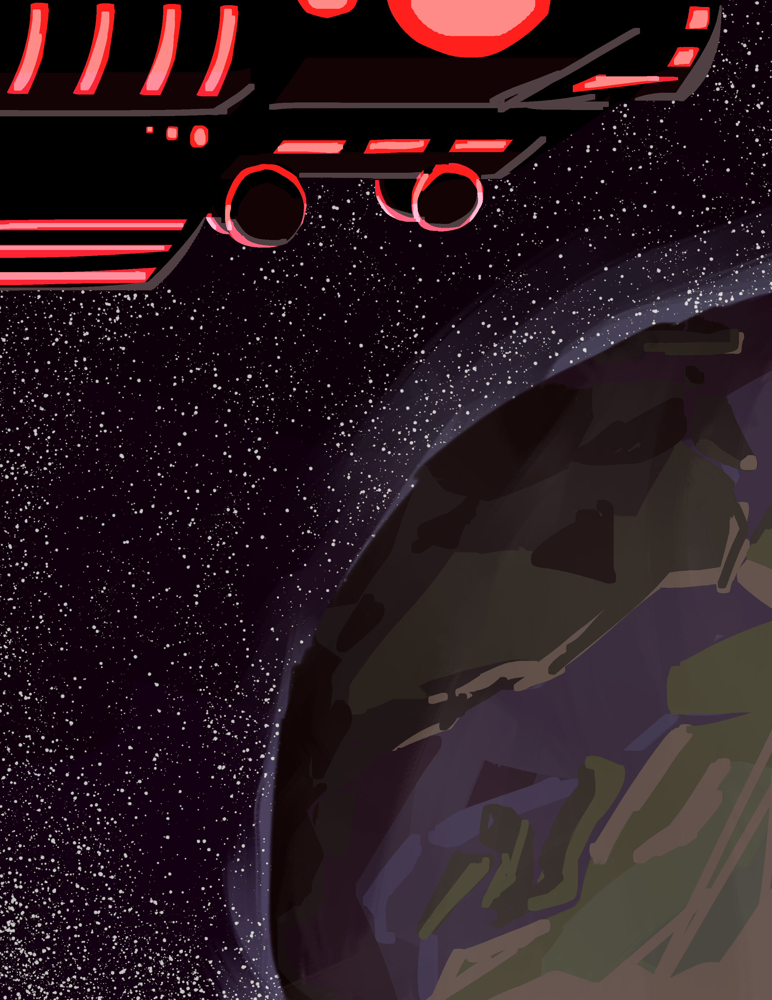

???+ tip

    I recommend using [this PDF](https://file.garden/Zi28N2lFSSn-KxkR/coa/COA%20I%20-%20Advent%20of%20the%20Haelborne.pdf) version instead of this article - it is more polished and the PDF format allows me to make it more visually appealing. Do note that it isn't updated as frequently and is currently outdated.

???+ tip
    
    I also recommend reading the ability descriptions, but if you're not into that stuff, just skim it over and you'll be fine. Maybe.

???+ warning

    Current illustrations are considered beta versions and are subject to change.

# Advent of the Haelborne

*Chronicles of the Aethein, Book I*
*By RatseerOfRattesse*

## Prologue: Eating New People
*never ask a dysphorium about their dietary habits*

The Haelborne’s dimension ship was a grand undertaking, an enormous hunk of metallic material forged and shaped into a habitable vessel. Ritual diagrams shone across its hull, granting it the magic to cross between realities. For now, it was docked atop the sky-dome of Kaaldenvale, a reality encompassing just a single planet, doing nothing. For any other fringe interdimensional organization, this would be a massive and wasteful expenditure. But for the Haelborne, it was but one of their silent, thousand-strong fleet, out plundering the cosmos like the others.

This particular mission, however, was quite special. Both in terms of the objective… and who was involved.

Aboard the ship, in one of the lounges, was a fae and a dysphorium.

The fae were the local intelligent species of Kaaldenvale, somewhat resembling the elves of Earth folklore. Unlike those nature spirits, they were built for killing, evolved from highly predatory mammals – they bore such features as retractable cat-like claws, razor-sharp flexible ears, and jagged rows of teeth. This particular fae was a relatively recent recruit to the Haelborne cause, specifically for this mission. His name was Limril.

The dysphorium were nothing like the fae. A population of thousands scattered across the cosmos, with nowhere to call home, they roamed realities, slaughtering thousands with the power of an unchained soul. There was nothing keeping it from committing mass genocide on a whim, except for a lucrative deal.

This dysphorium was a nightmarish concoction. It had serrated blades incorporated into its limbs. Its face was dominated by a wide, ever-grinning mouth of sharp teeth. Its deep blue-grey hair floated in nonexistent wind, parted by a pair of twisting horns. From the rightmost horn hung an hourglass filled with blood red sand. Its name was Grim.

The two were playing a local board game. Limril was unusually enthused for his nonchalant and apathetic demeanour. Grim was alternately moving pieces and tasting them.

“Damnit,” Limril sighed. “Grim, can you not eat those?”

“I could…” Grim spat a bunch of twisted wooden scraps out of its mouth. “But my contract tells me I have to not eat the people.”

“How is that relevant?”

“It is.”

“How helpful.”

Limril sighed again and swept the board and pieces off the table. He waved his hand, and the board hovered its way across the floor and into a cupboard. Eyes dulling, he snatched a can of soda out of nothingness, popping it open and downing a gulp.

“So,” he said between sips. “You up for dispatch to Javenshard this week?”

“What-shard?” Grim mumbled, its grin fracturing back to a mildly triumphant smile. “What’s to eat there?”

“Javenshard, Grim. A town. In Haelcrien. And you can’t eat anyone until we get scouting done. And then we have to figure out the arrangement with the Felheils…”

Grim blew a raspberry – which was quite odd looking, because it didn’t have lips, and its tongue looked like a spiked mace made from red flesh.

“Can I go negotiate with those guys? I love eating – I mean EATING new people.”

Limril stared at it.

“Fuck I said it twice. Anyway, why’re we going there?”

“The Fundament Glass, Grim. The reason we recruited you in the first place?”

"Recruited me? No, I think I recruited myself.”

“Of course you do. When you get powerful enough, it just seems like everything happens because you’re around.”

“It does because it’s true. So why are we after a piece of glass?”

“If you keep playing dumb, I am going to report you to management.”

“How many calories is that worth?”

## Chapter I: Everything Stops
*and that's on a literal and thematic level >:D*

Hello there. Book. This is Aryon Hastor! I’m writing this little tome of misfortunes to… document things. For future reference, in case I… well I don’t know…

Is it just me or do ‘I don’t know’ and ‘IDK’ have different meanings nowadays? Like, ‘I don’t know’ is something the protagonist says after the comic relief guy asks in a really scared voice ‘what are we going to do’ or something like that. Then on the other hand ‘IDK’ is just pure cluelessness. No ominous connotations with that one.

Oops. I went off on a tangent again. I gotta stop doing that.

Back to the topic at hand. Which isn’t really a topic. But whatever. Y’know, it just occurred to me that anybody who finds this thing just dropped in a public building in another universe would think that top bit was just the author making a lazy excuse so their perspective character could write in first person. Completely hypothetically. Definitely not happening. Y’know, not everything is sarcasm! People should stop being so cynical… not that I can talk.
I’m writing this as I walk down a forest path with my sister Bia. You might think this is a terrible idea and I should pay more attention while walking through a spooky scary forest while on the hunt for monsters. No, I’m good. I’m tier seven! That affords me a lot of attribute points - twenty-seven of which are in soul. I can multitask way better than a regular person. Took Bia and I six years to level this high -we’ve nearly reached tier eight- and, oh, lemme tell ya, is it WORTH IT! I can run across the entirety of our town Javenshard in seconds!

I glance over at Bia, who’s merrily skipping down the trail. She’s two years older than me - I’m eighteen - and, contrary to the majority of sibling to sibling relationships, she’s always the one annoying me, not the other way around.

Bia is tall and slender, just over two metres. She has short but impeccably styled purple hair (a hallmark of the Hastor line). Every fae family has their own signature combination of colours – this is the Hastors,’ and all of us have it - though I wear it better than Bia, of course. She wore her enchanted combat outfit, consisting of an armoured jacket with silver bands and long, airy pants. Her ears stretch out far longer than the average fae, expanding about ninety centimetres to each side (another hallmark of the Hastor line - we’re really, uh, special). Three divots were carved into them from the bottom – ear shape was a feature unique to every fae, but us Hastors get more variety with how long ours are.
Compared to Bia, I’m some sort of gremlin. Height-wise. If that wasn’t clear. I have to assume certain levels of disability in anybody reading this (because it’s probably ME).

I’m short for a fae, only one and a bit metres tall. My hair’s longer and is extremely messy. My ears droop downward a lot. I’m wearing a parka with selective armour plating, with a red scarf layered over it. All my stuff has different enchantments that facilitate health regeneration and enhanced speed, to aid my really weird and unnecessarily risky combat style.

“This is supremely stupid,” I grumbled, panning my eyes across the trees.

“Ahh, it’s FINE!” Bia replied, glancing down. “The monsters here aren’t even that high level. They’re only tier… what, thirteen?”

I stared back with glaring intensity. Bia could be an asshole, and it looked like she was about to start one of her episodes.

“And we’re tier seven.”

“Well isn’t that just spoopy. But please shut up and go find monsters already.”

Rolling my eyes, I summoned a weapon with the snap of a finger. A dagger flickered into existence in my hands. Its blade was made with deep purple crystal. Red trails shimmered throughout the crystal, twisting and swirling like hundreds of miniature snakes.

???+ info "Ability: [Voidburst Dagger] (Conjuring)"

    Incantation: none.

    Cost: meagre mana

    Cooldown: none.

    Damage Output:

    Meagre, scaling with tier

    Ethereal:

    \- 33.3% Void

    \- 33.3% Light

    \- 33.3% Reality

    Impact:

    \- Stabbing

    Effect:

    Tier I

    Conjure a Voidburst Dagger

    Minor boost to mana pool, crit chance, and crit damage, scaling with tier.

    Dagger inflicts [Devitalized Manaturgy]

    Tier IV

    Inflicts [Adverse Manaturgy].

    Tier V

    Inflicts [Vampiric Manaturgy]

    Consume health to increase damage by a percentage three times the health sacrificed.

    Tier VI

    If target is below a third of their mana pool, minor increase to global damage output, scaling with tier.

    Tier VII

    Increase mana cost to moderate to inflict [Harmonic Manaturgy] on caster and wielder.

???+ info "Effect: [Devitalized Manaturgy] (Weakening)"

    Slowly drains mana at a rate of meagre mana/id.

???+ info "Effect: [Adverse Manaturgy] (Damage)"

    When target uses mana, deal damage one twelfth of mana used.

???+ info "Effect: [Vampiric Manaturgy] (Draining)"

    One fourth of mana removed from the target, whether by the target or through external activity, is given to the user.

    If mana is removed by [Devitalized Manaturgy], extraction increases to one third.

    If mana is removed while [Adverse Manaturgy] is in effect, extraction increases to one third.

    If both [Devitalized Manaturgy] and [Adverse Manaturgy] are used, extraction increases to one half.

???+ info "Effect: [Harmonic Manaturgy] (Damage)"

    Increase damage of [Adverse Manaturgy] from summoning, casting, conjuring, and ritual type abilities by (target’s tier) %.

I twirled the dagger in a showy way, before sliding it into a scabbard on my belt. This bad boy had slain a lot of monsters and was one of the first abilities I’d acquired, from back when we first immigrated to Haelcrien and mother still had the heart and sanity to train me. From my belt pouch I took a metal tablet far larger than the pouch itself, yet somehow managing to fit inside.

I tapped the tablet three times with a finger like I had done hundreds of times before. After a brief moment, lines engraved themselves into the metal, creating a radar interface. A quick scanning animation followed, before dots appeared around the area. I tapped the closest one.

???+ info "Creature: [Crienbeast] (Beast)"

    Average Tier: III

    Summary:

    A combination of rat and bear, with a bear’s bulky body and fur, but a rat’s tail and head. They possess sharp claws and teeth, razor tails, and a set of spikes along their backs that allow them to manipulate gravity to a small extent. They are unable to flip or otherwise redirect gravity but are able to lessen it temporarily in a small area.

“Pack of crienbeasts, tier four, two hundred metres that way.”

Bia cackled. She held out her hand and chanted:

“Fallen horrors in the gloom, come forth and ferry my doom.”

Red mist coalesced in her palm before expanding to form a massive scythe, with a blade of crimson metal and grip of black hide.

???+ info "Ability: [Fel Scythe] (Conjuring)"

    Incantation: Fallen horrors in the gloom, come forth and ferry my doom

    Cost: meagre mana

    Cooldown: none.

    Damage Output:

    High, scaling with tier

    Ethereal:

    \- 50% Necrotic

    \- 50% Bleed

    Impact:

    \- Cutting

    Effect:

    Tier I

    Conjure a Fel Scythe. Scythe can launch small blood blade projectiles that deal minor damage.

    Tier II

    Attacks made with this weapon physically siphon a small amount of blood from the target.

    Tier IV

    Increases the strength of effect-based abilities. Negate affinity-based resistances.

    Tier V

    Inflict [Sanguine Decay].

    Tier VI

    Abilities used with this weapon equipped automatically change 10% of their damage output to bleed.

    Tier VII

    5% of damage received while this weapon is equipped is mirrored onto damage source as bleed damage.

???+ info "Effect: [Sanguine Decay] (Weakening)"

    Provides a slow damage over time effect until accumulating to 1000 instances. Upon reaching 1000, all instances are cleansed and replaced with one instance of [Necrotic Blight]

???+ info "Effect: [Necrotic Blight] (Damage)"

    Instantaneously deals moderate necrotic damage. Continues to deal slowly deescalating damage for ten sec. before dropping off.

Without another word, she dashes off into the forest, heading towards the pack of monsters ahead. Decimating local species time. I’ve gotta write the rest of this after we finish fighting.

I rolled my eyes, conjuring a pair of wings before launching after my sister.

???+ info "Ability: [Wings of Equilibrium] (Utility)"

    Cost: meagre mana

    Cooldown: none.

    Damage Output:

    Low, scaling with tier

    Ethereal:

    \- 50% Holy

    \- 50% Unholy

    Impact:

    \- Metaphysical

    \- Cutting

    Effects:

    Tier I

    Conjure a pair of mismatched wings. Can be used to glide short distances for a minuscule mana cost per second.

    Tier II

    Project an aura that negates tier-based damage reduction. This affects every target within the aura, including you and your allies.

    Tier V

    Wings possess damage reduction on tier above current and can be manipulated as shields.

    Wings possess damage one tier above current and can be manipulated to cut at targets.

    Tier VII

    Wings can now launch and propel flight on their own.

    Wings passively move to deflect incoming projectiles. Projectiles can be redirected at enemies for a meagre mana cost.

With a rush of wind, I landed in the middle of a forest clearing, immediately knocking several crienbeasts off their feet. As stressed as I was in this over-ranked area of the forest, the thrill of combat rushed me right into the zone. Brandishing my dagger, I immediately leapt at the nearest monster, the sheer force of the launch tearing the poor thing’s head right off its body. It tumbled about for a few seconds while the rest of its Governance-given energy sapped away and it dissolved into a pile of assorted items. Normally monsters didn’t dissolve so quickly, but I must’ve hit that one too hard.

???+ info

    [Enemy selected]
???+ info

    [60%]
???+ info

    [20%]
???+ info

    [dead]
???+ info

    You have defeated: [Crienbeast]

Bia dashed into the clearing just a moment later. Her scythe flashed into a black and red blur, whirling to spear three beasts through the stomach. Viscera spilled, tendons ripped, lots of other yummy fleshy things fell on the ground. Yet the three crienbeasts still stood, courtesy of their enhanced tier four attributes.

???+ info

    [Enemy selected] x3
???+ info

    [40%]
???+ info

    [dead]
???+ info

    You have defeated: [Crienbeast] x3

The poor creatures scrambled to re-assert their position – but NOPE, ‘cause I’m here to kick ass and other body parts too. A swarm of light blades dislodged from my outstretched hand, trailing fire and burning through poor, weak flesh. A second volley ensured their demise with a bonus free cremation (for free!).

???+ info "Ability: [Rain of Light] (Attack)"

    Incantation: Let the blaze of dawn light the blasphemous mind

    Cost: meagre mana

    Cooldown: 30 sec.

    Damage Output:

    Medium, scaling with tier

    Ethereal:

    \- 50% Light

    \- 50% Flame

    Impact:

    \- Stabbing

    Effect:

    Tier I

    Conjure a swarm of light spears. Each spear deals meagre damage, scaling with tier.

    Tier III

    Conjure an additional ring of larger light spears. Each larger spear deals moderate damage.

    Tier V

    Smaller spears inflict [Blinding Descension]

    Tier VII

    Spears can sap shadow out of a small area while airborne. This includes the life force of shadow-based and shadow-adjacent creatures.

???+ info "Effect: [Blinding Descension] (Weakening)"

    Target acquires an affinity weakness to light and light-adjacent damages.

The rat-bear hybrids rushed forwards in a wave, claws flashing and teeth gnashing. Rocks and chunks of earth lifted as they ran, the spines across their backs lighting up a soft green as the debris shot forward. That was a neat little ability of theirs – manipulating gravity in a small area around them. Anyway, let’s let the little cuties run around a little more. It gets boring from here.

Within the span of a minute, the entire pack lay dead and disembowelled across the forest floor.

???+ info

    You have defeated: [Crienbeast] x6

Ooh, aren’t the wafting scents of burnt flesh so nice in the pristine outside air? I know, they really are.

Leaves crunched as I stepped to the nearest body. I tapped a finger to the beast’s temple, brushing the thing’s fur with pleasure – there was loot to come.

???+ info "Loot 1x [Crienbeast Tier IV]?"

I ignored the Governance window and proceeded to tap the other corpses, as Bia did likewise on the other side of the clearing. Windows stacked up rapidly before they consolidating into one.

???+ info "Loot 10x [Crienbeast Tier V]?"

I mentally accepted the prompt, and ten bodies dissolved with a poof, leaving piles of neatly packaged monster parts scattered across the ground. Sheets of leather, bags of fur, bundled claws and spines. From Bia’s position came another poof, quickly followed by a whoop of surprise.

“Hoh!” Bia called from across the clearing. “This guy dropped a core!”

I immediately spun around. In Bia’s hand was what looked like a mangled electrical component, composed of a cube-shaped body and tangles of metal wire. Within the core shone a pulsing multicoloured light. These little things were manifestations of the Governance and were embedded in the bodies of all monsters it spawned. Rarely however, did one come out of the process in a usable state.

I did not see what I just described, however. In Bia’s hands was a pile of shining silver coins.

???+ info "Item: [Depleted Lesser Governance Core] (Core)"

    Tier: IV

    Previously a [Lesser Governance Core], depleted after being used to construct a monster. Can be repurposed as a ritual or artifice component.

“Nice.” I shrugged, returning to collecting the other drops. I stuffed them all into a second belt pouch. Claws and fur, despite being too large to fit through the opening, simply shrunk as they approached the pouch before slotting into the dark space inside.

???+ info "Item: [Extradimensional Sack] (Bag)"

    Tier: VII

    Manufactured by: Scruff & Grime Leathers

    A simple run of the mill leather bag- but bigger on the inside.
    Item capacity: 40 m.3

We gathered up the rest of the free money and trekked back into the trees and off to the shallower parts of the woods.

“Woo! What a haul!”  Bia exclaimed excitedly. She snatched a metal tablet out of her own belt pouch, fingers flitting about across its surface in practiced motion, cataloguing our operation today. “Two commissions taken, and a ton of bonus loot. Ari – aye – whaddya say we take a day off tomorrow?”

I just stared silently at the dome of scattered lights in the sky. Sorry Bia, I tune out a lot. This late in the day, the stars cast dim orange light onto the ground, though some of them had turned off entirely.

“Huh? Oh,” I muttered, returning her gaze to the forest in front of her. “It’s almost stardown. We should go faster.”

“Boring,” Bia chimed out, sliding the tablet away and jamming her hands in her pockets in a popping motion. “Nightime’s fun! That’s when all the real spooping monsters come out!”

“Y’know, I have a mild suspicion that that’s definitely not a good thing.”

“You’re no fun. I’m going to leave now, meet you at home later!”

In one movement spanning less than a second, she had completely disappeared from sight. With a blink, I pulled at the energy behind my eyes. A red sigil appeared in my vision, becoming smaller as it mapped itself onto my retreating sister’s back.

“Very funny!” I called. “Get back here!”

There was no response. The sigil became smaller, but I could still see in perfect clarity. Perks of levelling so high.

“Bia!”

“BIA!”

I sighed and continued through the melancholic forest. I walked at a leisurely pace, trying to conjure up some thoughts in my solitude. But my mind was empty. Adamantly content to simply observe the world.

I should stop being poetic.

Nah, fuck that.

Trees stretched into unidentifiable shapes.

Leaves chattered in whispers of forgotten languages.

Birds chirped and called distantly.

The shadows seemed… particularly mocking. Like a really really expressive chandelier.

And then everything stopped.

“What the- “

At first, I thought I’d gone deaf. In a place a tier zero would hear nothing, a tier seven could hear the smallest flickers in the environment, from the crawling of insects across the mildewed surfaces to the dripping of minuscule waters from trees to soft dirt.

But no, it wasn’t me.

Silence rang in an almost tangible wave. Something was wrong, something fundamental. I summoned my dagger, slowly turning on the spot, scanning the trees. Nothing else dared move or make noise as a Presence settled over the forest. I couldn’t distinguish any of its elements. It was a maelstrom of madness, merry and ecstatic with the cold promise of eternal unexistence.

I blinked, expecting another red sigil to appear. Nothing.

There were two explanations for this.

A: Something is nearby. Something far more powerful than myself. More powerful than anything I had ever fought, judging by what I felt in that Presence.

B: I am tripping balls.

My eyes slashed across the trees, picking out anything out of place before spotting it: a faint blur speeding forward. Cracks and groans echoed from its position as if reality strained where it stepped.

It was way too fast for me to run away. At least tier fourty based on that one time I watched skilled adventurers fighting higher-tier monsters in Troltano. I couldn’t match its physical speed, but I had years of combat experience. On pure instinct – without even a thought – an array of translucent blue shields sprang up in front of me, just in time to meet a swarm of metal blades.

???+ info "Ability: [Shattersweep Shield] (Defence)"

    Incantation: none

    Cost: meagre mana

    Cooldown: 30 sec.

    Damage Output:

    Low, scaling with tier

    Ethereal:

    \- 90% Light

    \- 10% Mystic

    Impact:

    \- Blunt

    \- Stabbing

    Effects:

    Tier I

    Conjure a floating shield. When hit, will absorb damage up to moderate damage, shatter, and send shards at the enemy, each dealing meagre shrapnel damage.

    Tier II

    Shards inflict [Fracture]. You can chain-conjure up to six shields, but each one will be less effective than a regular one.

    Tier IV

    Throw the shield as a projectile, periodically stunning and knocking back anything in its path. Shards detach from the main shield as it moves, each dealing moderate stabbing damage.

    Tier VI

    Merge up to three shields to form a larger shield. Larger shields cannot be used as projectiles but will follow user and can be moved in a small radius around the user.

    Tier VII

    You may now conjure up to twelve shields, each at the base mana cost.

???+ info "Effect: [Fracture] (Weakening)"

    Target becomes more susceptible to ethereal damage and is occasionally hit with some void damage and multiplies this effect. Effect stacks.

The shields shattered. Stupid me, assuming my puny tier seven power could hold up to random tentacle monsters.

Blue shards danced outwards explosively before dissolving. In the split second time it took for the strikes to break through, I pulled my arms up to block the strike – and had them utterly eviscerated.

Blood spattered everywhere, strips of flesh peeling away. Tendons slithered out of my scrambled arms, pain flaring as the copper smell of blood wilted away from ripped meat.

So much useless, powerless meat.

???+ info

    HP: [50%]

I stood there for a few seconds, almost disbelievingly.

It had been so long since I’d seen my own blood.

“Shit…”

It was at this point that poor little Aryon Hastor realized… that she had supremely fucked up.

I glanced up at the monster.

“Shit, shit, shit, shit.”

Eight eyes glowed with bright red glee, arranged in a circle surrounding a gaping jaw of metallic teeth. Dark hair floated in flailing strands, drifting through a nonexistent wind.

Why wasn’t it attacking?

Oh yeah. This would be a supremely comedic moment when it slapped me sixteen metres backwards through seventeen trees.
I should probably… run?

“Nope, nope – NOPE, GOODBYE!” I screamed as I conjured my wings and launched into the sky. “I think I’ll just be going this way now and you’re not gonna get anywhere closer or I don’t damn know what I’ll do MAYBE I SHOULD STOP HYPERVENTILATING AND FUCKING RUN!”

The whistling of wind through metal sounded as black tendrils topped with wicked blades surfaced around me. The entity barrelled upwards, closer, closer, closer and closer. I turned around just long enough for the Governance to analyze the monster. A window appeared in the corner of my vision. It didn’t help – in fact, I was now MORE panicked.

???+ info "Being: [Unknown] (Dysphorium (Alt. 3152))"

    [Obfuscated]

    Entity does not have a root in Governance system

    Entity shares foreign magic system equivalent of your title [Dormant]

“WHAT DOES THAT MEAN?!!!! WHAT ARE YOU??!!!!!!!” I half cried. I flung light blades at the thing, screaming and crying my way upwards. Cackling drifted through the rancid air as a massive metal claw snatched me downwards. Debris detonated from the impact as I was slammed against a tree.
The entity didn’t move it’s main body, instead pushing me up the trunk with the claw attached to its tentacle.

It rattled its way closer, taking its time. Its Presence grew stronger, the layers of reality bending and warping as it slashed forwards, limbs distending with snaps and crackles. Finally, it reached the foot of the tree. Its head snapped upwards, eyes piercing my skull as it concentrated its Presence towards me. This was a technique only known by the most elite of adventurers. No sound could escape my lips.

“Hello there!” the entity cheered happily, like a preschooler with a new toy. “I’m Grim!”

Silence. I physically could not talk – the Presence still screaming in my veins.

“Oh, not up for a talk then? Funny! Straight to the chase then…” Grim’s eye sockets narrowed. It had no pupils, but this still achieved a look of persecution – or, to be less descriptive, a look of ‘I’m going to kill you and everyone you love and then I’m going to steal your tendons to make a blanket.’ “Would you be so kind as to hand over the Firmament Hourglass?”

The Presence relaxed slightly.

The Presence relaxed slightly.

The Presence relaxed slightly.

“W-what?” I shuddered, heart pounding through my chest. The trinket under my scarf seemed to become heavier.

Grim’s eyes narrowed further. It sighed and dragged its hand upwards. It had no fingers – the end of its forearm instead hosted three serrated, articulated metal claws. With a movement faster than I could see, it pulled my necklace out from under my scarf. At the end of the chain was that tiny hourglass, filled with blood red sand.

Oh, oh yeah. I definitely know what it wants.

“This little trinket around your neck, of course!”

So, I was stuck in a very bad position. I could be loyal and keep the treasure my clinically insane mother had adamantly told me several thousand times not to lose – or I could save my own life.

Wanna guess which one I went with?

“Uh, no.”

This was a completely rational and logical decision. You can imagine me giving a thumbs up right now.

The Presence returned in an instant, a reality-shattering aura thundering into place. Screams and wails echoed through my ears, the smell of soot and ash burning through my skull like the spilled internal bodily fluids of hundreds of ended lives. Another tentacle, this one topped with a massive scythe, unlatched itself from Grim’s back and ripped into my chest. Frankly, it was a miracle I was still alive. Tier seven blood coursed out of the wound, the vital force keeping her together spilling by the litre.

???+ info

    HP: [40%]

“Perhaps I was not clear enough?” Grim cackled. “Honestly man, I’m STARVING. Best give me the little thingy or I’ll be forced to – eheheh – have a snack.”

“I have to uh – uh – go somewhere, I have – like, an appointment with my… anarchist!”

Grim raised another claw-hand. It dug further into my ribcage, tossing out various organs before picking up my heart and casually popping it into its mouth.

???+ info

    HP: [5%]

I had no lungs to scream. No biggie. I’m sure everything will turn out okay. Sarcastic optimism is my coping mechanism!

“Relinquish the hourglass please,” Grim chittered, its tone as goofy as ever.

I could only cough and splutter. This, however, was an advanced battle tactic known as DECEPTION, BITCH!

This method is also known as saving your most powerful move until the end of the fight for dramatic effect and definitely not because I’m too much of scaredy cat to manage logical thinking in a near death situation.

I raised a hand in a casting position, pointed at Grim. Four fingers stretched out as far forward as possible, the pinky folded backwards across the bottom of the thumb. There was a moment of silence, as Grim curiously tilted its head. Ooh, it had no idea.

I pulled at the energy under my eyes. Four red circles burned indents into my thumb, index, middle, and ring fingers. I grunted in pain.

Tendrils of piercing red light blasted from my fingers. Crackling erupted at an ear-piercing pitch as the red lightning shot towards Grim and sent the thing flying off hundreds of kilometres into the horizon. Panting, I fell to the ground, clutching the gaping hole in my chest. The flesh had already started to knit back together – thank the Immortals for ranked-up healing kicking in.

Crawling into a comfortable position, I reached into my extradimensional pouch, fumbling about before snatching out a massive bottle. It had an unbalanced top and bottom, almost like one of those kids’ science worksheets we did in first grade.

???+ info "Item: [Reinforced Glass Bottle] (Container)"

    Tier: VII

    Contains: [Greater Sustenance Elixir]

    Manufactured by: Five Brothers Alchemical Goods

    A glass bottle with magical reinforcements, meant to contain powerful potions.

???+ info "Potion: [Greater Sustenance Elixir] (Restoration)"

    Tier: VII

    Manufactured by: Five Brothers Alchemical Goods

    A potion that can completely restore missing health and mana.

I ripped off the cork and downed all the silver liquid inside. My wounds healed even faster, flesh and sinew flashing and flailing until it looked like there was never any damage at all. It was half a minute before I moved. Even though it had physically healed me, it wasn’t able to cure exhaustion.

Once the potion had done its job, I shambled upright. Again lifting an arm in casting position, I waved it in a ring and the red energy cut a hole in the world. Through the tear was my bedroom – not that my dreary state could interpret what I was seeing. This entire portal wasn’t even a conscious action. On instinct, I needed my bed. I slouched through the portal, collapsing on the plank floor of the room, before rolling to stare upwards. My vision faded to black, the last thing I saw the tinkling of candlelight against the grey ceiling.

## Chapter II: Vacation...?
*do I at least get paid*

The slamming of a door some distance away snapped me out of unconsciousness. I was lying across the wood-panelled floor of my bedroom, surrounded by a ring of ripped flesh and dried blood. Likely discarded material from after the potion kicked in. I glanced at the walls, clustered with shelves and shelves of assorted books, monster skulls, and painting canvas. Silently, I clambered upright, only to collapse against the wall next to the door. With a jerking motion, I slammed open the door with a slap of the hand, throwing myself against the upstairs railing as if fired from a slingshot. Movement with a fully repaired body after being recently near-deceased is a little tricky.

A coughing fit ensued as I snapped up to take the stairs down before –

“Ari!” Bia’s voice sang loudly from below. “You in here?!”

“Y-yes,” I spluttered, dragging my feet as I staggered down to our living room. Bia stood next to the table, looking expectantly at the stairs. Her grin faded. A terrible omen – Bia is always making that evil grin of hers.

“What the hell happened?” Bia immediately dropped all pretence of her usual giddiness. “I just got back from stealing Dan’s bottles, what did you do?!”

“I got attacked by a demon, that’s what!” I refueled with energy, glaring daggers at Bia. “This is why we don’t go ANYWHERE near the deep woods. While *you* were off pilfering the pub, I was getting mauled against by a bleeding ten foot tall metal monster!”

Bia paused, a rare look of hesitation on her face.

“And… what monster was it?”

Wordlessly, I sent over the Governance profile generated for the entity. With that done, I fell violently onto the couch, lying there contemplatively. In retrospect, the entire scene was a little kooky; it looked as if Bia was running a therapy session (which, Immortals forbid, she was definitely not qualified to do).

Bia read over the profile several times, eyes seeing but not comprehending – though that’s what she usually did. Dumbass.

???+ info "> Item mailed from [Aryon Hastor]"

    Being: [Unknown] (Dysphorium (Alt. 3152))

    [Obfuscated]

    Entity does not have a root in Governance system

    Entity shares foreign magic system equivalent of your title [Dormant]

“’Not rooted in Governance system?’ And it shares your Dormant title, but in another magic system?” She coughed nervously. “Last I checked, we’re not living in a fantasy novel, right?”

“How in the twelve hells am I supposed to know?” I hyperventilated. “It hit me twice and I was near dead, I wasn’t contemplating the existence of something that isn’t compatible with the system our society has grown with since – since the Miruen Empire!”

Bia stared out the living room window at the black night. You could just barely see the houses along our street.

“We should tell someone this thing is in the forest. Nothing tier thirteen should be able to take out Ms. Perfect Hastor that easily.”

“Nothing at all should be able to take out any Hastor that easily,” I said, the still-lingering panic overriding her name calling. “How it even got through my passive sensory is a complete mystery. And who would we tell? You think the mayor of this dump can do anything about it? We specifically picked a low rank place like Javenshard to settle down – so we wouldn’t have to deal with crazy stuff like this!”

“You specifically picked Javenshard so you wouldn’t have to deal with crazy stuff like this,” Bia rolled her eyes, and added in a mutter. “Coward.”

“You shut it.”

“No, you,” She retorted with a natural cadence. That was one of her most used phrases, and it was so very annoying. “We can travel over to Troltano and go tell Father ourselves. Or find someone high-tier to take out the thing – Troltano is a tier fifty-sixty area.”

“I’m not going all the way out there while that demon is still around.”

Bia raised an eyebrow. “Why? It’s just a monster. It’ll find other prey and should know better than to go near busy, established roads, much less follow you about.”

I opened her mouth, then closed it, then sighed.

“It’s not after me. It’s after Mother’s hourglass.”

“You- “ Bia spluttered. “What? It’s sentient? It’s not an actual monster?”

“No, it’s not. Monsters are fabricated by the Governance to feed faevinity experience, you know this? So, what kind of monster is intelligently motivated not by sadism, but by a specific shiny trinket?”

“Why would it want the hourglass? The thing can’t use the glass’ powers, can it?”

“Don’t think so. It didn’t show off any reality-bending. But hells, I don’t know! It’s a spooky shadow demon, we didn’t learn about those in adventuring school.”

”Check the glass. Is there something on it? Some kind of tracking device? Anything?”

I gently pulled out the hourglass from my shirt. The blood red sands tinkled softly as the trinket moved.

???+ info "Item: [Old Hourglass] (Accessory)"

    Tier: I

    A family heirloom of the Hastor line. Do not lose it.

“It’s still the same as ever,” I sighed, disappointed. “Perhaps I should report this to someone.”

“It’s still the same as ever,” I sighed, disappointed. “Perhaps I should report this to someone.”

“It’s still the same as ever,” I sighed, disappointed. “Perhaps I should report this to someone.”

“Ari you selectively deaf dumbass I said that a minute ago.” Bia exclaimed. “If that thing gets into Javenshard it’s going to obliterate everyone. Nobody here is high enough tier to even stand in front of it. Except for Mother, but you know what she’s been like since…”

I groaned. “Y’know, I could just send Father a letter.”

“Oh, you know what he’s like too. He won’t listen to us unless we go slap in him the face ourselves. Besides, a trip will be fun! We’ve been cooped up here for years, we gotta go somewhere else eventually.”

“And the matter of the murder monster after my face?” I glared.

Bia smiled sweetly, leaned forward.

“Oh, I’m sure it’ll be fine. Can we just have a regular, fun, vacation...?”

I only glared harder, purple pupils boring past a sheaf of hair and straight into Bia’s eyes. After a second of silence in which you could practically hear the cartoonishly escalating sound effect-

“Fine.” I relented. “I suppose it was about time I fought something higher rank.”

“Hells yeah!” Bia pumped her fist. “Nice. We should leave… tomorrow morning?”

“Fair enough. I don’t have much to pack.”

“Yes… I’ll call on Golden Boy.”

“Lloyd? Why?”

“Oh, and the Verosavens.”

“You want to bring them along too?!”

“Why not? It’ll be a fun little vacation!”

“Ugh…” I started, extremely unenthused. “Well… as far as I care it’s purely business. And Dan and Rosa are tier threes with non-combat specialties. They won’t last long if that thing comes after us, or if we’re out hunting.”

“They can sit the fighting out,” Bia shrugged nonchalantly. “If the thing’s after your hourglass it won’t care about them.”

“But – you - whatever…”

Bia pumped her fist again. It was extensively rare for me to put up with her bullshit, much less agree with said bullshit. A victory for her – I’d do something petty about it but I’m too exhausted from almost fucking dying. Grinning, Bia stalked over to the stairs and began climbing.

“Well, I’m gonna go get some sleep,” she chittered. “I’d suggest you do that too. We’re leaving seven in the morning tomorrow.”

“Noon,” I called, my gaze not leaving the ceiling as Bia ascended the staircase.

“Nine!”

“Noon, Bia.”

“Nine.”

“I hate you.”

Bia laughed and vanished upstairs.

***

I stalked my way through the forest trail, legs ripping right through the thorns and brambles. Weak early morning sunlight shone through the forest canopy, lighting up the blooming flowers scattered throughout the underbrush. Small streams ran about the weeds, blighting the dirt with moisture.
Though I was reluctant to leave the vicinity of Javenshard, I suppose we had earned a vacation. I’d worked hard to keep adventuring, and Bia… ahh, Bia did her best. I sound like Mother. Speaking of…

Her cabin was nestled in a jungle of bushes and vines. Stepping over a discarded watering can and towards the door, the soggy wooden steps creaked under my boots. I paused, cringed, but continued on. I knocked thrice.

For a moment, there was silence. I edged backwards against the rain-soaked railing.

Brisk footsteps tapped their way forward and paused too, and then the door swung open.

Duskir Hastor was seventy years old, but she looked only thirty thanks to a hard-earned tier sixty-seven life force. She still had at least a century left – one of the reasons many fae devoted themselves to ranking up. Eighty years always felt too short for me, even with my own extra time.

Mother wore a colourful poncho over a generic set of casual clothing. Her hair was deep purple like all the Hastors. Wild, violet eyes darted around the forest, unable to focus.

“Hello, Ari,” Duskir mumbled, still looking everywhere but at me. “What brings you to my cabin?”

“I have a request for you,” I said.

Duskir looked around hesitantly.

“Mother.”

“…come in.”

She scrambled back into the house and slammed the door. Typical Mother. I opened the door again and stepped inside, carefully closing it behind me.
Duskir sat in a rocking chair in front of a table, which was placed uncannily in the centre of the room. She never lit it; the crystal matrix kept the cabin heated had been on for years and I’m pretty sure she’d forgotten it existed. There was only one other chair in the room; Duskir didn’t have guests. I sat casually.

“So, dear,” Duskir asked mechanically. “What bothers you?”

I leaned forward conspiratorially.

“I was attacked in the forest last night. By something that shouldn’t have been in there. Something nobody in Javenshard can fight, except for you.”

Duskir’s eyes narrowed, a rare spark of sanity entering her gaze.

“Show me your logs.”

I mailed over the entity’s Governance description.

???+ info "> Item mailed from [Aryon Hastor]"

    Being: [Unknown] (Dysphorium (Alt. 3152))

    [Obfuscated]

    Entity does not have a root in Governance system

    Entity shares foreign magic system equivalent of your title [Dormant]

“What in the…” Duskir glared at the message accusatorially. She sprang up, hands drooping oddly at the sides. “You aren’t pranking me, are you?”

“No.”

“I can’t help you fight that.”

“You know what it is?”

“Yes, and I can’t help you.”

“Then what is it?!”

“I don’t know.”

“You said you knew!”

“I’ve met it, but I don’t know what it is.”

I groaned. With Mother, it was more likely she had known but forgot.

“Never mind that,” I said in exasperation. With a flourish, I lifted the hourglass necklace over my head and placed it on the coffee table. “What can you tell me about this?”

Duskir leaned forward.

“Never mind that,” I said in exasperation. With a flourish, I lifted the hourglass necklace over my head and placed it on the coffee table. “What can you tell me about this?”

Duskir leaned forward.

“Never mind that,” I said in exasperation. With a flourish, I lifted the hourglass necklace over my head and placed it on the coffee table. “What can you tell me about this?”

Duskir leaned forward.

The sands tinkled softly.

“Isn’t that…” Duskir started. “That’s the Hastor hourglass. You know what that is.”

“Tell me, is it valuable?”

“Looking to sell it?” Her eyes narrowed dangerously – though her pupils still didn’t focus. “Don’t.”

“How tragic,” I said in deadpan. “Here, Mother, would you like a drink?”

I reached into my dimensional sack and pulled out a filled teacup, handing it to Duskir.

???+ info "Item: [Polished Teacup] (Silverware)"

    Tier: Zero

    Contains: Bottled Truth

    Manufactured by: Drehmali Southern Utilities

    A simple and effective teacup.

    Enchantments: Disguise I

???+ info "Enchantment: [Disguise] (Deception)"

    Effects:

    Change the name of an item or other valid Governance entry of or connected to enchanted item.

???+ info "Potion: [Bottled Truth] (Deceptive)"

    Tier: L

    Produced by: Altegan Alchemical

    Induces a trance-like state that forces the user to tell the truth.

Duskir gazed at it until it her own Governance instance analyzed it. I’m not the best with anything other than fighting, really, so I’d been up all last night trying to fix this thing up. Quite proud of the results. Of course, I didn’t brew the potion, just did the enchantment. Tier fifty is too high for a measly tier seven like myself with mediocre brewing skills.

???+ info "Item: [Polished Teacup] (Silverware)"

    Tier: Zero

    Contains: Roriodoan Tea

    Manufactured by: Drehmali Southern Utilities

    A simple and effective teacup.

???+ info "Potion: [Roriodoan Tea] (Tea)"

    Tier: Zero

    Manufactured by: Roriodo Farms Inc.

    A soft tea produced from the meadows of the Roriodo River.

“Thank you, Ari,” she said, taking a sip. “I’ve always loved the local teas. They taste… honest… …honest… …honest…”

“Yes, indeed.” I said mock-professionally. “In fact, I brewed some of this myself. I’m learning, aye?”

“Well, it tastes wonderful, dear.”

“Of course it does, I made it,” Oof. Shouldn’t have said that. “Now, what can you tell me about the hourglass?”

“It’s an old family heirloom.”

“And where did the Hastors get it?”

Duskir’s eyes suddenly sharpened again.

“I’m not at liberty to disclose that information.”

But my eyes sharpen better. That’s completely irrelevant, but I… I don’t know what my point here is, actually. This is a dead end. Here, have some more cool dialogue.

“Why, have another sip.”

“I think I’ll pa– “

A line of red lightning sprang from my fingers, snapping Duskir’s arms in place.

“No.”

My other hand sparked lightning, picking up the teacup and tipping it down her throat.

???+ info "Title: [Reality Warper]"

    Gives the user the ability to manipulate reality. This title is unrestricted but does not draw on mana, rather the user’s soul itself. Due to the stress it puts on the soul, it effectively grows in strength as the user’s soul does. Reality manipulation includes: reshaping/repurposing matter, duplicating matter, voiding matter, conjuring matter, and more.

“Where is the hourglass from?”

“It was procured by Matriarch Raelia,” Duskir spoke, her voice now lacking what little cadence it had before.

“And who is Raelia?"

“That – that is…”

“Useful to me,” I growled. The teacup tipped more potion into Duskir’s mouth. She went limp, twitching as she spoke.

“She arrived in the northern lands of the old Miruen Empire – just before the Empire itself fell. The first of the Hastor line. She claimed to be a deific entity and was the first of our line.”

“So, one of them con artists then,” I remarked, hands fidgeting with a spark of reality energy. It dissipated against my chair armrest. “Does the hourglass do anything?”

“As far as I know, it only enhances reality-bending abilities,” Duskir’s voice seemed to be sputtering out. Possibly a bad sign? Nah, it’s fine. “It allows us to use them for longer without spontaneously combusting.”

“That’s very enlightening Mother, I already knew that. So why do I have it?”

“I am to pass it down to the next eligible Hastor.”

“Why not Bia?”

“She refused it.”

“Huh.”

For the first time here, I was confused. I couldn’t see Bia – or anyone – turning down something like that. Hells, I’ll take any free item to even slightly enhance my abilities. More efficient monster hunting, more money.

“Well, this has been somewhat productive.” I gestured towards the door. “I’m going to... leave.”

I waved and left the cabin.

I pondered the information I’d stolen from Mother. I felt a little bad, feeding her a potion like that, but it was the easiest way to get to what I needed.
Though, now that I think it over, this information wasn’t worth much. It’s nothing pivotal. She’s just told me some generic worldbuilding crap that isn’t useful to the plot. Why does Grim want this thing? It’s just some old shiny trinket that it can’t even use because it doesn’t have the Hastors’ specific abilities.

It has to have some sort of agenda. Or is it working under someone else’s agenda???

Grim was insanely powerful. If it was working for something else, what kind of power did they have?

***

I sat on a stool in the Bearcroft Inn. No one else was in the building, as it was several hours before the usual opening time at noon. The inn was owned by Dan Verosaven, one of my childhood friends and one of the three Bia had invited along on their trip. We were supposed to meet here at seven with all our stuff packed (and with ‘a good attitude’, said Bia). Despite my previous complaint abouting getting up so early, I’d somehow ended up here before everyone else.

I was drowsily slouched over the bar, reading a book and only comprehending half the words. A shot glass was left empty on the counter. I had no reservations about drinking – good ol’ tier seven me was more than capable of processing alcohol in far larger doses than a regular normie fae. The headache and insomnia were more a result of the brutal beating from Grim. Magical healing was intensely potent at fixing physical damage, but often caused minor aftereffects as backlash.

The creaking of the half-polished front door roused me from my half-sleep.

“Woah, early today?” Bia called dryly. “Not slacking? Who, Aryon?!”

“Morning, Ari,” Dan followed with his scruffy, deep voice.

The Verosaven family was descended from an older line of craftsmen dynasties, all of which had a dark bluish-grey hair and bright orange eye colour. Dan was a twenty year old fae, with voluminous hair and a small beard, with a noble facial structure and eyes that were either expressly bored or jovially amused. His ears were regular fae length, just ten centimetres. A single barb hung at the ends of his ears, curving upwards to meet a strangely blocky formation. He wore a dishevelled tweed jacket over some casual clothes, his hands stuck firmly in his pant pockets.

“Ahh!” I called. “Good morning Dan. Where’s Rosa?”

“No ‘good morning’ for me?” Bia asked in mock hurt. “I’m offended.”

Dan shook his head and walked over to the counter to set down his backpack.

“*Be* offended,” I scoffed. “It makes me feel better.”

Bia raised a finger and was about to speak before the door slammed open and right into her face.

“WHAT’S UP?” A voice screamed at the top of her lungs.

Rosalith Verosaven pranced in with her usual over energetic demeanour, spinning and waving her arms like maniac, blue-grey ponytail flailing about like a whip. She wore a baggy bright orange hoodie, obscuring her one and a half metre frame. Rosa was the youngest of our group, born three years earlier than her brother. Her ears were a short six centimetres.

Funny little thing about the Verosavens. Back when they had Dan, they were kinda struggling for money. Lower class families here in this continent named their children with less syllables than higher classes. Then, a few years later, they sorta stumbled into a bit of an absolute bloody fortune just lying in the woods. Some kind of fully intact Governance component left behind by some monster.

It was around this time they had Rosa, and with their newfound fortune they could afford some more syllables. Of course, it’s not like they actually had to buy longer names. Just a culture thing that everyone respects around here - plus, it makes a goofy little anecdote I can use to break up the monotony of these idiots’ dialogue.

“Ugh…” Bia moaned in pain, creaking upright and rubbing her nose.

Dan waved silently from behind the counter, not looking up from whatever he was retrieving from the cabinet.

“Oh, hello Rosa,” I said. She glared at Bia, slumped against the wall, her groans getting steadily more comical. “Shut it, you. You’re tier seven, stop being theatrical.”

“Theatrical?!” Bia decried. “Why, I am in utmost pain! Have you no respect for the needy-“

A blade of light swung outwards from my wrist, stabbing into the wood next to Bia’s throat with a twang. The quiet noise of simmering wood filled the room for a brief few seconds before the blade disintegrated.

“As I said,” Ari cooed, miming blowing steam off a gun. “Shut your oral aperture in punctual time, please.”

“Hypocrite,” Bia muttered. “And a pedant too.”

“As I said,” Ari cooed, miming blowing steam off a gun. “Shut your oral aperture in punctual time, please.”

“Hypocrite,” Bia muttered. “And a pedant too.”

“Ari, please don’t fuck up my walls,” Dan chuckled, going back to his counter before popping out with a closed sign. “Ah, here we are,” he continued to the silent room. He walked over to the front door and hung the sign across the door.

**BEARCROFT INN**
**CLOSED**
**RENT IS NO LONGER DUE**

Dan slowly walked over to a seat and sat down, pulling out a notepad and pencil.

“Ahem,” Rosa loudly cleared her throat. “So… Bia, where’re we off ta? Ya said Ari had to go report some kinda HOA bullshit?”

“That’s extremely inaccurate,” I laughed. “I was attacked by a demon.”

“Spooky.” Rosa said in a bored voice. “So, yes, HOA bullshit.”

“What kind of logic - “
“A pair of large, obese ls.”
I dragged a hand over my face. Rosalith was equal parts annoying and enjoyable in conversation.

“Rosa, you didn’t steal some of my stock too didya?” Dan called, then pointed at Bia. “And I know what *you* did last night.”

“Absolutely no idea what you are talking about, Dan,” Bia said cheerfully.

“Okay then…” Dan said, narrowing his eyes.

“Nice,” Bia said. “Now that these unfounded accusations have been cleared… We all here?”

“We’re missing -”

“Thanks for the cue Ari - WHERE THE FUCK IS LLOYD?!”

“Here!” A voice called as the door swung open again.

“Oh, speak of the plot convenience!” Rosa rolled her eyes.

Lloyd rushed in, dropping a pair of extradimensional bags on the ground before quickly straightening up.

Lloyden was the last person Bia had invited along. His golden hair curled around his face neatly, topped with a red cap. He wore an unnaturally clean jacket that looked to be on the higher end of the quality spectrum. It was unlike him to be the last person to arrive to any given meeting, what with his constant obsession with acting professional. Must have had shitty parents or something, I dunno.

“Sorry I’m late,” He said profusely. “It’s simply the pinnacle of disappointment that I’ve delayed the proceedings of this gathering. I make clear my regret in - “

Rosa grabbed one of the chairs and slammed it into his chest. It didn’t hurt him - he was a tier seven adventurer like myself, and Rosa had no tier at all. He did, however, stumble back in shock.

“Can you all stop causing property damage?” Dan said, though he sounded just as bored as usual.

“That’s absolutely so very interesting,” Rosalie said, ignoring her brother. “Alright, thanks for the recap, Golden Boy, but we really didn’t need that much.” She turned to Bia. “What’re we doing again?”

“We’re going to Troltano,” I answered, as her neck snapped around to me instead. “To hire a higher tier adventuring party to clear out whatever attacked me last night.”

“Oh, Troltano. That’s in… what, the south?”

“Yes. At the border of the Sammemmnon province. You’ve graduated, you must know the local geography.”

“No, I’m stupid.”

“Hey, relatable!” Bia said.

Lloyd settled down on a bar stool next to Ari and pulled out a drinking flask, warily watching the chair he’d been slammed with.

“So!” Bia announced. “Does everyone have their luggage?”

A chorus of assent echoed through the room.

“Righto! Off we go then! I have the crabs ready in the lot.“

She marched right out the door.

“What does she mean by crabs?” Rosa asked.

“No idea, but it’s probably something stupid,” I replied, before following my sister outside.

???+ warning
    
    Next chapter is WIP.