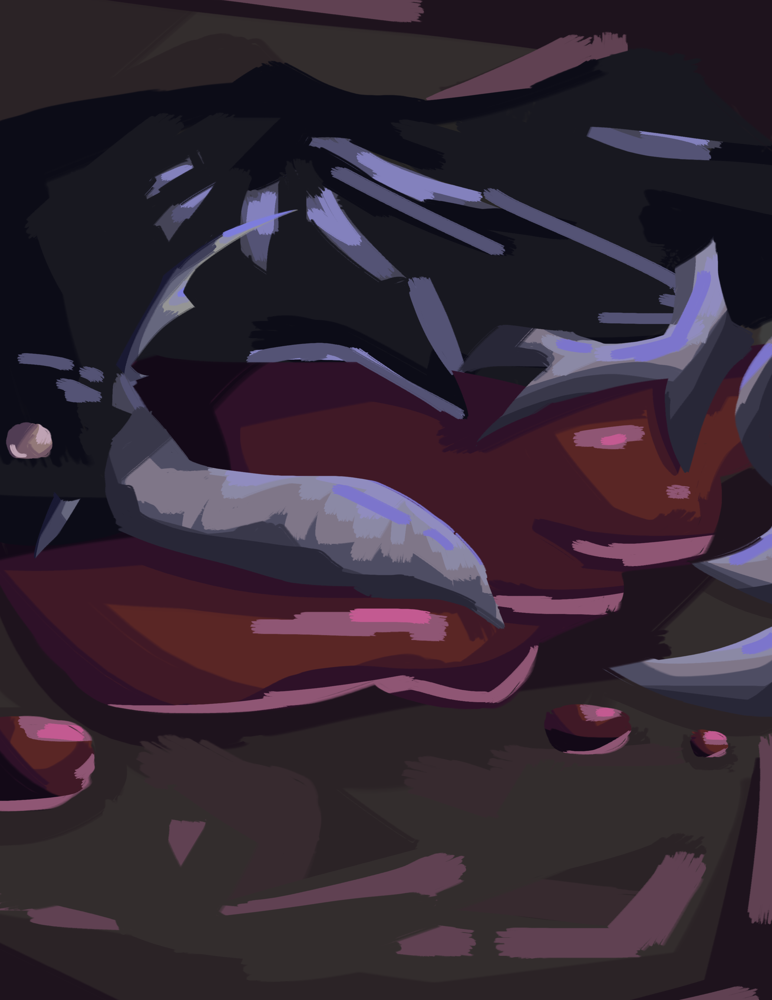
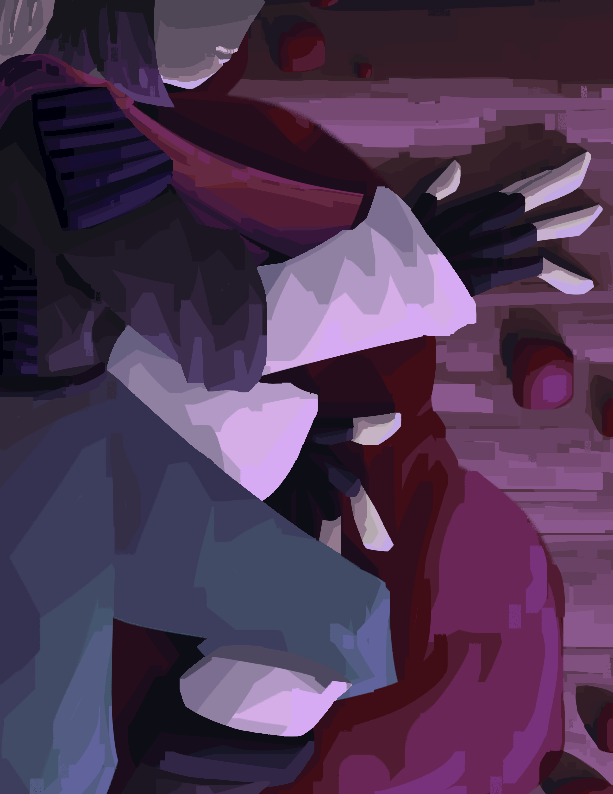
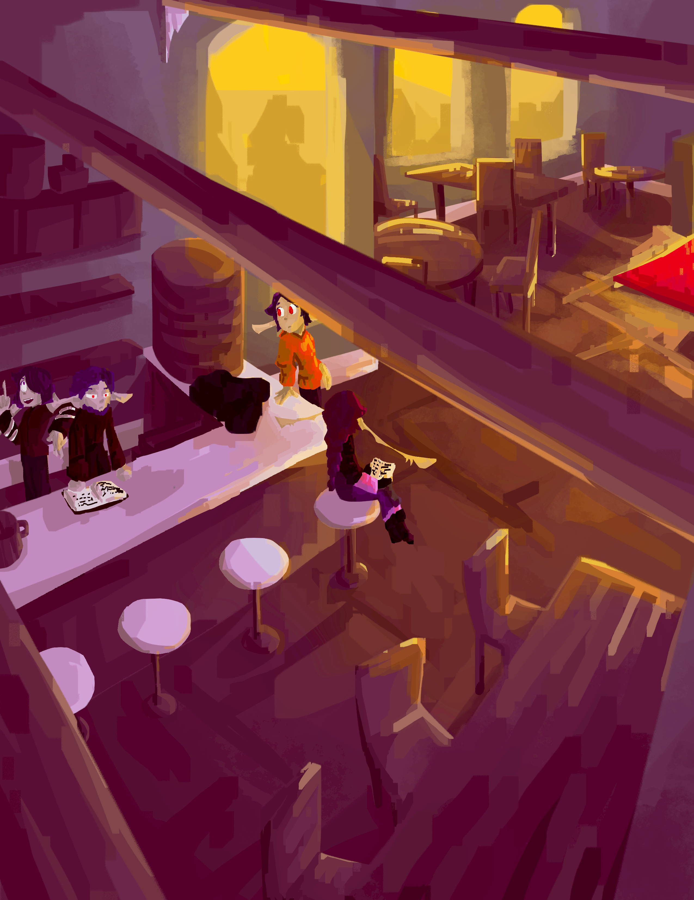

???+ tip

    I recommend using [this PDF](https://file.garden/Zi28N2lFSSn-KxkR/coa/COA%20I%20-%20Advent%20of%20the%20Haelborne.pdf) version instead of this article - it is more polished and the PDF format allows me to make it more visually appealing.

???+ tip
    
    I also recommend reading the ability descriptions, but if you're not into that stuff, just skim it over and you'll be fine. Maybe.

???+ warning

    Current illustrations are considered beta versions and are subject to change.

# Advent of the Haelborne

*Chronicles of the Aethein, Book I*
*By RatseerOfRattesse*

"In the pursuit of great, we failed to do good.” – Viktor, Arcane

## Prologue: Eating New People
*never ask a dysphorium about their dietary habits*

The Haelborne’s dimension ship was a grand undertaking, an enormous hunk of metallic material forged and shaped into a habitable vessel. Ritual diagrams shone across its hull, granting it the magic to cross between realities. For now, it was docked atop the sky-dome of Kaaldenvale, a reality encompassing just a single planet, doing nothing. For any other fringe interdimensional organization, this would be a massive and wasteful expenditure. But for the Haelborne, it was but one of their silent, thousand-strong fleet, out plundering the cosmos like the others.

This particular mission, however, was quite special. Both in terms of the objective… and who was involved.

Aboard the ship, in one of the lounges, was a fae and a dysphorium.

The fae were the local intelligent species of Kaaldenvale, somewhat resembling the elves of Earth folklore. Unlike those nature spirits, they were built for killing, evolved from highly predatory mammals – they bore such features as retractable cat-like claws, razor-sharp flexible ears, and jagged rows of teeth. This particular fae was a relatively recent recruit to the Haelborne cause, specifically for this mission. He announced himself Limril, and proceeded to blunder his way through various social situations with unasked-for factoids.

The dysphorium were nothing like the fae. A population of thousands scattered across the cosmos, with nowhere to call home, they roamed realities, slaughtering thousands with the power of an unchained soul. There was nothing keeping it from committing mass genocide on a whim, except for a lucrative deal.

This dysphorium was a nightmarish concoction. It had serrated blades incorporated into its limbs. Its face was dominated by a wide, ever-grinning mouth of sharp teeth. Its deep blue-grey hair floated in nonexistent wind, parted by a pair of twisting horns. From the rightmost horn hung an hourglass filled with blood red sand. Its name was Grim.

The two were playing a local board game. Limril was unusually enthused for his nonchalant and apathetic demeanour. Grim was alternately moving pieces and tasting them.

“Damnit,” Limril sighed. “Grim, can you not eat those?”

“I could…” Grim spat a bunch of twisted wooden scraps out of its mouth. “But my contract tells me I have to not eat the people.”

“How is that relevant?”

“It is.”

“How helpful.”

Limril sighed again and swept the board and pieces off the table. He waved his hand, and the board hovered its way across the floor and into a cupboard. Eyes dulling, he snatched a can of soda out of nothingness, popping it open and downing a gulp.

“So,” he said between sips. “You ready for dispatch to Javenshard this week?”

“What-shard?” Grim mumbled, its grin fracturing back to a mildly triumphant smile. “What’s to eat there?”

“Javenshard, Grim. A town. In Haelcrien. And you can’t eat anyone until we get scouting done. And then we have to figure out the arrangement with the Felheils…”

Grim blew a raspberry – which was quite odd looking, because it didn’t have lips, and its tongue looked like a spiked mace made from red flesh.

“Can I go negotiate with those guys? I love eating – I mean EATING new people.”

Limril stared at it.

“Fuck I said it twice. Anyway, why’re we going there?”

“The Fundament Glass, Grim. The reason we recruited you in the first place?”

"Recruited me? No, I think I recruited myself.”

“Of course you do. When you get powerful enough, it just seems like everything happens because you’re around.”

“It does because it’s true. So why are we after a piece of glass?”

“If you keep playing dumb, I am going to report you to management.”

“How many calories is that worth?”

## Chapter I: Everything Stops
*and that's on a literal and thematic level >:D*

Hello there. Reader, fae, sentient entity, monkey? I’m writing this little tome of misfortunes to… document things. For future reference, in case I… well I don’t know… I was bored.

“What are you writing?” Bia asks from somewhere on the left.

Is it just me or do ‘I don’t know’ and ‘IDK’ have different meanings nowadays? ‘I don’t know’ is something the protagonist says after the comic relief guy asks in a terrified voice, ‘what are we going to do’, or something like that. Then, on the other hand ‘IDK’ is just pure cluelessness. No ominous connotations with that one.

Ah. I went off on a tangent again. I gotta stop doing that.

“Hello?” Bia calls.

“Shut up.”

“Rude! Ari, have you ever considered that maybe the reason you have no frie-”

Loud pen scratching noises! Back to the topic at hand. Which isn’t really a topic. But whatever. Hey, it just occurred to me that anybody who finds this thing mysteriously unattended in another universe would think that top paragraph was the author making a lazy excuse so their perspective character could write in first person. Completely hypothetically. Not everything is sarcasm. Don’t be so cynical!... not that I can talk.

I’m writing this as I walk down a forest path with my sister. You might think this is a terrible idea and I should pay more attention while walking through a spooky scary forest infested with monsters and shit. No, I’m good. As a tier seven in the Gov’nance systems, I’ve gotten a lot of attribute points, twenty-seven of which are in soul. I can multitask way better than a regular fae. Took Bia and I, what, six years? to level this high – we’ve nearly reached tier eight too – and, oh, lemme tell ya, it’s worth it. I can run across the entirety of Javenshard in seconds! And to think people lived before the Governance came along. I mean, there is a lot of people who don’t use it… but those people are just lazy. And missing out.

Bia’s merrily skipping down the trail while still ranting about my social deficits – which I assure you do not exist. Bia’s two years older than me – I’m eighteen – and, contrary to the majority of sibling to sibling relationships, she’s always the one annoying me, not the other way around. I’m simply too dignified to give a shit about low hanging self assurement.

Bia’s real tall,  just over two metres. She has short but impeccably styled purple hair (a hallmark of the family). This is the Hastors’ fae colour palette, so we all of have it – though I wear it better than Bia, of course. Mother has it too, even though she married in – I swear it’s coincidence. I hope we’re not inbred – Father did always say we were descended from royalty and those fuckers are notorious for it. She wore her enchanted combat outfit, consisting of an armoured jacket with silver bands and cargo pants. Our ears stretch out far longer than the average fae, expanding about ninety centimetres to either side (another hallmark of the Hastor line – we’re really, uh, special). Three divots were carved into them from the bottom – ear shape was a feature unique to every fae, but the regs over there haven’t got the length to really be all that unique. Again, we’re special.

Compared to Bia, I’m some sort of gremlin. Height-wise, if that wasn’t clear. I have to assume certain levels of disability in anybody reading this (because it’s probably me).

I’m short for a fae, only one and a bit metres tall. My hair’s longer, styled super weird with a braid and multiple blatant violations of the laws of physics. My ears droop downward a lot. My gear (the non-conjured parts anyway) a parka with selective armour plating, with a red scarf layered over it. Not the most resilient – thank wealth inequality for repair enchantments.

“... and that’s why you suck and the gods hate you.”

I looked up.

“What?”

I totally heard everything she said. It’s just funnier to pretend I didn’t.

“Smartass.”

“Better than dumbass,” I grumbled, panning my eyes across the trees. “Speaking of which, you, and this idea.”

“Oh, it’ll be fine!” Bia replied, spreading her fingers. “The monsters here aren’t even that high level. They’re only tier… what, thirteen?”
I stare back with glaring intensity.

“And we’re tier seven.”

“Well isn’t that just tragic! But please, shut up and do the scan already.”

Rolling my eyes, I summon a weapon with the snap of a finger. A dagger flickers into existence in my hands. Blade of deep purple crystal, with red trails shimmering throughout, twisting and swirling like hundreds of miniature snakes.

???+ governance "Ability: [Voidburst Dagger] (Conjuring)"

    Incantation: none.

    Cost: meagre mana

    Cooldown: none.

    Damage Output:

    - Meagre, scaling with tier

    - Ethereal:

        - 33.3% Void

        - 33.3% Light

        - 33.3% Reality

    - Impact:

        - Stabbing

    Effect:

    - Tier I

        - Conjure a Voidburst Dagger

        - Minor boost to mana pool, crit chance, and crit damage, scaling with tier.

        - Dagger inflicts [Devitalized Manaturgy]

    - Tier IV

        - Inflicts [Adverse Manaturgy].

    - Tier V

        - Inflicts [Vampiric Manaturgy]

        - Consume health to increase damage by a percentage three times the health sacrificed.

    - Tier VI

        - If target is below a third of their mana pool, minor increase to global damage output, scaling with tier.

    - Tier VII

        - Increase mana cost to moderate to inflict [Harmonic Manaturgy] on caster and wielder.

???+ governance "Effect: [Devitalized Manaturgy] (Weakening)"

    Slowly drains mana at a rate of meagre mana/id.

???+ governance "Effect: [Adverse Manaturgy] (Damage)"

    When target uses mana, deal damage one twelfth of mana used.

???+ governance "Effect: [Vampiric Manaturgy] (Draining)"

    One fourth of mana removed from the target, whether by the target or through external activity, is given to the user.

    If mana is removed by [Devitalized Manaturgy], extraction increases to one third.

    If mana is removed while [Adverse Manaturgy] is in effect, extraction increases to one third.

    If both [Devitalized Manaturgy] and [Adverse Manaturgy] are used, extraction increases to one half.

???+ governance "Effect: [Harmonic Manaturgy] (Damage)"

    Increase damage of [Adverse Manaturgy] from summoning, casting, conjuring, and ritual type abilities by (target’s tier) %.

I twirl the dagger in a showy way, before sliding it into a scabbard on my belt. This bad boy had slain a lot of monsters and was one of the first abilities I’d acquired, from back when we first immigrated to Haelcrien and mother still had the heart (and sanity, can’t forget that part) to train me.

From my belt pouch (extradimensional!!!) I take a metal tablet far larger than the pouch itself. I tap the tablet three times with a finger like I had done hundreds before. After a brief moment, lines engrave themselves into the metal, creating a radar interface. A quick scanning animation follows, before dots appear around the area. I tap the closest one.

???+ governance "Creature: [Crienbeast] (Beast)"

    Average Tier: III

    Summary:

    A combination of rat and bear, with a bear’s bulky body and fur, but a rat’s tail and head. They possess sharp claws and teeth, razor tails, and a set of spikes along their backs that allow them to manipulate gravity to a small extent. They are unable to flip or otherwise redirect gravity but are able to lessen it temporarily in a small area.

“Pack of crienbeasts, tier four, two hundred metres that way.”

Bia cackled. She holds out her hand and chants:

“Fallen horrors in the gloom, come forth and ferry my doom.”

Red mist coalesces in her palm before expanding to form a massive scythe, with a blade of crimson metal and grip of black hide.

???+ governance "Ability: [Fel Scythe] (Conjuring)"

    Incantation: Fallen horrors in the gloom, come forth and ferry my doom

    Cost: meagre mana

    Cooldown: none.

    Damage Output:

    - High, scaling with tier

    - Ethereal:

        - 50% Necrotic

        - 50% Bleed

    - Impact:

        - Cutting

    Effect:

    - Tier I

        - Conjure a Fel Scythe. Scythe can launch small blood blade projectiles that deal minor damage.

    - Tier II

        - Attacks made with this weapon physically siphon a small amount of blood from the target.

    - Tier IV

        - Increases the strength of effect-based abilities. Negate affinity-based resistances.

    - Tier V

        - Inflict [Sanguine Decay].

    - Tier VI

        - Abilities used with this weapon equipped automatically change 10% of their damage output to bleed.

    - Tier VII

        - 5% of damage received while this weapon is equipped is mirrored onto damage source as bleed damage.

???+ governance "Effect: [Sanguine Decay] (Weakening)"

    Provides a slow damage over time effect until accumulating to 1000 instances. Upon reaching 1000, all instances are cleansed and replaced with one instance of [Necrotic Blight]

???+ governance "Effect: [Necrotic Blight] (Damage)"

    Instantaneously deals moderate necrotic damage. Continues to deal slowly deescalating damage for ten sec. before dropping off.

Without another word, she dashes off into the forest, heading towards the pack of monsters ahead. Decimating local species time. I’ve gotta write the rest of this after we finish fighting.

I rolled my eyes, conjuring a pair of wings before launching after my sister.

???+ governance "Ability: [Wings of Equilibrium] (Utility)"

    Cost: meagre mana

    Cooldown: none.

    Damage Output:

    - Low, scaling with tier

    - Ethereal:

        - 50% Holy

        - 50% Unholy

    - Impact:

        - Metaphysical

        - Cutting

    Effect:

    - Tier I

        - Conjure a pair of mismatched wings. Can be used to glide short distances for a minuscule mana cost per second.

    - Tier II

        - Project an aura that negates tier-based damage reduction. This affects every target within the aura, including you and your allies.

    - Tier V

        - Wings possess damage reduction on tier above current and can be manipulated as shields.

        - Wings possess damage one tier above current and can be manipulated to cut at targets.

    - Tier VII

        - Wings can now launch and propel flight on their own.

        - Wings passively move to deflect incoming projectiles. Projectiles can be redirected at enemies for a meagre mana cost.

With a rush of wind, I landed in the middle of a forest clearing, immediately knocking several crienbeasts off their feet. As stressed as I was in this over-ranked area of the forest, the thrill of combat rushed me right into the zone. Brandishing my dagger, I immediately leapt at the nearest monster, the sheer force of the launch tearing the poor thing’s head right off its body. It tumbled about for a few seconds while the rest of its Governance-given energy sapped away and it dissolved into a pile of assorted items. Normally monsters didn’t dissolve so quickly, but I must’ve hit that one too hard.

???+ governance

    [Enemy selected]
???+ governance

    [60%]
???+ governance

    [20%]
???+ governance

    [dead]
???+ governance

    You have defeated: [Crienbeast]

Bia dashed into the clearing just a moment later. Her scythe flashed into a black and red blur, whirling to spear three beasts through the stomach. Viscera spilled, tendons ripped, lots of other yummy fleshy things fell on the ground. Yet the three crienbeasts still stood, courtesy of their enhanced tier four attributes.

???+ governance

    [Enemy selected] x3
???+ governance

    [40%]
???+ governance

    [dead]
???+ governance

    You have defeated: [Crienbeast] x3

The poor creatures scrambled to re-assert their position – but NOPE, ‘cause I’m here to kick ass and other body parts too. A swarm of light blades dislodged from my outstretched hand, trailing fire and burning through poor, weak flesh. A second volley ensured their demise with a bonus cremation (for free!).

???+ governance "Ability: [Rain of Light] (Attack)"

    Incantation: Let the blaze of dawn light the blasphemous mind

    Cost: meagre mana

    Cooldown: 30 sec.

    Damage Output:

    - Medium, scaling with tier

    - Ethereal:

        - 50% Light

        - 50% Flame

    - Impact:

        - Stabbing

    Effect:

    - Tier I

        - Conjure a swarm of light spears. Each spear deals meagre damage, scaling with tier.

    - Tier III

        - Conjure an additional ring of larger light spears. Each larger spear deals moderate damage.

    - Tier V

        - Smaller spears inflict [Blinding Descension]

    - Tier VII

        - Spears can sap shadow out of a small area while airborne. This includes the life force of shadow-based and shadow-adjacent creatures.

???+ governance "Effect: [Blinding Descension] (Weakening)"

    Target acquires an affinity weakness to light and light-adjacent damages.

The rat-bear hybrids rushed forwards in a wave, claws flashing and teeth gnashing. Rocks and chunks of earth lifted as they ran, the spines across their backs lighting up a soft green as the debris shot forward. That was a neat little ability of theirs – manipulating gravity in a small area around them. Anyway, let’s let the little cuties run around a little more. It gets boring from here.

Within the span of a minute, the entire pack lay dead and disembowelled across the forest floor.

???+ governance

    You have defeated: [Crienbeast] x6

Ooh, aren’t the wafting scents of burnt flesh so nice in the pristine outside air? I know, they really are.

Leaves crunched as I stepped to the nearest body. I tapped a finger to the beast’s temple, brushing the thing’s fur with pleasure – there was loot to come.

???+ governance "Loot 1x [Crienbeast Tier IV]?"

I ignored the Governance window and proceeded to tap the other corpses, as Bia did likewise on the other side of the clearing. Windows stacked up rapidly before they consolidating into one.

???+ governance "Loot 10x [Crienbeast Tier V]?"

I mentally accepted the prompt, and ten bodies dissolved with a poof, leaving piles of neatly packaged monster parts scattered across the ground. Sheets of leather, bags of fur, bundled claws and spines. From Bia’s position came another poof, quickly followed by a whoop of surprise.

“Hoh!” Bia called from across the clearing. “This guy dropped a core!”

I immediately spun around. In Bia’s hand was what looked like a mangled electrical component, composed of a cube-shaped body and tangles of metal wire. Within the core shone a pulsing multicoloured light. These little things were manifestations of the Governance and were embedded in the bodies of all monsters it spawned. Rarely however, did one come out of the process in a usable state.

I did not see what I just described, however. In Bia’s hands was a pile of shining silver coins.

???+ governance "Item: [Depleted Lesser Governance Core] (Core)"

    Tier: IV

    Previously a [Lesser Governance Core], depleted after being used to construct a monster. Can be repurposed as a ritual or artifice component.

“Nice.” I shrugged, returning to collecting the other drops. I stuffed them all into a second belt pouch. Claws and fur, despite being too large to fit through the opening, simply shrunk as they approached the pouch before slotting into the dark space inside.

???+ governance "Item: [Extradimensional Sack] (Bag)"

    Tier: VII

    Manufactured by: Scruff & Grime Leathers

    A simple run of the mill leather bag- but bigger on the inside.
    Item capacity: 40 m.3

We gathered up the rest of the free money and trekked back into the trees and off to the shallower parts of the woods.

“Woo! What a haul!”  Bia exclaimed excitedly. She snatched a metal tablet out of her own belt pouch, fingers flitting about across its surface in practiced motion, cataloguing our operation today. “Two commissions taken, and a ton of bonus loot. Ari – aye – whaddya say we take a day off tomorrow?”

I just stared silently at the dome of scattered lights in the sky. Sorry Bia, I tune out a lot. This late in the day, the stars cast dim orange light onto the ground, though some of them had turned off entirely.

“Huh? Oh,” I muttered, returning her gaze to the forest in front of her. “It’s almost stardown. We should go faster.”

“Boring,” Bia chimed out, sliding the tablet away and jamming her hands in her pockets in a popping motion. “Nightime’s fun! That’s when all the real spooping monsters come out!”

“Y’know, I have a mild suspicion that that’s definitely not a good thing.”

“You’re no fun. I’m going to leave now, meet you at home later!”

In one movement spanning less than a second, she had completely disappeared from sight. With a blink, I pulled at the energy behind my eyes. A red sigil appeared in my vision, becoming smaller as it mapped itself onto my retreating sister’s back.

“Very funny!” I called. “Get back here!”

There was no response. The sigil became smaller, but I could still see in perfect clarity. Perks of levelling so high.

“Bia!”

“BIA!”

I sighed and continued through the melancholic forest. I walked at a leisurely pace, trying to conjure up some thoughts in my solitude. But my mind was empty. Adamantly content to simply observe the world.

I should stop being poetic.

Nah, fuck that.

Trees stretched into unidentifiable shapes.

Leaves chattered in whispers of forgotten languages.

Birds chirped and called distantly.

The shadows seemed… particularly mocking. Like a really really expressive chandelier.

And then everything stopped.

“What the- “

At first, I thought I’d gone deaf. In a place a tier zero would hear nothing, a tier seven could hear the smallest flickers in the environment, from the crawling of insects across the mildewed surfaces to the dripping of minuscule waters from trees to soft dirt.

But no, it wasn’t me.

Silence rang in an almost tangible wave. Something was wrong, something fundamental. I summoned my dagger, slowly turning on the spot, scanning the trees. Nothing else dared move or make noise as a Presence settled over the forest. I couldn’t distinguish any of its elements. It was a maelstrom of madness, merry and ecstatic with the cold promise of eternal unexistence.

I blinked, expecting another red sigil to appear. Nothing.

There were two explanations for this.

A: Something is nearby. Something far more powerful than myself. More powerful than anything I had ever fought, judging by what I felt in that Presence.

B: I am tripping balls.

My eyes slashed across the trees, picking out anything out of place before spotting it: a faint blur speeding forward. Cracks and groans echoed from its position as if reality strained where it stepped.

It was way too fast for me to run away. At least tier fourty based on that one time I watched skilled adventurers fighting higher-tier monsters in Troltano. I couldn’t match its physical speed, but I had years of combat experience. On pure instinct – without even a thought – an array of translucent blue shields sprang up in front of me, just in time to meet a swarm of metal blades.

???+ governance "Ability: [Shattersweep Shield] (Defence)"

    Incantation: none

    Cost: meagre mana

    Cooldown: 30 sec.

    Damage Output:

    - Low, scaling with tier

    - Ethereal:

        - 90% Light

        - 10% Mystic

    - Impact:

        - Blunt

        - Stabbing

    Effect:

    - Tier I

        - Conjure a floating shield. When hit, will absorb damage up to moderate damage, shatter, and send shards at the enemy, each dealing meagre shrapnel damage.

    - Tier II

        - Shards inflict [Fracture]. You can chain-conjure up to six shields, but each one will be less effective than a regular one.

    - Tier IV

        - Throw the shield as a projectile, periodically stunning and knocking back anything in its path. Shards detach from the main shield as it moves, each dealing moderate stabbing damage.

    - Tier VI

        - Merge up to three shields to form a larger shield. Larger shields cannot be used as projectiles but will follow user and can be moved in a small radius around the user.

    - Tier VII

        - You may now conjure up to twelve shields, each at the base mana cost.

???+ governance "Effect: [Fracture] (Weakening)"

    Target becomes more susceptible to ethereal damage and is occasionally hit with some void damage and multiplies this effect. Effect stacks.

The shields shattered. Stupid me, assuming my puny tier seven power could hold up to random tentacle monsters.

Blue shards danced outwards explosively before dissolving. In the split second time it took for the strikes to break through, I pulled my arms up to block the strike – and had them utterly eviscerated.

Blood spattered everywhere, strips of flesh peeling away. Tendons slithered out of my scrambled arms, pain flaring as the copper smell of blood wilted away from ripped meat.

So much useless, powerless meat.

???+ governance

    HP: [50%]

I stood there for a few seconds, almost disbelievingly.

It had been so long since I’d seen my own blood.

“Shit…”

It was at this point that poor little Aryon Hastor realized… that she had supremely fucked up.

I glanced up at the monster.

“Shit, shit, shit, shit.”

Eight eyes glowed with bright red glee, arranged in a circle surrounding a gaping jaw of metallic teeth. Dark hair floated in flailing strands, drifting through a nonexistent wind.

Why wasn’t it attacking?

Oh yeah. This would be a supremely comedic moment when it slapped me sixteen metres backwards through seventeen trees.
I should probably… run?

“Nope, nope – NOPE, GOODBYE!” I screamed as I conjured my wings and launched into the sky. “I think I’ll just be going this way now and you’re not gonna get anywhere closer or I don’t damn know what I’ll do MAYBE I SHOULD STOP HYPERVENTILATING AND FUCKING RUN!”

The whistling of wind through metal sounded as black tendrils topped with wicked blades surfaced around me. The entity barrelled upwards, closer, closer, closer and closer. I turned around just long enough for the Governance to analyze the monster. A window appeared in the corner of my vision. It didn’t help – in fact, I was now MORE panicked.

???+ governance "Being: [Unknown] (Dysphorium (Alt. 3152))"

    [Obfuscated]

    Entity does not have a root in Governance system

    Entity shares foreign magic system equivalent of your title [Dormant]

“WHAT DOES THAT MEAN?!!!! WHAT ARE YOU??!!!!!!!” I half cried. I flung light blades at the thing, screaming and crying my way upwards. Cackling drifted through the rancid air as a massive metal claw snatched me downwards. Debris detonated from the impact as I was slammed against a tree.
The entity didn’t move it’s main body, instead pushing me up the trunk with the claw attached to its tentacle.

It rattled its way closer, taking its time. Its Presence grew stronger, the layers of reality bending and warping as it slashed forwards, limbs distending with snaps and crackles. Finally, it reached the foot of the tree. Its head snapped upwards, eyes piercing my skull as it concentrated its Presence towards me. This was a technique only known by the most elite of adventurers. No sound could escape my lips.

“Hello there!” the entity cheered happily, like a preschooler with a new toy. “I’m Grim!”

Silence. I physically could not talk – the Presence still screaming in my veins.

“Oh, not up for a talk then? Funny! Straight to the chase then…” Grim’s eye sockets narrowed. It had no pupils, but this still achieved a look of persecution – or, to be less descriptive, a look of ‘I’m going to kill you and everyone you love and then I’m going to steal your tendons to make a blanket.’ “Would you be so kind as to hand over the Firmament Hourglass?”

The Presence relaxed slightly.

The Presence relaxed slightly.

The Presence relaxed slightly.

“W-what?” I shuddered, heart pounding through my chest. The trinket under my scarf seemed to become heavier.

Grim’s eyes narrowed further. It sighed and dragged its hand upwards. It had no fingers – the end of its forearm instead hosted three serrated, articulated metal claws. With a movement faster than I could see, it pulled my necklace out from under my scarf. At the end of the chain was that tiny hourglass, filled with blood red sand.

Oh, oh yeah. I definitely know what it wants.

“This little trinket around your neck, of course!”

So, I was stuck in a very bad position. I could be loyal and keep the treasure my clinically insane mother had adamantly told me several thousand times not to lose – or I could save my own life.

Wanna guess which one I went with?

“Uh, no.”

This was a completely rational and logical decision. You can imagine me giving a thumbs up right now.

The Presence returned in an instant, a reality-shattering aura thundering into place. Screams and wails echoed through my ears, the smell of soot and ash burning through my skull like the spilled internal bodily fluids of hundreds of ended lives. Another tentacle, this one topped with a massive scythe, unlatched itself from Grim’s back and ripped into my chest. Frankly, it was a miracle I was still alive. Tier seven blood coursed out of the wound, the vital force keeping her together spilling by the litre.

???+ governance

    HP: [40%]

“Perhaps I was not clear enough?” Grim cackled. “Honestly man, I’m STARVING. Best give me the little thingy or I’ll be forced to – eheheh – have a snack.”

“I have to uh – uh – go somewhere, I have – like, an appointment with my… anarchist!”

Grim raised another claw-hand. It dug further into my ribcage, tossing out various organs before picking up my heart and casually popping it into its mouth.

???+ governance

    HP: [5%]

I had no lungs to scream. No biggie. I’m sure everything will turn out okay. Sarcastic optimism is my coping mechanism!

“Relinquish the hourglass please,” Grim chittered, its tone as goofy as ever. "I need your soul’s permission."

I could only cough and splutter. This, however, was an advanced battle tactic known as DECEPTION, BITCH!

This method is also known as saving your most powerful move until the end of the fight for dramatic effect and definitely not because I’m too much of scaredy cat to manage logical thinking in a near death situation.

I raised a hand in a casting position, pointed at Grim. Four fingers stretched out as far forward as possible, the pinky folded backwards across the bottom of the thumb. There was a moment of silence, as Grim curiously tilted its head. Ooh, it had no idea.

I pulled at the energy under my eyes. Four red circles burned indents into my thumb, index, middle, and ring fingers. I grunted in pain.

Tendrils of piercing red light blasted from my fingers. Crackling erupted at an ear-piercing pitch as the red lightning shot towards Grim and sent the thing flying off hundreds of kilometres into the horizon. Panting, I fell to the ground, clutching the gaping hole in my chest. The flesh had already started to knit back together – thank the Immortals for ranked-up healing kicking in.

Crawling into a comfortable position, I reached into my extradimensional pouch, fumbling about before snatching out a massive bottle. It had an unbalanced top and bottom, almost like one of those kids’ science worksheets we did in first grade.

???+ governance "Item: [Reinforced Glass Bottle] (Container)"

    Tier: VII

    Contains: [Greater Sustenance Elixir]

    Manufactured by: Five Brothers Alchemical Goods

    A glass bottle with magical reinforcements, meant to contain powerful potions.

???+ governance "Potion: [Greater Sustenance Elixir] (Restoration)"

    Tier: VII

    Manufactured by: Five Brothers Alchemical Goods

    A potion that can completely restore missing health and mana.

I ripped off the cork and downed all the silver liquid inside. My wounds healed even faster, flesh and sinew flashing and flailing until it looked like there was never any damage at all. It was half a minute before I moved. Even though it had physically healed me, it wasn’t able to cure exhaustion.

Once the potion had done its job, I shambled upright. Again lifting an arm in casting position, I waved it in a ring and the red energy cut a hole in the world. Through the tear was my bedroom – not that my dreary state could interpret what I was seeing. This entire portal wasn’t even a conscious action. On instinct, I needed my bed. I slouched through the portal, collapsing on the plank floor of the room, before rolling to stare upwards. My vision faded to black, the last thing I saw the tinkling of candlelight against the grey ceiling.

## Chapter II: Vacation...?
*do I at least get paid*

The slamming of a door some distance away snapped me out of unconsciousness. I was lying across the wood-panelled floor of my bedroom, surrounded by a ring of ripped flesh and dried blood. Likely discarded material from after the potion kicked in. I glanced at the walls, clustered with shelves and shelves of assorted books, monster skulls, and my paintings of the Javenshard wilderness. Silently, I clambered upright, only to collapse against the wall next to the door. With a jerking motion, I slammed open the door with a slap of the hand, throwing myself against the upstairs railing as if fired from a slingshot. Movement with a fully repaired body after being recently near-deceased is a little tricky.

A coughing fit ensued as I snapped up to take the stairs down before –

“Ari!” Bia’s voice sang loudly from below. “You in here?!”

“Y-yes,” I spluttered, dragging my feet as I staggered down to our living room. Bia stood next to the table, looking expectantly at the stairs. Her grin faded. A terrible omen – Bia is always making that evil grin of hers.

“What the hell happened?” Bia immediately dropped all pretence of her usual giddiness. “I just got back from stealing Dan’s bottles, what did you do?!”

“I got attacked by a demon, that’s what!” I refueled with energy, glaring daggers at Bia. “This is why we don’t go ANYWHERE near the deep woods. While *you* were off pilfering the pub, I was getting mauled against by a bleeding ten foot tall metal monster!”

Bia paused, a rare look of hesitation on her face.

“And… what monster was it?”

Wordlessly, I sent over the Governance profile generated for the entity. With that done, I fell violently onto the couch, lying there contemplatively. In retrospect, the entire scene was a little kooky; it looked as if Bia was running a therapy session (which, Immortals forbid, she was definitely not qualified to do).

Bia read over the profile several times, eyes seeing but not comprehending – though that’s what she usually did. Dumbass.

???+ governance "> Item mailed from [Aryon Hastor]"

    Being: [Unknown] (Dysphorium (Alt. 3152))

    [Obfuscated]

    Entity does not have a root in Governance system

    Entity shares foreign magic system equivalent of your title [Dormant]

“’Not rooted in Governance system?’ And it shares your Dormant title, but in another magic system?” She coughed nervously. “Last I checked, we’re not living in a fantasy novel, right?”

“How in the twelve hells am I supposed to know?” I hyperventilated. “It hit me twice and I was near dead, I wasn’t contemplating the existence of something that isn’t compatible with the system our society has grown with since – since the Miruen Empire!”

Bia stared out the living room window at the black night. You could just barely see the houses along our street.

“We should tell someone this thing is in the forest. Nothing tier thirteen should be able to take out Ms. Perfect Hastor that easily.”

“Nothing at all should be able to take out any Hastor that easily,” I said, the still-lingering panic overriding her name calling. “How it even got through my passive sensory is a complete mystery. And who would we tell? You think the mayor of this dump can do anything about it? We specifically picked a low rank place like Javenshard to settle down – so we wouldn’t have to deal with crazy stuff like this!”

“You specifically picked Javenshard so you wouldn’t have to deal with crazy stuff like this,” Bia rolled her eyes, and added in a mutter. “Coward.”

“You shut it.”

“No, you,” She retorted with a natural cadence. That was one of her most used phrases, and it was so very annoying. “We can travel over to Troltano and go tell Father ourselves. Or find someone high-tier to take out the thing – Troltano is a tier fifty-sixty area.”

“I’m not going all the way out there while that demon is still around.”

Bia raised an eyebrow. “Why? It’s just a monster. It’ll find other prey and should know better than to go near busy, established roads, much less follow you about.”

I opened her mouth, then closed it, then sighed.

“It’s not after me. It’s after Mother’s hourglass.”

“You- “ Bia spluttered. “What? It’s sentient? It’s not an actual monster?”

“No, it’s not. Monsters are fabricated by the Governance to feed faevinity experience, you know this? So, what kind of monster is intelligently motivated not by sadism, but by a specific shiny trinket?”

“Why would it want the hourglass? The thing can’t use the glass’ powers, can it?”

“Don’t think so. It didn’t show off any reality-bending. But hells, I don’t know! It’s a spooky shadow demon, we didn’t learn about those in adventuring school.”

”Check the glass. Is there something on it? Some kind of tracking device? Anything?”

I gently pulled out the hourglass from my shirt. The blood red sands tinkled softly as the trinket moved.

???+ governance "Item: [Old Hourglass] (Accessory)"

    Tier: I

    A family heirloom of the Hastor line. Do not lose it.

“It’s still the same as ever,” I sighed, disappointed. “Perhaps I should report this to someone.”

“It’s still the same as ever,” I sighed, disappointed. “Perhaps I should report this to someone.”

“It’s still the same as ever,” I sighed, disappointed. “Perhaps I should report this to someone.”

“Ari you selectively deaf dumbass I said that a minute ago.” Bia exclaimed. “If that thing gets into Javenshard it’s going to obliterate everyone. Nobody here is high enough tier to even stand in front of it. Except for Mother, but you know what she’s been like since…”

I groaned. “Y’know, I could just send Father a letter.”

“Oh, you know what he’s like too. He won’t listen to us unless we go slap in him the face ourselves. Besides, a trip will be fun! We’ve been cooped up here for years, we gotta go somewhere else eventually.”

“And the matter of the murder monster after my face?” I glared.

Bia smiled sweetly, leaned forward.

“Oh, I’m sure it’ll be fine. Can we just have a regular, fun, vacation...?”

I only glared harder, purple pupils boring past a sheaf of hair and straight into Bia’s eyes. After a second of silence in which you could practically hear the cartoonishly escalating sound effect-

“Fine.” I relented. “I suppose it was about time I fought something higher rank.”

“Hells yeah!” Bia pumped her fist. “Nice. We should leave… tomorrow morning?”

“Fair enough. I don’t have much to pack.”

“Yes… I’ll call on Golden Boy.”

“Lloyd? Why?”

“Oh, and the Verosavens.”

“You want to bring them along too?!”

“Why not? It’ll be a fun little vacation!”

“Ugh…” I started, extremely unenthused. “Well… as far as I care it’s purely business. And Dan and Rosa are tier threes with non-combat specialties. They won’t last long if that thing comes after us, or if we’re out hunting.”

“They can sit the fighting out,” Bia shrugged nonchalantly. “If the thing’s after your hourglass it won’t care about them.”

“But – you - whatever…”

Bia pumped her fist again. It was extensively rare for me to put up with her bullshit, much less agree with said bullshit. A victory for her – I’d do something petty about it but I’m too exhausted from almost fucking dying. Grinning, Bia stalked over to the stairs and began climbing.

“Well, I’m gonna go get some sleep,” she chittered. “I’d suggest you do that too. We’re leaving seven in the morning tomorrow.”

“Noon,” I called, my gaze not leaving the ceiling as Bia ascended the staircase.

“Nine!”

“Noon, Bia.”

“Nine.”

“I hate you.”

Bia laughed and vanished upstairs.

***

I stalked my way through the forest trail, legs ripping right through the thorns and brambles. Weak early morning sunlight shone through the forest canopy, lighting up the blooming flowers scattered throughout the underbrush. Small streams ran about the weeds, blighting the dirt with moisture.
Though I was reluctant to leave the vicinity of Javenshard, I suppose we had earned a vacation. I’d worked hard to keep adventuring, and Bia… ahh, Bia did her best. I sound like Mother. Speaking of…

Her cabin was nestled in a jungle of bushes and vines. Stepping over a discarded watering can and towards the door, the soggy wooden steps creaked under my boots. I paused, cringed, but continued on. I knocked thrice.

For a moment, there was silence. I edged backwards against the rain-soaked railing.

Brisk footsteps tapped their way forward and paused too, and then the door swung open.

Duskir Hastor was seventy years old, but she looked only thirty thanks to a hard-earned tier sixty-seven life force. She still had at least a century left – one of the reasons many fae devoted themselves to ranking up. Eighty years always felt too short for me, even with my own extra time.

Mother wore a colourful poncho over a generic set of casual clothing. Her hair was deep purple like all the Hastors. Wild, violet eyes darted around the forest, unable to focus.

“Hello, Ari,” Duskir mumbled, still looking everywhere but at me. “What brings you to my cabin?”

“I have a request for you,” I said.

Duskir looked around hesitantly.

“Mother.”

“…come in.”

She scrambled back into the house and slammed the door. Typical Mother. I opened the door again and stepped inside, carefully closing it behind me.
Duskir sat in a rocking chair in front of a table, which was placed uncannily in the centre of the room. She never lit it; the crystal matrix kept the cabin heated had been on for years and I’m pretty sure she’d forgotten it existed. There was only one other chair in the room; Duskir didn’t have guests. I sat casually.

“So, dear,” Duskir asked mechanically. “What bothers you?”

I leaned forward conspiratorially.

“I was attacked in the forest last night. By something that shouldn’t have been in there. Something nobody in Javenshard can fight, except for you.”

Duskir’s eyes narrowed, a rare spark of sanity entering her gaze.

“Show me your logs.”

I mailed over the entity’s Governance description.

???+ governance "> Item mailed from [Aryon Hastor]"

    Being: [Unknown] (Dysphorium (Alt. 3152))

    [Obfuscated]

    Entity does not have a root in Governance system

    Entity shares foreign magic system equivalent of your title [Dormant]

“What in the…” Duskir glared at the message accusatorially. She sprang up, hands drooping oddly at the sides. “You aren’t pranking me, are you?”

“No.”

“I can’t help you fight that.”

“You know what it is?”

“Yes, and I can’t help you.”

“Then what is it?!”

“I don’t know.”

“You said you knew!”

“I’ve met it, but I don’t know what it is.”

I groaned. With Mother, it was more likely she had known but forgot.

“Never mind that,” I said in exasperation. With a flourish, I lifted the hourglass necklace over my head and placed it on the coffee table. “What can you tell me about this?”

Duskir leaned forward.

“Never mind that,” I said in exasperation. With a flourish, I lifted the hourglass necklace over my head and placed it on the coffee table. “What can you tell me about this?”

Duskir leaned forward.

“Never mind that,” I said in exasperation. With a flourish, I lifted the hourglass necklace over my head and placed it on the coffee table. “What can you tell me about this?”

Duskir leaned forward.

The sands tinkled softly.

“Isn’t that…” Duskir started. “That’s the Hastor hourglass. You know what that is.”

“Tell me, is it valuable?”

“Looking to sell it?” Her eyes narrowed dangerously – though her pupils still didn’t focus. “Don’t.”

“How tragic,” I said in deadpan. “Here, Mother, would you like a drink?”

I reached into my dimensional sack and pulled out a filled teacup, handing it to Duskir.

???+ governance "Item: [Polished Teacup] (Silverware)"

    Tier: Zero

    Contains: Bottled Truth

    Manufactured by: Drehmali Southern Utilities

    A simple and effective teacup.

    Enchantments: Disguise I

???+ governance "Enchantment: [Disguise] (Deception)"

    Effects:

    Change the name of an item or other valid Governance entry of or connected to enchanted item.

???+ governance "Potion: [Bottled Truth] (Deceptive)"

    Tier: L

    Produced by: Altegan Alchemical

    Induces a trance-like state that forces the user to tell the truth.

Duskir gazed at it until it her own Governance instance analyzed it. I’m not the best with anything other than fighting, really, so I’d been up all last night trying to fix this thing up. Quite proud of the results. Of course, I didn’t brew the potion, just did the enchantment. Tier fifty is too high for a measly tier seven like myself with mediocre brewing skills.

???+ governance "Item: [Polished Teacup] (Silverware)"

    Tier: Zero

    Contains: Roriodoan Tea

    Manufactured by: Drehmali Southern Utilities

    A simple and effective teacup.

???+ governance "Potion: [Roriodoan Tea] (Tea)"

    Tier: Zero

    Manufactured by: Roriodo Farms Inc.

    A soft tea produced from the meadows of the Roriodo River.

“Thank you, Ari,” she said, taking a sip. “I’ve always loved the local teas. They taste… honest… …honest… …honest…”

“Yes, indeed.” I said mock-professionally. “In fact, I brewed some of this myself. I’m learning, aye?”

“Well, it tastes wonderful, dear.”

“Of course it does, I made it,” Oof. Shouldn’t have said that. “Now, what can you tell me about the hourglass?”

“It’s an old family heirloom.”

“And where did the Hastors get it?”

Duskir’s eyes suddenly sharpened again.

“I’m not at liberty to disclose that information.”

But my eyes sharpen better. That’s completely irrelevant, but I… I don’t know what my point here is, actually. This is a dead end. Here, have some more cool dialogue.

“Why, have another sip.”

“I think I’ll pa– “

A line of red lightning sprang from my fingers, snapping Duskir’s arms in place.

“No.”

My other hand sparked lightning, picking up the teacup and tipping it down her throat.

???+ governance "Title: [Reality Warper]"

    Gives the user the ability to manipulate reality. This title is unrestricted but does not draw on mana, rather the user’s soul itself. Due to the stress it puts on the soul, it effectively grows in strength as the user’s soul does. Reality manipulation includes: reshaping/repurposing matter, duplicating matter, voiding matter, conjuring matter, and more.

“Where is the hourglass from?”

“It was procured by Matriarch Raelia,” Duskir spoke, her voice now lacking what little cadence it had before.

“And who is Raelia?"

“That – that is…”

“Useful to me,” I growled. The teacup tipped more potion into Duskir’s mouth. She went limp, twitching as she spoke.

“She arrived in the northern lands of the old Miruen Empire – just before the Empire itself fell. The first of the Hastor line. She claimed to be a deific entity and was the first of our line.”

“So, one of them con artists then,” I remarked, hands fidgeting with a spark of reality energy. It dissipated against my chair armrest. “Does the hourglass do anything?”

“As far as I know, it only enhances reality-bending abilities,” Duskir’s voice seemed to be sputtering out. Possibly a bad sign? Nah, it’s fine. “It allows us to use them for longer without spontaneously combusting.”

“That’s very enlightening Mother, I already knew that. So why do I have it?”

“I am to pass it down to the next eligible Hastor.”

“Why not Bia?”

“She refused it.”

“Huh.”

For the first time here, I was confused. I couldn’t see Bia – or anyone – turning down something like that. Hells, I’ll take any free item to even slightly enhance my abilities. More efficient monster hunting, more money.

“Well, this has been somewhat productive.” I gestured towards the door. “I’m going to... leave.”

I waved and left the cabin.

I pondered the information I’d stolen from Mother. I felt a little bad, feeding her a potion like that, but it was the easiest way to get to what I needed.
Though, now that I think it over, this information wasn’t worth much. It’s nothing pivotal. She’s just told me some generic worldbuilding crap that isn’t useful to the plot. Why does Grim want this thing? It’s just some old shiny trinket that it can’t even use because it doesn’t have the Hastors’ specific abilities.

It has to have some sort of agenda. Or is it working under someone else’s agenda???

Grim was insanely powerful. If it was working for something else, what kind of power did they have?

***

I sat on a stool in the Bearcroft Inn. No one else was in the building, as it was several hours before the usual opening time at noon. The inn was owned by Dan Verosaven, one of my childhood friends and one of the three Bia had invited along on their trip. We were supposed to meet here at seven with all our stuff packed (and with ‘a good attitude’, said Bia). Despite my previous complaint abouting getting up so early, I’d somehow ended up here before everyone else.

I was drowsily slouched over the bar, reading a book and only comprehending half the words. A shot glass was left empty on the counter. I had no reservations about drinking – good ol’ tier seven me was more than capable of processing alcohol in far larger doses than a regular normie fae. The headache and insomnia were more a result of the brutal beating from Grim. Magical healing was intensely potent at fixing physical damage, but often caused minor aftereffects as backlash.

The creaking of the half-polished front door roused me from my half-sleep.

“Woah, early today?” Bia called dryly. “Not slacking? Who, Aryon?!”

“Morning, Ari,” Dan followed with his scruffy, deep voice.

The Verosaven family was descended from an older line of craftsmen dynasties, all of which had a dark bluish-grey hair and bright orange eye colour. Dan was a twenty year old fae, with voluminous hair and a small beard, with a noble facial structure and eyes that were either expressly bored or jovially amused. His ears were regular fae length, just ten centimetres. A single barb hung at the ends of his ears, curving upwards to meet a strangely blocky formation. He wore a dishevelled tweed jacket over some casual clothes, his hands stuck firmly in his pant pockets.

“Ahh!” I called. “Good morning Dan. Where’s Rosa?”

“No ‘good morning’ for me?” Bia asked in mock hurt. “I’m offended.”

Dan shook his head and walked over to the counter to set down his backpack.

“*Be* offended,” I scoffed. “It makes me feel better.”

Bia raised a finger and was about to speak before the door slammed open and right into her face.

“WHAT’S UP?” A voice screamed at the top of her lungs.

Rosalith Verosaven pranced in with her usual over energetic demeanour, spinning and waving her arms like maniac, blue-grey ponytail flailing about like a whip. She wore a baggy bright orange hoodie, obscuring her one and a half metre frame. Rosa was the youngest of our group, born three years earlier than her brother. Her ears were a short six centimetres.

Funny little thing about the Verosavens. Back when they had Dan, they were kinda struggling for money. Lower class families here in this continent named their children with less syllables than higher classes. Then, a few years later, they sorta stumbled into a bit of an absolute bloody fortune just lying in the woods. Some kind of fully intact Governance component left behind by some monster.

It was around this time they had Rosa, and with their newfound fortune they could afford some more syllables. Of course, it’s not like they actually had to buy longer names. Just a culture thing that everyone respects around here - plus, it makes a goofy little anecdote I can use to break up the monotony of these idiots’ dialogue.

“Ugh…” Bia moaned in pain, creaking upright and rubbing her nose.

Dan waved silently from behind the counter, not looking up from whatever he was retrieving from the cabinet.

“Oh, hello Rosa,” I said. She glared at Bia, slumped against the wall, her groans getting steadily more comical. “Shut it, you. You’re tier seven, stop being theatrical.”

“Theatrical?!” Bia decried. “Why, I am in utmost pain! Have you no respect for the needy-“

A blade of light swung outwards from my wrist, stabbing into the wood next to Bia’s throat with a twang. The quiet noise of simmering wood filled the room for a brief few seconds before the blade disintegrated.

“As I said,” Ari cooed, miming blowing steam off a gun. “Shut your oral aperture in punctual time, please.”

“Hypocrite,” Bia muttered. “And a pedant too.”

“As I said,” Ari cooed, miming blowing steam off a gun. “Shut your oral aperture in punctual time, please.”

“Hypocrite,” Bia muttered. “And a pedant too.”

“Ari, please don’t fuck up my walls,” Dan chuckled, going back to his counter before popping out with a closed sign. “Ah, here we are,” he continued to the silent room. He walked over to the front door and hung the sign across the door.

**BEARCROFT INN**
**CLOSED**
**RENT IS NO LONGER DUE**

Dan slowly walked over to a seat and sat down, pulling out a notepad and pencil.

“Ahem,” Rosa loudly cleared her throat. “So… Bia, where’re we off ta? Ya said Ari had to go report some kinda HOA bullshit?”

“That’s extremely inaccurate,” I laughed. “I was attacked by a demon.”

“Spooky.” Rosa said in a bored voice. “So, yes, HOA bullshit.”

“What kind of logic - “
“A pair of large, obese ls.”
I dragged a hand over my face. Rosalith was equal parts annoying and enjoyable in conversation.

“Rosa, you didn’t steal some of my stock too didya?” Dan called, then pointed at Bia. “And I know what *you* did last night.”

“Absolutely no idea what you are talking about, Dan,” Bia said cheerfully.

“Okay then…” Dan said, narrowing his eyes.

“Nice,” Bia said. “Now that these unfounded accusations have been cleared… We all here?”

“We’re missing -”

“Thanks for the cue Ari - WHERE THE FUCK IS LLOYD?!”

“Here!” A voice called as the door swung open again.

“Oh, speak of the plot convenience!” Rosa rolled her eyes.

Lloyd rushed in, dropping a pair of extradimensional bags on the ground before quickly straightening up.

Lloyden was the last person Bia had invited along. His golden hair curled around his face neatly, topped with a red cap. He wore an unnaturally clean jacket that looked to be on the higher end of the quality spectrum. It was unlike him to be the last person to arrive to any given meeting, what with his constant obsession with acting professional. Must have had shitty parents or something, I dunno.

“Sorry I’m late,” He said profusely. “It’s simply the pinnacle of disappointment that I’ve delayed the proceedings of this gathering. I make clear my regret in - “

Rosa grabbed one of the chairs and slammed it into his chest. It didn’t hurt him - he was a tier seven adventurer like myself, and Rosa had no tier at all. He did, however, stumble back in shock.

“Can you all stop causing property damage?” Dan said, though he sounded just as bored as usual.

“That’s absolutely so very interesting,” Rosalie said, ignoring her brother. “Alright, thanks for the recap, Golden Boy, but we really didn’t need that much.” She turned to Bia. “What’re we doing again?”

“We’re going to Troltano,” I answered, as her neck snapped around to me instead. “To hire a higher tier adventuring party to clear out whatever attacked me last night.”

“Oh, Troltano. That’s in… what, the south?”

“Yes. At the border of the Sammemmnon province. You’ve graduated, you must know the local geography.”

“No, I’m stupid.”

“Hey, relatable!” Bia said.

Lloyd settled down on a bar stool next to Ari and pulled out a drinking flask, warily watching the chair he’d been slammed with.

“So!” Bia announced. “Does everyone have their luggage?”

A chorus of assent echoed through the room.

“Righto! Off we go then! I have the crabs ready in the lot.”

She marched right out the door.

“What does she mean by crabs?” Rosa asked.

“No idea, but it’s probably something stupid,” I replied, before following my sister outside.

## Chapter III: Crab Rider
*big crab*

???+ warning

    Chapter illustrations currently WIP.

“Those are not horses.”

Bia had apparently bought a bunch of crabs. Not a van, not a car, not even a horse. Three six foot tall crabs standing in the street outside the inn, each fitted with a saddle.

???+ governance "Creature: [Hexacampus] (Crustacean)"

    Average Tier: V

    Summary:

    A large crab creature, usually four or five feet tall. Its legs make up most of that height, as they are nearly vertical when standing. They shuffle like all crabs, but are able to do so at extreme speed, rivalling that of a traditional motorized vehicle. Because of this, fae use them as mounts, but they are rarely seen due to how hard to tame they are.

“Bia,” I said, annoyed. “Why in the seven hells did you buy hexacampi? How bloody expensive was this?!”

“Cars and horses are just so default y’know?” She exclaimed, leading one to kneel low enough to step on. “Now, six gigantic ass-kicking megacrabs? Not only is that just really frickin’ sick, this is also a golden opportunity to show off some kooky worldbuilding!”

“Interesting statement,” Dan said. He was still standing in the doorway, writing away on his notepad. Not even gigacrabs could shock away his stoicism. Rosa was already next to one of the hexacampi, rapidly flitting around it as she inspected the creature.

“I have some… concerns,” She said. “The practicality of riding creatures that walk sideways, for example.”

Lloyd raised a finger. “Faevinity have been employing hexacampi as mounts since the Miruen Empire. Though not commonly seen in Eorwin – “

“Shp-shp-shp,” Bia rolled her eyes. “Lloyd, just one sentence is enough. Look: These things are fast – and definitely sensible in the evolutionary landscape. Not that hard! I could even have cut off that part about the evolutionary landscape, but that adds a nice little tidbit of comedy, which is necessary for unknown reasons.”

Bia mounted one of the crabs and tapped its shell, which sent it rocketing off as she grabbed the straps attached to the saddle.

“Anyway, I had these for quite a while already. Trained em myself too,” She guided the hexacampus off down the street, past the inn’s garden and then circled back around.

“That’s fuckin’ sick,” Rosa exclaimed, eyes wide.

“I know right?!” Bia exclaimed back.

“I could run faster than one of those,” I scoffed, rolling my eyes. “Dan?”

I look up and spot Dan already on a hexacampus as it waddled off at a leisurely pace. He was still writing in the notebook, having ignored our bickering.

“Should’ve expected that,” I muttered, then moved towards one of the crabs. It snapped a pincer at me, so I conjured a knife and swiped back.

“Easy with the crabs!” Bia called. “They were actually pretty expensive. But we’re rich! But also, they were expensive.”

I glared at her, then the crab. The hexacampus eventually decided to kneel down, so I stepped on – though still with some difficulty. Four foot tall. Lloyd did the same with his.

Rosa hopped right up onto hers, which promptly zoomed off at a speed expected of a tier five creature. It whirled off down the street, Rosa screaming on its back.

“BIA! I thought you trained these!”

“Uh, yep, I did,” Bia said shiftily. “Jobber must be a bit excited.”

I turned to look at her incredulously as Rosa continued.

“How long ago exactly did you buy these?”

“A week! I got em from this guy I met at the inn.”

“We’re supposed to depend on massive crabs that you bought off a random guy in Dan’s inn, which you only trained for a week. Oh yeah, and they’re also the size of a car and have gigantic pincers.”

“Relax! It’s fine. I have a way with animals. I think.”

I looked pointedly at the rapidly re-approaching dot that was Rosa and the crab.

“Of course.”

“Ehehe. I told him to do that,” Bia whispered to me. I sighed.

“Rosa!” I called, ignoring Bia’s protests. “You should tell Bia to fuck off!”

“Why?!” She yelled back.

“It’ll be funny!”

“BIA! FUCK YOU!”

Eventually, we managed to get ‘Jobber’ under control, and we set off to leave Javenshard. There wasn’t a lot of luggage, as everything was carried in dimensional bags. I was quite glad to have bought those bags – absolute lifesavers, I’ll tell ya. Even so, they had taken quite a hunk out of our funds back when Bia and I bought them for the business. In the words of Bia, they were expensive. But also, we’re rich! But also, they’re expensive.

We rode out past the inn and towards the town’s walls. Towns here in the north of the Haequar province either built walls or made delicious meals for the monsters. The adventurers here may be able to mitigate that a little, but Javenshard was small enough that everyone pretty much knew everyone. Except for myself, of course. Yes, I had the great privilege of social skills! I just didn’t bother to use them.

Anyway, the town was small, so adventurers weren’t very common here. There were only three or four residents besides Bia and myself. Oh, and Lloyd, but he wasn’t local. Based on what I’d seen of their fights, the locals’ skills were… severely lacking. Even just Bia was an entirely different paradigm compared to them, and that’s saying a lot! To myself, they were children. Little little children, dabbling in the grown-up’s business.

Rosalie was fuming with Bia after the incident with ‘Jobber’. They were still trading increasingly nonsensical insults up ahead. Dan had joined in, not taking sides but simply overanalyzing every word of their conversation. I was sat on a hexacampus, riding next to Lloyd.

“So,” he said. “Are you alright?”

“What?” I said, surprised. “What d’you mean?”

“You look gloomy. Someone kill the cat?”

“Lloyd, what are you on about? Everything’s fine.”

“I don’t think it’s fine, Ari,” Lloyd said inquisitively. “Didn’t you like… half die yesterday?”

“It’s fine. You know the risks, Lloyd, you’re an adventurer too. We half die all the time.”

“That doesn’t mean it doesn’t suck.”

“Look, I’m fine,” I gestured, exasperated. “I got stabbed, I healed back up. The stabber was a little weird, but I’m fine. Stop worrying!”

“Okay, okay. I was just checking. Because, like, Bia’s kind of silly, and Rosa takes after her. And Dan is just weird. They don’t make the best support.”

“Heh. Bia is very silly,” I looked at the road, cutting through the forest. Bia, Rosa, and Dan were still chattering up ahead. “Well, thanks for giving a shit, but I don’t need it.”

“Ari, Ari. Alright, then,” He laughed. “Well, did you get anything valuable out of yesterday’s haul?”

“Um, I don’t know. Wait… yes! Yeah, Bia looted a crienbeast and got a Governance core. Sick, right?”

“Really?” Lloyd’s eyes went wide. “I’ve been adventuring two years and I haven’t seen a single one.”

“Hell yeah!” I pumped a fist. “We’ll probably sell it when we get to Evedast. I would have done it this morning, or when we get to Roriodo later, but there aren’t many people with the money nor use for such a thing.”

“And you do?”

“I’m rich. Adventuring pays great when you know what you’re doing. But I’m not much of a ritualist, no. Nor an artificer. I mean, I could probably make something with it – ”

“So you’re saying you don’t.”

“Welllllll I wouldn’t say that. I’m just, specialized in other things.”

Lloyd chuckled. “Right. Such as?”

“Killing, and more killing.”

“How diverse. I can at least do artifice.”

“But I can do that too!”

“Oh, really? What’s the best thing you’ve made?”

“Um, I don’t know,” I shrugged. “Lemme look through my bag.”

I swung the dimensional backpack onto my lap, reaching my arm in. Most high quality dimensional bags had a function that gave users an instinctual sense of whatever was inside. No idea how it worked - I’m not a ritualist. It was probably some sort of instrument that interfaced with the user’s aura (/Presence but we only use that for the spooky dramatic weirdos). Actually, why am I considering this when these things can fit a whole ass banquet table into a space the size of a fist?

Whatever. Anyway, I searched the bag for something cool. I’d seen Lloyd’s work – he made lots of magic items. Magic darts, potion belts, even some cool little knives I’d seen him engraving ritual circles onto. I’d have to match his standard.

I shuffled through the various objects. A potion, another potion, and a lot more potions. I hadn’t really made anything except potions. Then I sensed it – the puppet.

It was a white rabbit puppet, with no eyes, a massive open mouth, and a bow tie.

???+ governance "Item: [Rabbit Puppet] (Puppet)"

    Tier: 0

    Made by: Aryon Hastor

    *I don’t fucking know it’s a rabbit puppet.*

I didn’t remember making it, but it had my name on it. The Governance didn’t lie – I must’ve forgotten it. The puppet was simple, but it was also very high quality. It would do.

“Aha!” I said triumphantly, pulling the puppet out and dangling it from my finger.

“Is that… a rabbit?”

“I have no idea, but it has my name on it and it looks cool.”

I handed him the puppet, and he turned it over, inspecting it.

“Well, it’s not half bad.”

“Correct.”

“It’s fully bad.”

I shot him a flat look.

The crabs moved efficiently under Bia’s direction – a miracle, as Bia never did anything efficiently. After three hours of tireless riding, the walls of Roriodo came into view. Grand stone walls - which were, in reality, frauds! You think these poor, low tier villages could be even that capable? Nah, all of these are just metre thick walls with fear rituals in them. If a monster wanted in, they got in. They were just deterred from wanting it.

We passed through the gates, which had extra rituals on them cos they were extra flimsy. Inside, Roriodo was much like Javenshard. Settlements here often grew into series of rings, as a function of the Governance. The Governance made a point of infiltrating each and every aspect of fae life, and the building of settlements was just one of the many areas it helped facilitate.

I’d only been here once before, having crossed through it when Bia and I originally came to Javenshard years ago. The monsters were marginally higher rank back north, so I saw no point backtracking. Bia, however, did.

“Afternoon, Dahr!” Bia called from the back of her hexacampus as we passed by a man with a straw hat. He was digging through a coat with so many pockets it was more negative space than matter.

“Bia! Good to see ya,” Dahr raised a fishing pole from the rack next to him in greeting. “I see ye got yer dirty rich hands on a crabbo. What I wouldn’t give to fish up one of those things! Except, of course, a hefty sum of cash to one.”

“Of course, of course,” Bia laughed as we rode away. “Hope your next catch goes good!”

Dahr raised a hand in farewell, then returned to digging through his coat.

I steered my hexacampus towards Bia’s.

“You know this guy?”

“Oh, I know everyone here,” she replied.

“Everyone,” I repeated incredulously.

“Look, it’s not a bad thing to have a social life. Try it out sometime.”

Bia wasn’t lying when she said she knew everyone in Roriodo. I could swear that she greeted literally every civilian we passed by. And I use the term civilian specifically – there were definitely no adventurers here. Or at least, no adventurer worth paying attention to. I could probably decimate this whole town in a week! With Bia and Lloyd – fuck it, a day, tops. Adventurers as skilled as us are super rare ‘round the northen end of Haelcrien. 

Eventually, Bia brought us to the stables that she used when she’d come around Roriodo in the past (she rented a horse sometimes). They didn’t usually receive hexacampi, but Bia’s bullshitting, charisma, and mysterious goodwill with Roriodoans convinced em to deal with our rides. With those taken care of, we started looking for somewhere to stay the night.

“So, what’s it like here in these other northern towns?” Rosa asked me giddily.

“Ask Bia instead,” Dan said in his usual I-am-very-bored-and-therefore-cool tone. “Ari doesn’t leave Javenshard. She has no social life.”

“Why does everyone keep saying that?” I spun around, braid twirling.

“Because it’s true?” chimed Lloyd.

“That’s one know-it-all comment I can stomach!” Rosa said. Lloyd pumped his fist. “Okay, Ari, you’re boring.” She zipped to Bia’s side with speed that didn’t befit a tierless fae.

“So, Bia, what’s it like in the other northern towns?”

“Oh, it’s fucking weird,” Bia said. “And I like it that way. These non-Ari, happy and fun civilian types are really quite pleasant to be around and do indeed have a social life…”

I shook my head and walked along, panning my eyes over the street. The town was composed mostly from stone-walled cabins with wooden roofs, as was standard this far north and this far from true civilization. A rare few metal-scaffolding buildings were scattered around the town’s central square, but other than that, it was quite quaint.

“Ohhh yeah!” Bia spouted suddenly. “Rosa, Dan. We should get you some adventuring gear.”

Dan shrugged.

“Ooooh yes,” Rosa answered with matching enthusiasm. “Definitely. Must have. Fighting monsters? Cool as all hells.”

“Oh come on,” I said. “We can’t get you shit here. Roridio is not an adventuring town and I will not have my idiots going around in discount gear.”

“Don’t worry,” came Bia. “I know a guy.”

“You seem to know a lot of people here.”

“I have a social —“

***

Bia guided us to a box that was the picture of theatrically pretentious impure hermetic-cabin-in-the-woods-ness. Logs were stacked atop one another for the logs — but it was blatantly just a facade over some smooth and insulated wood and metal. The other, more obvious facade was the sloped roof, which was in fact just a flat decorative piece stood up on the roof of the building. It was like the building was trying harder to look fake than to actually hide behind its various pretenses.

What I mean to say is, it looked suspicious as hell.

Bia proceeded to barge her way in like an overconfident protagonist blissfully unaware of their various financial deficits. The wooded plank doors declined. I marched up next to her and pushed the doors to either side. They were sliding doors — I know my shady businesses.

“Oh bloody hells,” Bia muttered as I continued in. “Really?!”

“Haven’t you been here before?” Lloyd asked her.
	
“Yeah, but Noka keeps changing shit up. Marketing maybe. Why in Ayueso’s name does anyone use sliding doors?! They’re so goddamned inelegant.”

“Ayueso would not like scum uttering her name, I’d wager,” I drawled in monotone, walking up to a bench placed at the side of the room. I sat down and gazed expectantly at the door like a disappointed mother. “Also, the Trinity doesn’t exist. Basic firmament theory proved that two decades ago and we’re still dealing with damned Stagnants.”

“You say hells all the time,” Bia complained.

“The hells are cool, and — “

“Well actually, they’re a purely metaphysical space in which heat does not exist.”

“Shut the fuck up.”

The other three filed in as Bia walked up to the counter and rang a bell. We waited awkwardly until a tall woman in a discount sorceress outfit stumbled into view.

“Bia!” she said in cheerful greeting, trying too hard to fake an old woman’s voice.

“Hello, Noka,” Bia replied in the squeakiest tone she could muster. “Have you any burgers?”

They both burst out laughing.

“You do realize making inside jokes in front of people who don’t know them just makes you look crazy?” I asked.

“I am crazy!” Bia replied with a giggle.

“For burgers,” Noka added delightfully.

“Oh for fuck’s sake,” I sighed, pushing Bia away as she fell into a laughing fit. “Morning – Noka, was it? We’re here to get a pair of zeroes some adventuring gear. Loath as I am to believe in anything Bia recommends, the adventuring industry here sucks ass and you’re the only place we could find. As team leader –”

“Excuse me?” Rosa interjected. “Whoever said – “

“Me. We wouldn’t be out here if I hadn’t gotten mauled by a malicious fleshy cheese grater. As team leader –”

“As team leader,” Bia cut in joyously. “My job is to ensure my people’s safety –”

“And I demand a sample of your wares,” I cut back in, glaring at Bia. She had an odd ability to predict exactly what someone was about to say. Lloyd laughed.

“Oh, I assure you my wares are perfectly up to standard,” Noka said, leaning over the desk with a leering grin. I stared back with half-lids.

She unlocked the gate into the backroom and stepped in with a waving gesture. We followed through the door into a storage room the size of a walk-in closet. There was no equipment here; just piles of leather that I guessed to be dimensional bags. Noka poised to begin looking for something – then turned back around.

“Say, what archetype you going for?”

“Say what?” Rosa asked.

“She means,” I answered. “If you want to be a mage or warrior or seven foot tall globular mass or whatever the fuck.”

“What’s the coolest one?”

“Me. High skill high damage and zero margin of error.”

“Scout archetypes are pretty fun too,” Lloyd said.

“Lloyd, you’ve only ever tried that archetype.”

“And you –”

“My adventuring journey was a long succession of formulative experiences of emotional depth –”

“Fuck you Ari, you’re boring,” Bia jumped in. “As a support spellcaster with suspiciously offensive blood powers, I can assure you that my specialization –”

“Has a cool factor based entirely off eye candy and zero effectiveness.”

“Bullshit!”

“Look Bia, you barely ever contribute –”

“Hi,” said Rosa, holding up a green cloak and some light-looking fabric garments, lined with silver decor. “Can y’all shut up? I picked something.”

“Let me inspect it,” Bia said.

“No NO, you have no expertise in this field. I literally had to buy you your own gear because you went to the wrong goddamn side of the city and instead of heading back got drunk in some shitstand bar all fucking day at twelve fucking noon –”

“Woah, woah, woah!” Bia exclaimed, arms wide. “I have, no IDEA! what you are talking about!”

Dan wheezed in the background.

“You’ll have to tell us that story sometime,” Lloyd grinned.

“Whatev,” I reached out for the green garment and gave it a tap.

???+ governance "Item: [Huntsman Set No. 12] (Outfit)"

    Tier: 0

    Made by: Noka Aquiesce

    *Another hunter’s garb. Probably could have done better on the deco, but I’m a craftsman, not an artist. Sue me.*

    Damage Reduction

    - Moderate

    - Specialization:

        - Piercing

    Enchantments:

    - Self-Repair

    - Reinforcement

???+ governance "Enchantment: [Self-Repair] (Repair)"

    Effects:

    Equipment self repairs. If overly damaged, may not be able to recover.

???+ governance "Enchantment: [Reinforcement] (Reinforcement)"

    Effects:

    Enhances equipment durability and protectiveness.

“Told you scouts were cool,” Lloyd nudged Bia in my peripherals.

“Light clothing doesn’t make you a scout!” Bia shout-whispered.

“Oh that’s actually…” I looked back at Noka, who grinned irritably. “The hell are you doing in a dingy hole like this?”

“I’m rich and like making shit,” she replied. “I also hate dealing with the general public, so I only take customers Bia brings over. Which turns out to be a lot more than I expected on account of her having a social life.”

This comment prompted narrowed eyes to Bia. She smiled innocently.

“Valid lifestyle then,” I approved, then turned to Rosalith. “Archery, aye? I recall your aim was never the best w hen we played warball.”

“Practice makes perfect!” she replied matter-of-factly.

“Procrastination makes perfect,” Bia said.

“Perfection is a fictional construct, ” said Lloyd.

“Philosophers thou art not,” I sighed. “Rosa, I’m assuming you actually have the money for this.”

“Oh wait, money exists,” Rosa said in tongue of poor. “Noka, how much?”

Suffice to say she blanched at the number.

“And Dan – ”

“Way ahead of you mate,” Dan stuffed an armoured-something into a dimensional bag. Two blades with inset green gems lay against the wall next to him.

“How the hell did you –”

“Did you four not notice that I contributed zero dialogue to your threeway pissing contest? Rosa, I’ll cover your costs. You’re making dinner for a week the next we get back though.”

Rosa raised a finger, then put it down with a sigh.

***

We found a place to stay the night – which wasn’t very hard with how many times Bia’s been here. She’s probably got a bajillion discounts on every hotel in the town, little freak.

Dinner’s been had and I’m not describing the chaotic mess that was – the others are still down there screaming at each other. I’m up in mine and Bia’s room painting, pulling from memory. Tier seven lets me do that without getting a headache.

“So,” Lloyd says from the couch, putting down his book. “Where else are we stopping before Troltano?”

I put down another brushstroke against a tall alpine trunk.

“Another little town called Evedast. I think that’s about it. Can’t wait to get out of here so Bia can stop obnoxiously knowing every single little thing about – everything.”

Lloyd laughed.

“Yeah, she’s real annoying sometimes. Funny though.”

“Never admit that in my company, Lloyd.”

“Of course.”

…

I turned back to the painting and crossed shadows across the sky.

“So what’re ya painting?”

“Javen Woods.”

“Do you paint anything else?”

Now that I think of it, not really.

“I painted the street some times.”

“What about, people?” 

I cocked an eyebrow. A dark silhouette appears left-bottom canvas.

“Not often, and always from the back. People are weird. Good to sketch, but I don’t like painting them. Too many planes on the face. Weird topography and I can never get it right.”

“I see. Maybe try that sometime?”

“And who would I paint?”

“People you spend a lot of time with, I’d guess. Or yourself, that’d look pretty good.”

“I’m not putting up a painting of myself on my bedroom wall. It would look narcissistic.”

I glared a splotch on the canvas that would not look right whichever way I painted over it.

“Artists make self-portraits all the time.”

“And where’d ya hear that? You took art in school?”

“No no, I didn’t.”

“Actually, where did you learn to fight?” I asked, now aggressively stabbing the paint blob. “It certainly wasn’t in these backwaters.”

“My family actually comes from the Delirian Isles. We’re scholars, by tradition, but I wanted something a little different. I had a… falling out with them.”

“What happened?” I inquired.

“They didn’t like where my life was going,” he shrugged. “Assholes. I still keep in touch with my cousin Ramuj though. He’s a cool guy. Does work for the Eden Repository in Edenthein.”

“Nice,” I said, having run out of things to discuss. Holding a conversation was not one of my best skills.

There was silence for a while. I seethed one last time at that splotch before starting to take down the easel.

“I should probably go to sleep now,” I said. “Tier seven or not, rest is important – they always drove that home back in the big city.”

“Big city?” Lloyd asked.

“Where we immigrated from. Parents never bothered telling me and I took enough of a hint not to ask.”

“Odd.”

“I’m going to sleep now. You should probably go too.”

“Yeah, okay. See you tomorrow, yeah?”

“No shit, where else would we be?”

## Chapter IV: You Can Call Me...
*it’s really not as edgy as the title sounds*
**GUEST WRITER: IDI0CY | LINES 1-14**

???+ warning

    Chapter illustrations currently WIP.

Firstdays. Who even decided to call them that? Horrid. Sometimes I feel like this world is lazily scrapped together by duct tape and glue. 
Today we set out for Evedast, the next little shithole town in our path – though I believe there is a modicum of industry there. It’s a farming town, I think. Vyne fruit, for the wineries further south.

First order of business was to herd Bia’s obsession out of the stables we commandeered last night.  After a nice shower, I headed over to the stables where we put our hexacampi. The others were already there. Lloyd perked up as I arrived, being the only one not engaged in pointless bullshitting. Dan and Rosa are doubtless arguing about something. Bia pats and whispers sweet unworths to a hexacampus.

As I watched the interaction, a wave of disapproval washed over.

“Bia, how much did these cost again?” I asked her.

“I don’t know Ari, numbers are for nerds.” Bia said, not bothering to turn around.

“Ari, you’re looking way too deep into this!” Rosa, joyously. “Sometimes, you just need big crabs in your life.”

I sighed and started helping with the hexacampi.

The hexacampi’s eyes stared blankly at me, to an almost unsettling degree. Thankfully, I was able to hear Bia giggling in time and I moved out of the way before the crab trampled over me. Rosa wasn’t nearly as fortunate, getting kicked back a couple of feet into the cobblestone.

“I’m starting to worry about the combat effectiveness of this group.” Lloyd said, smoothly boarding his hexacampus.

“Everything is fine, you have my word,” Bia said dismissively.

“There seems to be a lot of those going around,” I said, before getting onto my Hexacampus.

“Does anyone know where Dan is?” Rosa said, dusting herself off.

“Right here,” he says from atop another crab.

“How the fuck do you do that?” Rosa jumped. “Did you rank up behind my back or something? Uber-level your stealth skill?”

“Some people are just better than others,” Dan says solemnly. His facade promptly falls apart into laughter.

“Also,” began Lloyd. “Skills don’t actually make you better at something.”

He then turned to look sternly at Rosa. “You’re an adventurer now, you need to know these things.”

I laughed, not sure if he was even joking. That was about the highest level of humour Lloyd had.

“He’s right.” I said as we began moving. “Adventuring is a life or death business. You need to know what you’re doing or it’ll become a death business.”

“Mhmm,” agreed Lloyd, perking up as discussion of his specialist topic cropped up. Oh, *that’s* probably why he’s always nerding out. From Deliria and all that. Dunno how it took me this long to realize that. “Skills are actually kind of useless. They don’t enhance your ability or limit your ability. They’re purely visual representatives.”

“Please stop,” Rosa said. “I did not sign up for an informative monologue.”

“Oh, we’re only just getting started,” Lloyd beamed. “It’s a long path to Evedast and no one culls the monsters out here. An encounter is inevitable. And I sure as hell am not letting any of you ungrateful fucks die to a big rat or a… beanstalk… or…”

“Or your own stupidity,” I finished. “Probably the largest factor, and that’s not a joke. Which is why it’s imperative you learn.”

“You’re all boring,” Rosa rolled her eyes.

“Okay, fuckin’ pissbaby,” Lloyd rolled his own eyes with the seven-times multiplier of tier seven speed. Well, it’s probably not actually x7. Ask the man himself, I’m no expert.

“He’s right, Ros,” Dan murmured offsidedly. “Fifteen and you still act four.”

“I’m sixteen dumbass!”

“I know, I get it wrong on purpose because I know you’ll be a *pissbaby* about it.”

“Little shi –”

“Hi, hello,” Bia jumps in, having finally mounted her own hexacampus. “Can we go now? I’d love to lazily quip about here for a few more hours but we got places to go!”

I laughed, but mounted my own crab regardless. “Never thought I’d hear you advocating for efficiency.”

“I am the secret backbone of this group,” Bia said in mock smugness.

***

The stars have reached their bright yellow high-noon luminance and we’re only about halfway to Roriodo – and somehow only just encountered a low-tier monster pack. By which I mean the first monster of the trip – magic levels are too low here. Miraculous for Haelcrien standards and for my writing load. Tier seven does not in fact trivialize pencil soreness.

“How far now?” Bia called from the back of the group. We’d set up a formation on approach to the monsters – such tactics were wholly unnecessary for myself, my sister, and Lloyd, but with zeroes in company it was better safe than sorry.

I checked my tablet. The ping location was still six hundred metres to our east.

???+ governance "Creature: [Voracrest] (Avian)"

    Average Tier: III

    Summary:

    A raptor looking monster. Possesses razor teeth and wings composed of many sharp cartilage fragments. Small three-clawed hands are attached to the ends of the wings. They are covered in feathers that stay soft until hit, at which point they harden to protect the raptor.

“Only a few hundred metres,” I said, checking my tablet. “Don’t you have your own scanner?”

“Nope!”

“Buy one in Troltano. Or maybe Evedast, but I don’t know how developed their adventuring industry is there. Lloyd, you can go in now.”

“Alright,” said the Golden Boy, then dismounted his crab and dashed into the trees with the scrape of daggers leaving scabbards.

“What’s he doing?” Rosa asked.

“Gathering intel in advance,” Bia said matter of factly. “Usually we wouldn’t for low-tier mons, but –”

“He’s killing all but two of the tier oners so you two can have a fair fight,” I corrected offhandedly. “Don’t sugarcoat things for them Bia. It’s bad practice and there’s no way exactly two tier one voracrest manifest. Sad excuse for a pack.”

“Oh, come on Ari,” Bia rolled her eyes. “Intelligent people might know so, but stupid is the Verosaven family motto!”

“That was unwarranted,” said Dan. He was somehow keeping his balance while standing upright on a moving hexacampus, putting on his armour.

“Fuck you,” said Rosa. She was miserably failing to tie the one knot on her weird enchanted cloak-thing, crouching on her mount while looking like she thought she was standing and this was a legendary feat of acrobatics.

Trees and shrubbery rolled past us as we inched closer towards the pack of voracrest. This section of the forest was closer to the more temperate centre of Haelcrien, so the trees spaced further, which meant we could take the hexacampi hunting without getting them stuck. I mean, maybe that would’ve been better. I’d have an excuse to cut em up north Haelcrien’s mostly inland, and I’ve never tried crab before. Heard it tastes good though. Also, it’d piss Bia off and that’s always a plus.

I checked the scanner again – fifty metres. Sure enough, my tier seven senses promptly picked up the oily scent of monsters. They all seemed to smell like that – probably a side effect of the Governance’s production process. You’d feel them too, like you could feel ranked fae and just about any ranked creature. Something about the whole Presence thing with the high rankers.

“Stop!” I called as my ears picked up the whistling of wind. Lloyd’s back.

The rest of the party halted their hexacampi and dismounted as a gilded blur spun into being in front of us, daggers still twirling in his hands as they reentered their sheaths.

“Cleared to two voracrest as requested,” Lloyd said curtly. The man was weird when adventuring; usually he’s more casual but the moment a modicum of danger comes into play he turns into a drill sergeant. He shrugs towards Dan and Rosa. “You can send the zeroes in now.”

I waved the party forwards, following the scanner.

“The *zeroes* have a name,” Rosa said, fooling around with a bow and arrow and definitely holding them wrong. I’m not expert but I still know some archery basics. The Verosavens, on the other hand, never took a combat education.

“Maybe it’d have been prudent,” Dan said after an exasperated glance. “To hold off on giving this girl dangerous weaponry until she can take an archery course.”

“I’m sure she’ll be fine,” Bia said, conjuring her scythe. The siblings should be able to handle this one, but better safe than sorry. I summoned my dagger.

“*She* is right here!”

“And so are the voracrest,” I notified them. Right on cue, a shrill reptilian call preceded a blurry figure launching out of the trees. Rosa shrieked as a forty pound mass of feathers and scales crashed into her and began tearing at her with razor claws.

“You’re a ranged specialization, Rosa!” I called in the best approximation of encouragement my sarcastic voice could manage. I threw out a stack of shields between her incredibly non-durable gear and the voracrest’s incisors. She sighed in relief under the respite.

“Now, this is where you expertly roll away before –”

Another scream and the smell of fresh blood. The voracrest are on her again from the side. Immortals help us all, these people are too incompetent. And Bia, that’s not religious, that’s fact based. They found gods or some shit in the Void a few years ago and all the old trinitians are still freaking out. I turned away. Lloyd will clean up her attacker.

The other voracrest wooshed through the trees and at me. I punched the thing in the side and it spontaneously redirected at Dan, who seemed slightly more prepared and already had his shield up. With a surprising amount of precision, he spins with knife in hand and plunges it into the raptor’s chest.
“You seem oddly good at this,” I said.

“I’m an innkeeper,” Dan replied, taking out another knife and using the two blades like chopsticks in the soup of the raptor’s forehead. “You adventurers think monsters are bad, but customer service is a whole other frontier.”

Rosa stumbled over while downing a healing potion, her shirt covered in scratches and blood. Her flesh began to weave back together. Bia was looting the voracrest a ways away – Rose had done no damage to it and therefore would get nothing from trying to loot it. Strictly speaking, tier zeroes shouldn’t be using tier three healing potions, but Bia, Lloyd, and I don’t buy anything lower and it’s *usually* fine.

She collapsed by a tree and gasped passively.

“I think I’d rather serve drinks.”

“Good,” Dan said. “You can do that instead of making dinner as compensation for your gear.”

Rosa didn’t bother respond, groaning as her flesh sizzled to health. Dan tapped and looted the corpse, the currency energy flowing into him along with the experience. Bluish light enveloped him for a second – he grinned.

“Well wouldya look at that,” Lloyd grinned as well, walking over and giving Dan a pat on the back. “Welcome to the club.”

“Your membership is the lowest tier,” I added. “But at least the Governance isn’t an inherently capitalist system.”

“Well, the higher tier rank advantages are a little bit –”

“Lloyd, we live in northern Haelcrien. No high tierers are coming up here.”

“...Fair enough.”

“Oh, that’s nice,” Dan said. “”

???+ governance "> Item mailed from [Dan Verosaven]"

    You have [RANKED UP] to [TIER I]

    +6 Attribute Points

    +Resistance against [TIER 0]

    You may now live off of metaphysical energy instead of food

    To next tier: 1000 EXP

“Why don’t I get one?” Rosa asked.

“You did literally nothing except scream and get scratched,” I turned to look at her pointedly.

“And you, are a big meanie.”

“Aww, don’t worry Rosie,” Bia purred. “I’ll take ya out to murder a hamster later, aye?”

I shook my head with a laugh, then turned back to the competent one.

“We’ll set you up with a specialization ritual sometime later, yeah?”

“What’s that for again?”

I rolled my eyes. “Lloyd.”

He rolled his eyes too. “Ars, why me?”

“You’re the Governance lore guy,” I shrugged. “Makes sense.”

“Oh, come on, you know just as much.”

“And if I’m forced to explain it to specimens of this intellect I will have to kill myself.”

“Fine.” He dismissed his weapons. Dunno why he does that, he has sheaths. Actually, why have sheaths if his weapons are conjured??? “So, a specialization basically makes it so the abilities you manifest are all fine tuned to synergize with each other and have a cohesive theme. You can still gain abilities and rank up without one, but the power set gets disorganized and nothing works together.”

Dan gave a thumbs up.

“Right,” Rosa said slowly. “Got it. How d’you get abilities anyway?”

I slid a hand down my face. Sometimes I forget these two grew up here. 

“By trying,” I started. “That includes actually killing something, which you’ve yet to –”

Thankfully, Lloyd has us covered.

“- learn about, so it’s perfectly reasonable to be terrible at it the first time around!” He smiles a grin as gilded as his hair. Not that his teeth are, uh, yellow. Just shiny. “You get abilities when you do something important, when you cross a monumental point in your life. Dan didn’t get one here because he killed the thing way too easily, and you’ll probably need more danger to manifest something.”

“*More* danger?” Rosa groaned.

“Or you could take the coward’s way out,” I said irritably. “Buy an ability manifestation off of someone, though it’ll be hells expensive if it’s anything at all specialized.”

“Y’know…” Rosa moved her eyes in a rare moment of thought. “I could take making dinner for another few months if it nets me fireballs.”

“I’m on board with that.” Dan said.

***

Another few hours of travel later and the stars are dimming over stone walls in the distance. We’ve entered Haelcrien’s plains and you can see for kilometres in every direction – yet the lone impending shadow of Evedast is the only sign of civilization. It’s a miracle Haelcrien hasn’t been invaded by Carioneth yet. Our north is mostly uninhabited,low-tier land, and those fuckers are the most aggressive nation of the planet. If the Autumn Kingdom and it’s disproportionate population to ambient magic ratio wasn’t around, we’d’ve been conquered centuries ago.

Evedast fast approaches as the stars shy away. Vyne fruit orchards dotted with farmhouses wafted the smell of earth onto the path, as it transitioned from dirt and gravel to smooth stone-paved road.

“Will they even let us in at this hour?” Bia asked. Glad to see she was finally out of her area of expertise.

“Don’t know,” I shrugged. “I’ll bust the doors open if they don’t.”

“Oooh, careful around here,” Rosa sneered. “They might have actual competent adventurers in town.”

“No, doubt it,” I replied. “Monsters get scared off by the walls’ ritual inlays anyway, there’s no need. At most they’ll buy some monster parts from nomadic adventurers and they don’t come through often, it’s usually just merchants that bought the parts and carry them out here.”

“That’s still a chance…”

“Shut up, we’re here.”

Bia waved the hexacampi to an eerily synchronized stop before closed, impressive-looking gates. I hopped off and approached the door and gave it a knock. Interlocked ritual circles appeared on the wood in response to my touch, tendrils of glowing mist following. They tapped my fingers a few times and withdrew, satisfied. The doors swung open and closed behind us.

“Oooh, automatic,” Bia grinned. “Fancy. Maybe I should study ritual circles sometime.”

“Your work ethic wouldn’t let you, and you’d probably blow up the house too,” I said.

“Shut up.”

Bia and the Verosavs took the crabs to a stable while Lloyd and I went off to find a place to stay. I headed directly to the next ring-road as this one seemed to be residential. Commercial and residential rings usually alternated in the Governance’s city designs, with administrative sectors in the centre and other important buildings spread throughout.

Not many people were out this late, but the one man nearby seemed to heading directly towards us. Reddish hair, eyes, and beard, wearing an overextravagant sheriff’s hat and some manner of suit and combat robe mesh. Some manner of Presence too – Rosa was unintentionally right that there were high rankers in town. High rank meant either adventurer or nepobaby experience buyer, but incurred wariness regardless.

“Hello there!” said the man, waltzing over with hands in pockets. “Lost?”

“Not particularly,” I said. “Who are you?”

Lloyd pushed me back with an exasperated glare.

“Forgive my rude friend,” he said. “We’re doing fine, but thanks anyway. What’s your name?”

“You just said the same thing I did,” I told him.

“You are impolite.”

“I’m exactly what I intend to be.”

“Don’t worry ‘bout that, I was just as bad when your parents were in school,” he chuckled.  “Well if ya looking for a place to stay, there’s a nice inn down the street. Dollar Dragon or something, good room service and cheap price for six of you people.”

“Right,” Lloyd said. “...but how did you know we needed an inn?”

“You’re adventurers,” he said. “And tier seven at that. Not common ‘round here.”

I raised an eyebrow. Being able to tell our exact rank meant either an even higher rank than the twenty-thirty that I’d guessed, or a ridiculous attribute point allotment to Soul.

“Far enough,” I supposed. “So, what’s your name? Kinda dodged the question.”

“You can call me… Arodorros.”

“Odd name,” I said. “You high society around here? Aristocracy, however much of that’s left?”

“Oh, no, not around here. All the way from north Rueleva.”

“That’d be Dawne Kingdom territory. They don’t let people in nor out of that place. You can’t be from there.”

“Mhmm,” he shrugged.

“...Well, thank you for the advice,” I said. “See you around?”

“Certainly,” he smiled a little too genuinely, and walked off the exact direction he came.

I turned to Lloyd. “Stalker, d’you think?”

“Why would he stalk us?”

“Gods know. Maybe he really is from Dawne. The Unions don’t even know what those fuckers are up to, we certainly wouldn’t.”

“But… why us?”

“Might not be us. Some kind of generalized survey on Haelcrien adventurers or something.”

“I think you’re being a little stupid here,” Lloyd said.

“What?”

“Your hourglass.”

My eyes widened. “Fuuuck.”

“What’s with the darn hourglass anyway? And why won’t you just give it to Grim?”

“Well, god knows what Grim would do with it, and there’s no reason for it to keep its word and actually leave.”

“But it would’ve gotten you out without the whole breaking your ribs thing.”

“That’s… Lloyd, we can discuss this when we find a room and not the middle of a fucking public street.”

## Chapter V: MacGuffins and Morons
*at a perfect 1:5 ratio*

Arodorros’ was good on his word, at least. The inn he sent us to was decent enough – I sent Lloyd to fetch the others to this place. He left and returned in a minute’s time. I could probably take thirty secs, but I guess there is a lower limit due to having to speak at a speed the zeroes can comprehend. While he was doing that, I snagged us the rooms.

Lloyd sat down and summoned a can of soda from his storage space. Very sought-after type of ability – sadly, I never awakened such a thing. The manifestations for it don’t come often either, so they’re all bloody expensive.

???+ governance "Ability: [Dimensional Lockbox] (Utility)"

    Incantation: none

    Cost: none

    Cooldown: none

    Damage Output:

    - none

    Effects:

    - Tier I

        - Open a dimensional storage space.

    - Tier IV

        - Temporarily increase space available by continuously channelling mana. Releasing this function will dump the items contained in the extra space back into physical reality.

He took an experimental sip, then nodded approvingly. I rolled my eyes – he’s been addicted to this stuff ever since they started mass-distributing it. It’s just easy to get, I suppose – tastes like shit to me.

“So,” Lloyd leaned in conspiratorially, elbows on knees. “Tell me about the hourglass.”

I sighed, pulled the hourglass out from under my scarf.

It shook on its chain, red sand twinkling.

It shook on its chain, red sand twinkling.

It shook on its chain, red sand twinkling.

“So you know how my parents were some kind of high class in Rueleva.”

“That’s true? Thought you made that up.”

“Of course it’s true. I would never lie to you.”

Lloyd cocked his head. “Ari, you are a disgusting manipulative scoundrel. You would totally lie to me.”

“Oh don’t you fuckin’ – ugh. Whatever! My family’s prestigious in some obscure hellhole and this hourglass was passed down through the line.”

“Okay. That doesn’t explain a lot.”

“Damnit Lloyd, let me finish.”

He stared at me innocently.

“So, my bloodline can do this weird thing we call reality-bending.”

Lloyd choked and spluttered. “I’m sorry, what?”

I bent my fingers to cast and an arc of red lightning snatches Lloyd’s soda right out of his hands, spins it right around and sends it back to him.

“Like that.”

“So you have tele-fuckin-kinesis,” Lloyd gaped.

“Not just, ” I said, and turned his soda into an apple.

“Hey – what the –”

“More nutritious. Tier sevens need their nutrition – you wouldn’t want to present a bad role model to the Verosavs, wouldya?”

“Fuck you, Anyrysm tastes good. Apples are weirdly textured.”

“No they’re goddamn not.”

“Oh, you have no idea – whatever. The fuck d’you mean reality bending???”

“Basically, I can just… change matter. Move, reconfigure… all of that.”

???+ governance "> Item mailed from [Aryon Hastor]"

    Title: [Reality Warper]

    Gives the user the ability to manipulate reality. This title is unrestricted but does not draw on mana, rather the user’s soul itself. Due to the stress it puts on the soul, it effectively grows in strength as the user’s soul does. Reality manipulation includes: reshaping/repurposing matter, duplicating matter, voiding matter, conjuring matter, and more.

“That’s… really fucking cool,” he said, still looking shocked. “Also – COMPLETELY FUCKING OVERPOWERED? Why d’you get that?”

“No idea. Bloodline bullshit. But for most of them, it’s not so overpowered. The hourglass is the only thing that keeps me from burning to a crisp using it.”

“Ah. That’s… significantly less cool than I thought. But – still, that’s fucking sick for you.”

“Mhmm. I just don’t know why Grim would want the thing, much less this new guy Arodorros. Doesn’t make sense.”

“Ari, are you stupid?”

I raised an eyebrow.

“If it can supply the power for you to not melt into debris when otherwise you would… it’s probably pretty darn powerful by itself yes? And someone else could take that power and use it for their own purposes. It’s a great big MacGuffin of a battery.”

“That’s… that does make sense.”

Lloyd put down his apple after realizing he’d been holding it in drinking position the whole time. I pulled at my hair.

“So… ” I started, gathering thoughts. “So these two separate parties both want my mother’s old hourglass. Which means we have to fend off two separate parties on the way to Troltano.”

“Sounds fun!” Lloyd tried for cheery.

“Ughh… we’re so fucked.”

“Hey,” he patted my shoulder. “It’ll be fine. That Arodorros guy seemed friendly enough ya? Maybe we can just negotiate him out of here. And Grim hasn’t shown up this whole time. And us, we’ve got the fuckin, I dunno, something! We got this.”

I looked at him increduously. “You are so fucking weird.”

“No, you.”

“You.”

“Me, and you.”

“Acceptable compromise,” I laughed.

We shook mock hands, and I stared him in the eye. It was serious time.

“If Arodorros is actually from Dawne though, that implies a lot of political bullshit.”

“I mean… we’re asking your father to help out anyway, right? He’s your contact into the guilds and govs, he can get them to take up the situation from here.”

“Yeah, sure, but one… my father’s kind of an arse.”

Lloyd chortled. “You and me both mate.”

“Okay, buddy,” I snorted. “Two, dunno when you last freshened up on your geopol… but Dawne and most of Rueleva has triple the magic density of Haelcrien. Which also means that their people and assets are far more powerful. And –”

“And if Arodorros is got out of Dawne’s borders, it means he must be either ridiculously overpowered or an officially organized operative. Which means he also has either the Dawne Kingdom’s assets arrayed behind him, or the assets of an even more powerful entity.”

“Which means we’re fucked.”

“Well – hold on, not exactly. There’s always a chance yeah? Haelcrien doesn’t just have local guilds, we’ve also got branches of foreign guilds. Call in some favours?”

“Okay -” I said, then calmed myself. “Here’s the issue: we shouldn’t be having to deal with any of this. Listen to what you’re saying. You’re presuming we can just get my deadbeat father off his lazy gov’ning ass, which is a ridiculous presumption already, and you’re also just throwing around the idea of hiring high rank guilds and shit like we’re dicussing tomorrow’s breakfast. This is wrong.”

“Well, the hell else we s’posed to do?” Lloyd sounded almost angry. “We have to do something, we can’t just leave – abandon this. Grim will kill you if you won’t drop the damn hourglass and I don’t think you want to give it a nuclear battery or whatever. And we can’t just give some spooky foreign power the thing either, they could start a war or something!”

“Well,” I bit my lip.

“You’re not seriously considering – ”

I waved offhandedly.

“So? The big guns up in Avertine will handle it, or they’ll conscript the Autumnians in Sahrongard. There’s no way we’re stacking up against Grim nor Dawne, they’re not gonna send us to war.”

“You – you can’t just,” Lloyd facepalmed. “Ari. People are going to die.”

“People can run, and I’ll be sure to run first. And all you fuckers with me.”

“But people are gonna fucking die!”

“I just counterpointed that, Lloyd. Do you really care about all those doomed, or do you just like to pretend you’re a good person?”

I winced inwardly at my own words – that came out wrong. “Sorry, no, not that you’re a bad person but – okay, you are, but so is everyone else!”

Lloyd just shook his head.

“Whatever. We have to go to Troltano regardless. I’m making you and Bia will too.  We are heading to Troltano and dragging your father out of bed and then he’ll have the guilds save Haelcrien’s ass.”

“Hmph,” I went. “Lloyd, you know you can’t force me into anything. You can’t fight me.”

“Violence is only one form of persuasion.”

“And what else –”

The door swung open: “Hellooo!!!!” Bia called in, crunching down onto the sofa and setting down… also a can of Anyrysm soda. Bloody hell.

“I tried this drink you recommended, Lloyd,” she said with a smile. “Fuckin’ delicious.”

“It’s literally just liquid sugar,” I scoffed.

“Sugar’s good.”

“It’s bloody sugar flavoured water. It’s ridiculous in concept already, much less execution.”

“Whatev, tastes good,” she looked around and seemed to read the room for once in her life. “You okay Lloydie? You look a little red. Which is weird, you’re Golden Boy not… uh… I dunno, Reddish Boy. Radish Boy. Yeah.”

“Never call me that,” he said with an icebreaking laugh.

I turned to my sister. “We’ve got a lot to discuss.”

“Oh, ” she looked around with wide eyes. “I’m about to get loredumped aren’t I?”

***

After the annoyance of explaining something with higher than kindergarten comprehension levels to Bia, I’d taken a lengthy night’s sleep. We didn’t have to leave so early today – it’d be days until the next town and we’d end up camping in the middle anyway. Might as well relax a little.

It would’ve been lengthier if it weren’t for Bia.

“ARI! OI!!”

Fuck’s sake. I turned on the light. Bia had evidently left already.

“Bia, I could probably hear you if you just spoke regularly. Tier seven ears.”

“THIS IS FUNNIER.”

“SHUT THE FUCK UP!” came an unknown voice from the next room over.

Oh, yeah. We’ve been completely embarrassing ourselves, this is a public inn.

“Bia, be quiet,” I said in full confidence of her hearing, despite no response, and got dressed to find her before she caused any more disturbances. 

I found her in the inn’s main room in a quiet corner with Rosa, saturated in sweat and triumph, and Dan, saturated with mirth and ridicule. I raised an eyebrow.

“I took Rosie to hunt some monsters this morning,” Bia patted Rosa like a proud parent. “She did well enough to get ta tier one!”

“She almost died again,” Dan supplemented, and I was inclined to believe his version.

“I hate you all,” Rosa glared balefully at us.

“I didn’t say anything,” I smirked.

“Now you did.”

I laughed, as Lloyd came down the stairs, stuffing a book into his bag.

“We’re doing their specializations rituals now, yeah?”

“Yep!” Bia cheered. “Would’ve been earlier, if Ari could wake the fuck up.”

“Didn’t you just come in with Rosa?” I asked incredulously. “How would me not waking up have affected it at all?”

“Well, ya see here Ari, I had to blame someone and poor innocent Rosalie ain’t done nothing wrong, while you are a –”

“Disgusting manipulative scoundrel!” Lloyd finished joyously.

I sighed.

“Why d’you need me for the rituals anyway? Surely Lloyd could do it.”

“I’m all theory no practice,” said the Golden Boy, his knowledgeable facade peeled away.

“Really? You know I’m going to mock you forever now.”

“Don’t worry,” Bia said. “I’ve already been doing it.”

“Alright,” I turned to the Verosavs. “Have you picked a concept?”

“Beer,” said Dan. My eyebrows began levitating off my forehead – though the surprise was quickly quelled by Rosa’s incoming and very much expected statement:

“Nope!”

I’d write myself sighing again, but I think this diary’s already oversaturated with it.

“Right…” I turned to Lloyd. “You want to…”

Pleading eyes. Yeah, go on, I nod.

“Okay, so basically, the specializations like the thing that directs the way your abilities synergize –”

“You said that the first time I got mauled,” Rosa interjected.

“Oh, right,” Lloyd stopped and resumed with the speed of someone who’d forgotten he needed to speak at rate a tier one could comprehend. “Yeah, so you want to go with something super basic and general at the start that can be interpreted a lot of ways because you want versatility while you’re still deciding what to do so this ensures your shit goes well until you can put more effort into refining that specialization and it also leaves less massive weaknesses lying around as you’re not overspecializing into something before your power level can compensate for it and I’d recommend for like a – you’re doing a bow and arrow typa thing right – so probably something with agility based connotations like me and Arrs so like – well actually we didn’t really go for anything agility based haha – but anyway I’d say something to do with nature like Wind or Water or fuck it just go with Nature itself –”

“Lloyd,” Rosa put her hands up in a stopping motion. “Can we not? I’ll take Nature.”

“Wait – wait, but you need to – have to consider more than just –”

“It’s fine ‘Lloydie’,” I said. “Nature’s good enough for now. There’s no such thing as a bad specialization anyway, she’ll just have to refine it later.” I then turned to Dan. “But why Beer?”
“I like beer,” he said. “And no specialization’s a bad one, aye? It’ll work out.”

“Whatever,” I stood up and turned about. “We’re not just doing it here are we?”

Bia grinned. “I mean… why the heck not? It’s plenty open space here, empty in the mornings. Gives the locals a bit of a spectacle too ya?”

“Ugh. If we get kicked out I’m pinning it on you.”

“And then I’ll pin the innkeeper to the wall with a knife! It’ll be fine.”

“Arodorros is in town.”

“Ahhh he’s just some old man can’t do nothing.”

I ignored her, fetched a piece of chalk and a big wooden board from my dimensional bag. I placed the board on the ground in front of our little nest of couches and started drawing.

Ritual circles were the fundamental base of all Kaalvalese tech. The arrangement of the lines directs input aura energy in specific patterns to do specific things. A specialization ritual was among the simpler ones: the goal is to have the target’s soul bring out the concept it wants to use, prerequisite being that the soul has been exposed to that concept enough to use it. Fae souls are, by some quirk of evolution, inherently capable of this, so all that’s needed is to provide a power source for the integration.

To do this, I made a simple aura concentration ritual – swirling lines going inward, as aura likes to curve about. Some extra enhancements to stop the tap when enough is enough. I placed a governance core along each side of the circle and directed Rosa in.

“Okay…” she said. “Now what?”

“Reach for Nature, or whatever identification you have with it.”

“How the fuck do I do that?”

“Start by thinking about it, and maybe the soul will do the rest, or you’ll fail catastrophically and we’ll all laugh at you.”

She glared. “Not feeling very appreciated right now.”

“Welcome to the adventuring world,” Bia said mock dramatically. “As Ari will doubtless tell you, it’s a spoopy world of danger and daring, of risk and sacrifice. Watch your back, even around your allies, for truly, you may have none!!!!!”

“Shut the fuck up,” Rosa and I synced.

“Okay, so I’m thinking about Nature.”

“Yeah, keep doing that.”

It took until I’d set up Dan’s ritual that Rosa finally got it working. The chalk lines and flashed bright, healthy green before vaporizing, the light zipping into Rosa in a short lived localized tornado.

“Woah,” she breathed breathlessly.

That was a weird sentence. Anyway.

???+ governance "> Item mailed from [Rosalith Verosaven]"

    You have incorporated specialization concept [NATURE]

    Your specialization is now: [Nature] + [null] -> [Nature]

    Your abilities will now trend towards new specialization.

Dan was done not soon after.

???+ governance "> Item mailed from [Dan Verosaven]"

    You have incorporated specialization concept [BEER]

    Your specialization is now: [Beer] + [null] -> [Beer]

    Your abilities will now trend towards new specialization.

“Good,” I said, glad nothing had gone wrong. Small risk, but stupid people always make small risks bigger ones. “Now we’re done with that…”

I pulled two little blue marbles from my dimensional bag. They were both of the greyish sort of blue, swirling with patterns of jagged wind. Or maybe it was lightning. I’ve no idea, it just looked cool.

???+ governance "Item: [DASH] (Ability Manifestation)"

    Tier: 1

    A common dash ability contained in physical form.

“Your first somewhat combat abilities,” I grinned. “Don’t look down on its genericism. Dash is incredibly useful even to grownups like us three.”

They both took one.

“So, how do I take this?” Rosa asked. “Do I like, eat it or something? It looks kind of tasty.”

“That is in fact what you do,” Dan said.

“How the hell you know?” I asked him, surprised.

“I serve an inn. Most good innkeepers have telekinesis,” he replied. “I know you sheltered shit wouldn’t notice, but that is a thing.”

“Ah, okay. Very nice of you to say that way.”

They swallowed their Dashes.

???+ governance "Ability: [Dash] (Movement)"

    Incantation: none

    Cost: very low mana

    Cooldown: none

    Damage Output:

    - none
    
    Effects:

    - Tier I

        - Perform a rapid dash movement via meta energy rather than physical energy. Can be aimed any direction, even if you aren’t facing that way.

“Ooh, okay,” Dan read it over. Rosa didn’t.

“Sick,” she said, and crashed herself sideways into the wall.

“Good job.”

## Chapter VI: Advanced Interrogation Tactics
*secret tunnel*

The stars are rising and the bluelight is creeping over the trees again. No idea why the two morons had gone out so early – it’s pitch fucking black and tier ones can’t see. They’re out shopping for food – another issue with travelling with the lowtiers. Lloyden and I were off to buy some more emergency healing potions after I blew my last one on Grim, along with some other adventuring supplies.

Evedast, despite not having any adventurers of its own, saw many pass through it each week and so had a lot of decently supplied stores catering to us. We were able to find a decent potions place quite easily and then headed back off to a random tavern we’d designated as a meeting spot.

The door swung open to a completely empty room furnished with lot of red and gold deco and copious amounts of flowers. One banner hung from the ceiling beside the bar, on which was scrawled a word in Ruelevan-looking ideographs. This was probably one of those goofy foreign country-masquerading places. They’d serve you pieces of ‘foreign’ culture that were neither authentic nor tasty.

I stalked over to the bar and tapped the bell on the polished tabletop. 

Lloyd sat down. “This place even open?”

“They left the door unlocked,” I shrugged. “No closed sign no liability for us.”

“Criminal,” he jeered.

“And you’re in here with me!”

“But I had the presence of mind to question it,” he smiled.

“Accomplice then,” I snorted and sat down at a table. A minute later the bell had returned no response, so I gave up and waited for Bia and the Verosavs.

“What is taking them so long?” Lloyd asked, boredly scratching at some blemish on his wrist.

“It’s Bia,” I smirked. “She’s probably dragged them on a detour to a cheesemongerer or something.”

“Ohhhh yes I did!” said the devil now slipping into the room. “I mean, I wish I did, at least. Cheese is just too good. Totally should’ve, stupid me.”

“That’s… fair. Cheese is good,” I agreed as Dan and Rosa walked in behind her. The two of them both set down their bag of groceries on a table. Bia probably had her stuff in the dimensional bag. She could totally have fit the other two bags in as well – hasn’t, whether as some joke of her usual calibre or just ignorance.

“So…” Rosa asked. “Are we gonna like… get a drink or something?”

“Just stick something out from what you just bought,” I shrugged. “This place is empty.”

“...doesn’t that mean we shouldn’t be here?” Rosa asked, sitting down. Dan was pacing the tile floor – he liked standing, I think. “Are we trespassing?”

“They left the door unlocked. Who cares?”

“They seem to have left a lot of things unlocked,” Dan kicked at the floor and a plume of dust preceded the creaking of hinges.

“Dan,” I said. “There are a lot more elegant ways to open floorborne trapdoors, including ones where you don’t risk immediately falling in. You could just pulled it open with a hand or –”

“Ari, I’m literally fine,” he sighed. “Now, if Rosa’d noticed it instead…”

“Well you –” Rosa started.

“Guys!” Bia harmonized. “Can we stop and take a moment to consider we just discovered a – ” she tensed and sang: “SECRET TUNNEL.”

“Yes, and now we’re going to close it,” I said. “As a shopkeeper I could probably excuse a bunch of idiots entering my shop if the door was open, but I could certainly not excuse them crawling into my goddamn secret basement.”

“Oh come on…” Bia whined. “It’s a secret tunnel! Think of all the possibilities!”

“I’m not seeing anything down there,” Lloyd interjected, using that perception ability of his. It highlighted the outlines of things even through solid objects, which must get annoying in monster hordes. Not that we get those much around here. “It’s safe.”

“You’re seeing into one room. Who knows what lies in the next one, or the next? For all we know this shopekeeper could be a fuckin’ serial killer.”

“Oh well that’s just far-fetched,” Bia said. “That’s not a profitable profession.”

“Of all people here I thought you would’ve understood the importance of fun.”

“Well, I feel like there’s a lot of people that have grudges to resolve,” Lloyd said. “I certainly would love to kill some people I had previous terrible experiences with and the world would be better off without.”

Bia looked at him with a look of horror.

“Exactly, ” I snapped a finger at him.

“You two are crazy,” Rosa and Bia echoed each other, one joyous one worried.

“No, you are. We’re not going in there.”

“Oh, Ari, look,” Lloyd said. “I’ll head in first, I’m a scout, remember? Anything happens I’ll zoom right out.”

“We don’t know –”

“Whatever, I’m heading in. Be back in a few.”

“You –”

He jumped down the hole with a thud, completely ignoring the nearby ladder.

“Well, landing’s okay!” he called from below.

I groaned and slid a hand over my face. “You people.”

“Oh Ari, you worry too much,” Bia said. “Lloyd’s at least as capable as you are aye? And I’m sure you’d trust yourself to explore this thing.”

“Well, no, but also my mindset is a lot better equipped to –”

The screech of abilities firing broke out beneath.

“Shit,” my eyes widened. “Rosa, Dan, stay here. Bia and I will –”

“We’re coming, ” Dan said matter-of-factly.

“To goddamn die!”

“They’ll be fine,” Bia said. “Sounds like Lloyd’s winning, anyway.”

Right on cue, the signature golden light of his execute went off.

“Come down!” he called.

I zoomed down immediately. No longer able to fault him for ignoring the ladder, I suppose, but I was in a panic. I quick analyze the arrival room: red banners, perpendicular eyes overlaid on each other sown in. Wood flooring, lots of papers everywhere, nothing important, drop a lantern for the zeroes, next.

Lloyd stood in the next room over two bodies, cloaked in red and the sigils on the banners. This seemed to be some sort of storage room, and so was the next room in the complex. Both were filled with rows of shelves – why they hadn’t simply been merged was a mystery.

Bia, Dan, and Rosa arrived down the ladder just behind.

“Woah,” said Rosa. “Who are they?”

“Dunno,” Lloyd said. “Don’t think it’s anything good though. They attacked on sight and look awfully cultist-ey.”

Bia knelt down and pulled away one of their hoods.

“Looks local,” she said. “What d’you think they’re up to here?”

“Whatever it is they ain’t good at it,” I scoffed. “Lloyd was able to take them out. They wouldn’t have stood a chance if put up against any important forces Haelcrien has.”

“Well it could just be weak lackeys for a weak region,” Bia shrugged.

“I suppose,” I replied, uneasy. Turned to Lloyd: “Are you seeing any more of them?”

“Several,” he replied with a frown. “This complex extends a lot larger than it should. Definitely in violation of several building codes – next time Evedast administers a level upgrade it’s toast.”

“It’s going to get overwritten by a fuckin’ sewer,” I remarked. When settlements receives a level upgrade it restructures a lot of stuff by itself. However the Governance drafts upgrades is still unknown. There’s also been some conspiracies that the Governance is building secret complexes full of deadly toxic gases into cities, which I find not entirely far fetched.

“It’s definitely something illegal that they’re doing,” I said. “Maybe this is a serial killer hive.”

Bia snorted. “Oh come on, maybe they’re just… making cheese?”

“I’d forgive em for that,” Lloyd said. “They’re doing Haelcrien a good service.”

“Oh my god can you two focus?” I said, exasperated.

“Whatever,” Bia said. “Why don’t we just ask them?”

“Well,” Lloyd said. “They’re kinda dead.”

Bia slowly turned her head. Rosa went white. “What?”

“I thought you would’ve known,” Lloyd said. “You saw my execute go off.”

“Oh. Right. Couldn’t you have just… incapacitated them?”

“Bia, they came at me outta nowhere. My perception ability takes time to register things, instinct doesn’t.”

“Oh. Shit.”

Rosa stitched a smile back onto her face. “So like… are we gonna go in deeper…?”

“Myself and Lloyd will. You two stay back with Bia and – ”

“Lloyd, your ability can check the tier of the stuff right?” Bia asked.

“Yeah. The cultist guys are all tier threes.”

“Okay, Dan and Rosa can come then,” Bia said. “I’ll shield em.”

“You are not a defensive specialization,” I complained.

“Support is close enough,” Bia shrugged, then nailed mine and Lloyd’s eyes. “You leave them alive, please.”

“I’m a glass cannon and they’re underranked,” I said. “No guarantees.”

“Try,” she hissed.

I rolled my eyes. “Lloyd, let’s go.”

“Right by ya.”

We passed through the next storage room and the next room was some kind of office space with a chandelier. A light punch to the forehead knocked the hooded man at the desk to the ground.

Another few cultists poured through the doorway brandishing various weapons, all eerily silent. I parried away a knife and twisted a sword (and possibly the guy’s wrist) away, kneed the third in the chest and the fourth took a trip through the purple meatshredder that was my dagger and hand.

Lloyd finished them all off with an area stun spell. Golden light flooded forth.

???+ governance "Ability: [Consencrate] (Control)"

    Incantation: I warn of forces you do not understand; cede this land to deific hands.

    Cost: extreme mana

    Cooldown: 5 min.

    Damage Output:

    - none

    

    Effects:

    - Tier I

        - Apply [Stun] to all enemies in a circular area around you.

    - Tier III

        - Enemies in range are knocked out of the circle.

    - Tier V

        - Abilities in range of the circle with ongoing effects are dispelled for additional mana cost.

    - Tier VII

        - Enemies’ conjured weaponry is dispelled for additional mana cost.

???+ governance "Effect: [Stun] (Movement)"

    You are immobilized for 10 seconds if at the same tier as the source of this effect. If higher, time is reduced proportional to rank difference. If lower, time is increased proportional to rank difference at a much higher rate.

With how low-tier the cultists were and the bias towards low-ranks, Lloyd’s ability had them knocked out for a good few minutes. We had just finished tying them up when the last one leapt out of a side-closet – I grabbed them by the neck and slammed them against the wall. The hood flew off to reveal another local-looking fae woman, around thirty or forty. 

Lloyd called the others in for the interview.

“Coming!” Bia called. I turned to the cultist.

“So,” I said with finality. “What’s all this for?”

“None of your bloody business,” the cultist spat.

“Well, I am formally acquistioning this business and you’re going to goddamn tell me.”

“We’re just trying to live our lives down here,” she returned. “Piss off.”

“You attacked me on sight!” Lloyd protested. “Obviously ya must be up to no good –”

“Lloyd, stay calm. We’re in charge here, ” I leaned in closer. I think I pulled off intimidating quite well for someone four foot. “What exactly are you all up to?”

“None of your business.”

“Will it still be when I… rip your heart out?”

“Ain’t that a little extreme,” Bia said, walking in. 

“It’s probably like, poetic or something,” said Rosa playfully, though her smile was noticeably strained.

The cultist glared back adamantly. “You will have to reach into my soul and snap my faith before you get anything out of me or my compatriots.”

I glanced back. The others were still knocked out.

“We’ll see about that.”

“Ari, what are you…”

In a flurry of movement, I fished the little teacup of leftover Bottled Truth and tipped it down the cultist’s throat. Her eyes went a dull grey.

With a wide grin, I stepped back and clapped my hands in satisfaction.

“What did you do?” Bia asked, confused.

“Oh, just dropped her a little truth potion,” I smiled.

“Why the hell’ve you got that?” Dan said, suddenly interested. “Didn’t take you for a brewer.”

“An adventurer stays prepared,” I said, and turned back. “Now… what is the purpose of this complex? What are you doing down here?”

“I can’t tell you that,” said the cultist.

I frowned. The potion needed a bit to take hold. I gave it a sec.

“Okay, let’s try that again. Same question.”

“I can’t answer this question,”

“You – fucken – what?! Why can’t you answer?”

“It would violate the faith.”

“Some bullshit!”

Bia gave me a worried tap on the shoulder. “Um… Ari, maybe you just didn’t have enough…?”

“It’s bloody enough alright I studied that when I used this thing the first time!”

“What?” Bia narrowed her eyes and spoke in a voice very reminiscent of Duskir. Funny thing that she’s the person I referred to. “When else have you used this potion?!”

“Whatever. There’s no goddamn reason for this potion to not work unless this fucker’s sixteen ranks higher than she actually is!”

I sighed. “Okay,” I said, and pulled out my necklace. “Do you know what this is?”

“I can’t answer that.”

“Fucks’ sake!”

“Consider that maybe…” Dan started. “Maybe she’s just… really strong minded or something?”

I growled, face red. I stuffed the hourglass back into my shirt.

“Mind shouldn’t fucking matter.”

“Mind shouldn’t fucking matter.”

“Mind shouldn’t fucking matter.”

“Why not?”

“This thing strips away mind. Throws out all those fucked-false defences in the brain and makes the body talks straight to the soul.”

“That seems a little overkill.”

“There’s not a lot of ways to mind control people, so talking to stupid defenceless soul is much easier,” I said. “Fuck it, we’re out of here.”

“Wait – what about all the cultists?” Rosa said.

“Leave them here.”

“They’ll break out,” said Dan. “Tell people.”

“Let them. If they want to keep their little operation under wraps, they’ll keep to themselves. It won’t matter, and the guard won’t be able to find us regardless.”

“Well surely we should like, talk to them or something…”

Cut the rest out of my perception. I stalked right back outside, making sure to snag some of the documents lying around into my bag. I’d read them later. The Verosavs, Bia, and Lloyd announced their passage soon after with some racket and footsteps back in the other room.

Hopefully this has nothing to do with Grim and Arodorros. We’ve already got two parties on our tails; we really do not need a third.

## Chapter VII: Grim Hasn’t Even Caught Up Yet!
*foreshadowing is not a literary device*

Thankfully we didn’t encounter any more mysterious cultists. A few more trips around town for miscellaneous supplies and grabbing the crabs at the inn’s stables led us leaving just shy of noon. Somehow Bia had hypnotized the hexacampi into having navigation skills far above their synapse count, so Dan was making sandwiches on go with his telekinesis ability, Bia receiving orders to pass on to him. A normal scene at Dan’s establishment, complimented by crab cake still in the shell and a halfbrain moron at the counter.

“Speaking of which, I’d love some crab in the sandwich,” I said. Lloyd and I rode side by side, reviewing the documents we’d taken from the hideout.

“I’m not letting you eat the hexacampi,” Bia said. “Or consume any crustacean products in their vicinity. The main characters get the trauma, not their rides! Have some class.”

“I could really go for some crab cake right now,” Lloyd countered. “Reviewing legal documents makes you hungry.”

“You’ve reviewed nothing this whole time,” I said. “You’ve been eating a sandwich.”

“I’m tier seven, I can multitask.”

“But are you?”

He shrugged. “The mind is impenetrable. Whatever it is I say, you’ll never know.”

“Sandwich studying is not the same as document studying.”

“No, you,” he laughed in the mirth of inattentiveness. “Speaking of which, what’ve you found?”

“A lot less than if you’d help,” I replied, stuffing the sheaf of papers away.

“Okay, okay, I bloody get it. Can you get to the point?”

“It’s completely fucking indecipherable. These are like goddamn Deliran runes. Maybe if someone from Deliria could help, I might be able to understand it.”

“She’s got a point,” Dan shrugged as he slid me a sandwich. “Crab,” whispered.

“Oh shut up,” Lloyd said. “I dropped out of the family. I never followed their traditions and didn’t learn shit.”

Bia raised an eyebrow in my peripherals.

“Aren’t you some systemologist or something?” I asked him. “What’s it called, those people that study Governance mechanics to fuck with em?”

Lloyd’s eyes lit up red malice. “That is not what we do. Any exploits that come from ‘fucking around’ with the Governance are more likely to blow a city to bits than do anything useful.”

“I can see many use cases for blowing a city to bits,” Rosa giggled.

“That’s… fair, I suppose. But –” he snapped. “I bet those aren’t even Deliran.”

“No, they’re not. These are legal documents and mail letters, not ritual circles. But it’s still written in some fucking script I can’t read. So, help, please?”

Lloyd sighed and retrieved a paper towel to put down his sandwich. I guided my crab over to him and gave him a random document from my dimensional bag. He mimed adjusting glasses. Old habits back from not being tier seven and having vision issues. Or maybe just being a weirdo, I dunno.

“Yeah, definitely not Deliran. Doesn’t look like anything from the West at all, we don’t have ideographs this detailed,” he flipped the page over. “I’d almost say these look…”

His face froze. Whispering, low pitch for just mine and Bia’s levelled ears: “Dawnic.”

“Oh for fucks’ sake,” I groaned. “More of them? What are they doing, infiltrating Haelcrien? Actually – that could make sense.”

“Wait, wait,” Rosa asked. “What are we talking about?”

Bia shot me a worried glance. Dan leaned at us in interest as he handed Rosa her sandwich.

“Doesn’t matter,” I waved them off. I looked at Lloyd pointedly: I am reserving you for anti-evil-scheming and you will not be eating sandwiches. He smiled his eyes and we prompted our hexacampi to run ahead at max t-seven speed.

“Oi!” Rosa. “Get back here! Keeping secrets ain’t edgy, it’s emo!”

“Good quote,” Lloyd said, the two of us now a good few hundred metres ahead of the others. Hopefully Bia doesn’t let them get mauled by Grim or something.

“It’s certainly one of them,” I said. “Quite feeble if you were to ask me.”

“Which is why no one asks you. You and Bia speak like you’ve never spoken Eoresse yet you’ve been here long as the Verosavs. You also sound like you’re constantly having a voice crack.”

“That’s bullshit,” I raised a finger playfully. “You do that far more purely from not taking breaks in your sentences cuz you’re too damn invested in telling everyone the newest breakthrough in systemology or fucknot.”

“That was a pretty long sentence without a comma.”

“I use fuck as a comma. There were one or two in there, I think. Now. You’re sure that they’re FUCKING DAWNIC?”

“Oh, you bore, ya silly,” he laughed. “Yes, they were. At least, I think they are – I’ve never seen such complex ideographs on anything else. You know, my family once worked with some Dawnic machinery some dumbass stole from their borders – he didn’t live, but I guess they didn’t much care if we snagged some of their stuff…”

“Well,” I slid a hand over my face. “This is bullshit. I’m just trying to live out here and I’ve got a demon and a supernation on my ass.”

“Hey, it’s a cool necklace. And we’ve got a demon and a supernation on our asses. I’m not letting you get spit roasted by either.”

“A building can crush two ants as well as it can crush one, Lloyden. You wouldn’t be much help, just collateral. Also, work on your phrasing. So much time in the books and you’re constantly saying some, questionably, phrased things.”

“Pfft,” he spat. “I speak with intentionality and poise. You sound like one of those new age broadcast performers ‘cept you’re living sixty at twenty and your signal’s a bust.”

“Shut up,” I smirked and then sighed. “Oh, we’re going to need to go into hiding even after Grim is dealt with. I shouldn’t have brought the Verosavs – no, shouldn’t have let Bia bring them – now they’re in with this mess too.”

“Can’t you just give the govs the necklace? You kinda explained the situation last night but also you definitely did not.”

“Well, it’s kind of an important family heirloom. And you know Dawne isn’t backing off easily; I’m holding onto it. Without it I would not have been able to fend off Grim.”

“But… well, maybe if you handed it away you wouldn’t be such a big target for ‘em? They’re only after you for the ‘glass, so get rid of it and you’re good.”

“There’s also the fact that it’s extremely valuable.”

“Is it more valuable than your life? And don’t give me shit about you and your parents’ relationships. Duskir’s bloody insane last you said and you told me your father was an arse last night too.”

“No, not more than my life, no. But worth keeping.”

“Oh – godsdamnsit – Ari. This is the simplest solution. Just give it to someone else. Or better yet, throw it away.”

“No!”

“Please. Then we can be done with this. We can just have a nice trip to Troltano, file a report of conspiracies and demons and whatever, then have a happy waltz back home.”

“It is not that simple,” I glared. My fingers twitched.

“It is not that simple,” I glared. My fingers twitched.

“It is not that simple,” I glared. My fingers twitched.

“Come on, Ari. Aren’t you always going for the safe option?” he looked at me pleadingly. “This is the safest option. No one else has to get hurt, no one else.”

“I’ve told you no,” I crossed my arms. “That hourglass is the single thing that allows me to afford any risk at all. It is my safe option.”

“But is it safe for anyone around you?!” he snapped. “You’re a t-seven with according reflexes. Something higher tier comes after you maybe you can protect yourself, but what about the Verosavs? What about Bia?”

“It’s still a mighty good trick to have up my sleeve, innit?” I glanced backwards. Three idiot silhouettes were approaching. I turned back to Lloyd.

“Look,” Eye to eye, gripped his shoulders. “This is how it’s going to go. Haelcrien and the backers from Autumn Kingdom will handle Grim and Dawne. Meanwhile, we can move to Atlantan or something. I heard Tienarte is a pretty place.”

“You –”

I put a finger to his lips.

“The others are catching up. Quiet.”

***

I don’t get why Lloyd is so adamant about letting the hourglass go. Okay, so Dawne and Grim go away, but they’re still going to be looking for it aye? Shit happens anyway. And I’d certainly prefer that we keep something like that on our side. And he’s smart as me, so he’d know. Maybe even smarter – I bet that Deliran education and his attribute allotment certainly lean a bit that direction.

We’ve just set up camp in a little forest clearing, around a hundred metres off the path south. Three tents and Rosa fumbled her way into making a campfire no one asked for and almost burned the canvas right off one of the tents. At least the sausages she made over it tasted decent – despite half of them coming out as crumpled black husks.

You know, I’m still adjusting to not really needing to eat that much. Ranking up lets us just kind of harvest energy from the ambient magic around – and there’s a ton of that. It does take time, but a good night’s sleep is plenty to set me up for the day.

Food is still food, though. Salt is salt and sugar is sugar. Hells forbid someone liquify it though.

I munched down on a sausage as Lloyden and Bia discussed the new revelations. Well, tried to anyway. They’d already wandered off topic – thank god I have selective hearing. Witnessing a conversation out of hand from these two is a death sentencee – you know that trope of the incomprehensible being that fucks up your entire mind for looking at it because your brain is too stupid for such a concept? It’s basically that, but your mind is so below the subject matter being discussed that it kills itself out of second hand shame.

I wonder if that’s why we don’t see many eldritch deities in the wild. They all commit suicide via second hand embarassment. Oh, I think they’re being practical again.

“Well, I don’t get why you two are so stressed out about this!” Bia cheered. “Nothing’s really happened these past few days – it’s all been chill.”

“Oh, are we just forgetting raiding a fucking cult hive this morning?” I asked.

“I mean – ” Bia’s face darkened. “That was a little weird, I suppose.”

“More than a little,” Lloyd snorted. “Quite a performance, by the way, Ari.”

“I try my best,” I said dryly.

“Best was kinda shit then, aye?!” Bia snickered. “Couldn’t get a useful word out of her.”

“Probably just a stupid cultist,” I shrugged. “Didn’t have anything to say.”

“Yeah, right,” Bia grinned. “I appoint myself HIGH INQUISITOR! I shall handle all interrogations from here on!”

She did have half a point, I suppose. Whatever magic they used to resist soul-unveiling potions like that was either extremely esoteric or extremely powerful.

“Oh hell yeah!” Golden Boy threw my sister a fist bump. “Can I do the torturing? Ari’s a little pretentious with it.”

“Hey – I am perfectly serious when I –”

“Sure-o! Dream team unite!”

They cackled.

Eventually Lloyd decided to go sleep and left Bia and I sitting around. She turned to me before heading off herself:

“And, Ars, don’t worry so much, yeah? You’ve got eyebags.”

“You woke me up prematurely this morning, bitch.”

“Well, maybe you just have ambient eyebags or something. I dunno. But it’s all going to be fine. Grim hasn’t even caught up yet!”

“Don’t say yet, or better yet, avoid that sentence entirely. You’re jinxing us.”

“Oh, I thought you were supposed to be all against religion and superstitions and whaterver.”

“Just don’t, please. Let’s not take any chances.”

***

Bia woke me up again. At five in the fucking morning, with blazing loud shouting.

Now, I want you – well, hmm. You’re probably just future me. And my memory won’t be getting worse over gaining ranks. Whatever.

I want you to guess just what caused her to start shouting combat formations to a three combatants and a pair of idiots at five-fucking-sunrise in a forest clearing.

“Well, maybe you just have ambient eyebags or something. I dunno. But it’s all going to be fine. Grim hasn’t even caught up yet!”

Yeah.

Mad cackling and screeching came from somewhere nearby.

“Hello, hello!” Grim’s high drawl sliced its way around the trees. “You have – ehehe – TEN darn sec-ONDS to get movin’! I, am eating alla your poor arse today –”

“Shut the fuck up!” I projected my voice a few dozen metres left and mounted a hexacampus. Little trick Mother taught me a while back.

Dan slammed Rosa onto a hexacampus and took off. Bia looked at the last ‘campus without a rider and urged it to follow – we scrambled at t-seven straight back to the main trail. Screeching followed. Several trees collapsed in my peripherals.

“Okay, hold on – hold on!” Rosa said half-panicked half-excited. “What the fuck is happening?!”

“I’m happening, meat!” Grim again. Seemingly closing in. Red light was beginning to flare through the trees. A great big explosion preceded the creature busting through the treeline and onto the road.

“Bia!” I yelled. “Use the damn walls!”

“Oh, right!” she called back. “How, again?”

“Oh for fucks’ sake – THROW THEM!”

“AHHHHHHH –”

Dozens of solid concrete walls sprang up behind us, Bia swinging her arms wildly. I spun around and stood on my crab, my fingers spewing red lightning and light blades. Lloyd was also working next to me – the man had no ranged abilities but he always came prepared. A slightly underlevelled gun rained golden buckshot in Grim’s way. It wouldn’t score any damage but it’d certainly slow it down. Maybe.

“Oh, is this the HOA?” Rosa screamed. “Fuck off!”

“What’s an HOA?!” Grim responded, curious. Still clawing at the ground like a rabid dog though – and it’s definitely gaining on us. These hexcampi are not on par with a tier forty whatever-the-fuck-that-is.

“It’s like, these people that go around the neighbourhood and bitch about – WOAH!” Metal tentacles were burrowing through the ground – one had almost tripped their hexacampus.

“Watch the fucking ground!” I shouted, training one eye downwards.

“SORRY!” Grim screeched. “Keep telling me about HOAs!”

“Okay, so they kinda just come up to your house or your business or whatever and they like, I think they sell chocolate?! And also maybe dish soap –”

“Rosa, what the fuck around you on about?!” Dan said. He was placebo’ing himself into believing he was steering the hexcampus – it was steering itself, of course.

“Ari, I can’t hit shit! There’s too much dust!” Lloyd yelled. He bent right as some kind of metallic flake lit up red in flight. A blast echoed from behind us as it passed.

“I think the dish soap is supposed to encourage you to be a nicer person or something? I’m sure you understand, Big Clean wants to sell more dish soap so they have the HOAs –”

“OH, OKAY!” Grim had begun shouting after realizing it wasn’t very audible over all the chaos. “SO WHERE CAN I GET SOME DISH SOAP?!”

It launched out of the cloud of dust straight at my hexacampus, a claw outstretched. Lloyd shot it about fifty times but no dice – it kept barreling straight forward and pinned me to the crab, which bellowed an angry chirp and began spinning while still sprinting forward. For a crab, these things were pretty damn agile.

I brought up my greatsword to fend off the demon as it slithered several blade-tipped tentacles to assist its arms.

“You can get dish soap, eh –” Rosa raised her voice. “NOT HERE! LIKE, OFF IN THE AUTUMN KINGDOM!”

“WOAH, OKAY! I’LL BE SURE TO MAKE A VISIT THEN!”

“Crap, she didn’t fall for it,” Rosa cringed.

“MY PRONOUNS ARE IT/THEM, ASSHOLE! AND ALSO I AM NOT HOA!”

“THEN WHERE-YA FROM?”

I gritted my teeth, barely dodging a massive scythe-tentacle.

“I AM FROM BEYOND REALITY! EHHEAHAHA! YA EVER HEARD OF DIORVANA?!”

“NO, WHAT’S THAT?!”

Dan realized he was not indeed steering the crab and decided to start conjuring daggers at Grim instead. Unfortunately t-one projectiles weren’t doing much to it.

“IT’S LIKE, NORTH OF HERE, MAYBE! I DUNNO!”

“THEN WHY’D YA COME SO FAR HERE? I THINK –” Rosa gagged. “Sorry, too loud. Can you still hear?”

“YA!” Grim shouted, no longer looking at me. I chugged a resistance potion – my skin hardened.

“Okay, so why come all this way for us? I’m flattered.”

“Well don’t be! Just your mini-friend over here I need. And I’m getting paid!”

“By who?!”

“Someone out in the big bad cosmos, ehehe!”

Not Dawne at least.

“You belong there yourself,” I reengaged the demon and immediately took a slash to the eye, and a few more before –

I snapped four fingers in casting potion. Red lightning blasted a chunk off Grim’s arm and sent it reeling back. A sword swing and a follow up blast sequence launched it right back into the stratosphere.

“Keep going!” I shouted, bending down to retrieve a potion from my dimensional bag.

The hexacampi sped into the rising sun.

???+ warning
    
    Next chapter is WIP.