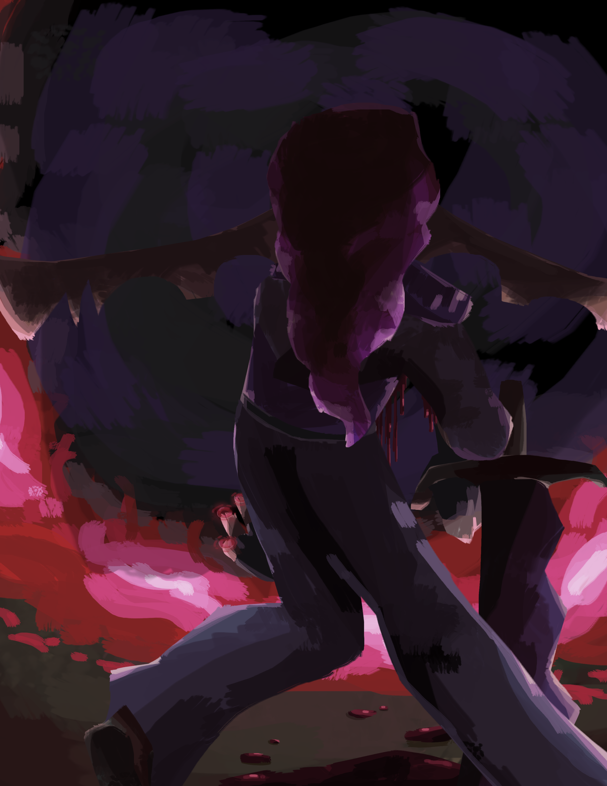

## Chapter I
# Everything Stops

*and that's on a literal and thematic level >:D*

I’m calling it – Bia’s getting herself killed today.

“What are you writing?” Bia asks from somewhere on the left.

Really. We’re a pair of tier sevens and she’s dragged us into the t-thirteen area of the woods. Some thrill and some mildly better loot is not worth death.

“Hello?” Bia calls.

“Shut up.”

“Rude! Ari, have you ever considered that maybe the reason you have no frie-”

Loud pen scratching noises. Ignore her.

I’m writing this as I walk down a forest path with my sister. As an uninitiated, you might think this is a terrible idea and I should pay more attention while walking through a spooky scary forest infested with monsters and shit. No, I’m good. As a tier seven in the Gov’nance systems, I’ve gotten a lot of attribute points, twenty-seven of which are in soul. I can multitask way better than a regular fae. Took Bia and I, what, six years? to level this high – we’ve nearly reached tier eight too – and, oh, lemme tell ya, it’s worth it. I can run across the entirety of Javenshard in seconds. And to think people lived before the Governance came along. I mean, there is a lot of people who don’t use it… but those people are just lazy. And missing out.

Bia’s merrily skipping down the trail while still ranting about my social deficits – which I assure you do not exist. Bia’s two years older than me – I’m eighteen – and, contrary to the majority of sibling to sibling relationships, she’s always the one annoying me, not the other way around. I’m simply too dignified to give a shit about low hanging self assurement.

Bia’s real tall,  just over two metres. She has short but impeccably styled purple hair (a hallmark of the family). This is the Hastors’ fae colour palette, so we all of have it – though I wear it better than Bia, of course. Mother has it too, even though she married in – I swear it’s coincidence. I hope we’re not inbred – Father did always say we were descended from royalty and those fuckers are notorious for it. She wore her enchanted combat outfit, consisting of an armoured jacket with silver bands and cargo pants. Our ears stretch out far longer than the average fae, expanding about ninety centimetres to either side (another hallmark of the Hastor line – we’re really, uh, special). Three divots were carved into them from the bottom – ear shape was a feature unique to every fae, but the regs over there haven’t got the length to really be all that unique. Again, we’re special.

Compared to Bia, I’m some sort of gremlin. Height-wise, if that wasn’t clear. I have to assume certain levels of disability in anybody reading this (because it’s probably me).

I’m short for a fae, only one and a bit metres tall. My hair’s longer, styled super weird with a braid and multiple blatant violations of the laws of physics. My ears droop downward a lot. My gear (the non-conjured parts anyway) a parka with selective armour plating, with a red scarf layered over it. Not the most resilient – thank wealth inequality for repair enchantments.

“... and that’s why you suck and the gods hate you.”

I looked up.

“What?”

I totally heard everything she said. It’s just funnier to pretend I didn’t.

“Smartass.”

“Better than dumbass,” I grumbled, panning my eyes across the trees. “Speaking of which, you, and this idea.”

“Oh, it’ll be fine!” Bia replied, spreading her fingers. “The monsters here aren’t even that high level. They’re only tier… what, thirteen?”
I stare back with glaring intensity.

“And we’re tier seven.”

“Well isn’t that just tragic! But please, shut up and do the scan already.”

Rolling my eyes, I summon a weapon with the snap of a finger. A dagger flickers into existence in my hands. Blade of deep purple crystal, with red trails shimmering throughout, twisting and swirling like hundreds of miniature snakes.

???+ governance "Ability: [Voidburst Dagger] (Conjuring)"

    Incantation: none.

    Cost: meagre mana

    Cooldown: none.

    Damage Output:

    - Meagre, scaling with tier

    - Ethereal:

        - 33.3% Void

        - 33.3% Light

        - 33.3% Reality

    - Impact:

        - Stabbing

    Effect:

    - Tier I

        - Conjure a Voidburst Dagger

        - Minor boost to mana pool, crit chance, and crit damage, scaling with tier.

        - Dagger inflicts [Devitalized Manaturgy]

    - Tier IV

        - Inflicts [Adverse Manaturgy].

    - Tier V

        - Inflicts [Vampiric Manaturgy]

        - Consume health to increase damage by a percentage three times the health sacrificed.

    - Tier VI

        - If target is below a third of their mana pool, minor increase to global damage output, scaling with tier.

    - Tier VII

        - Increase mana cost to moderate to inflict [Harmonic Manaturgy] on caster and wielder.

???+ governance "Effect: [Devitalized Manaturgy] (Weakening)"

    Slowly drains mana at a rate of meagre mana/id.

???+ governance "Effect: [Adverse Manaturgy] (Damage)"

    When target uses mana, deal damage one twelfth of mana used.

???+ governance "Effect: [Vampiric Manaturgy] (Draining)"

    One fourth of mana removed from the target, whether by the target or through external activity, is given to the user.

    If mana is removed by [Devitalized Manaturgy], extraction increases to one third.

    If mana is removed while [Adverse Manaturgy] is in effect, extraction increases to one third.

    If both [Devitalized Manaturgy] and [Adverse Manaturgy] are used, extraction increases to one half.

???+ governance "Effect: [Harmonic Manaturgy] (Damage)"

    Increase damage of [Adverse Manaturgy] from summoning, casting, conjuring, and ritual type abilities by (target’s tier) %.

I twirl the dagger in a showy way, before sliding it into a scabbard on my belt. This bad boy had slain a lot of monsters and was one of the first abilities I’d acquired, from back when we first immigrated to Haelcrien and mother still had the heart (and sanity, can’t forget that part) to train me.

From my belt pouch (extradimensional!!!) I take a metal tablet far larger than the pouch itself. I tap the tablet three times with a finger like I had done hundreds before. After a brief moment, lines engrave themselves into the metal, creating a radar interface. A quick scanning animation follows, before dots appear around the area. I tap the closest one.

???+ governance "Creature: [Crienbeast] (Beast)"

    Average Tier: III

    Summary:

    A combination of rat and bear, with a bear’s bulky body and fur, but a rat’s tail and head. They possess sharp claws and teeth, razor tails, and a set of spikes along their backs that allow them to manipulate gravity to a small extent. They are unable to flip or otherwise redirect gravity but are able to lessen it temporarily in a small area.

“Pack of crienbeasts, tier four, two hundred metres that way.”

Bia cackled. She holds out her hand and chants:

“Fallen horrors in the gloom, come forth and ferry my doom.”

Red mist coalesces in her palm before expanding to form a massive scythe, with a blade of crimson metal and grip of black hide.

???+ governance "Ability: [Fel Scythe] (Conjuring)"

    Incantation: Fallen horrors in the gloom, come forth and ferry my doom

    Cost: meagre mana

    Cooldown: none.

    Damage Output:

    - High, scaling with tier

    - Ethereal:

        - 50% Necrotic

        - 50% Bleed

    - Impact:

        - Cutting

    Effect:

    - Tier I

        - Conjure a Fel Scythe. Scythe can launch small blood blade projectiles that deal minor damage.

    - Tier II

        - Attacks made with this weapon physically siphon a small amount of blood from the target.

    - Tier IV

        - Increases the strength of effect-based abilities. Negate affinity-based resistances.

    - Tier V

        - Inflict [Sanguine Decay].

    - Tier VI

        - Abilities used with this weapon equipped automatically change 10% of their damage output to bleed.

    - Tier VII

        - 5% of damage received while this weapon is equipped is mirrored onto damage source as bleed damage.

???+ governance "Effect: [Sanguine Decay] (Weakening)"

    Provides a slow damage over time effect until accumulating to 1000 instances. Upon reaching 1000, all instances are cleansed and replaced with one instance of [Necrotic Blight]

???+ governance "Effect: [Necrotic Blight] (Damage)"

    Instantaneously deals moderate necrotic damage. Continues to deal slowly deescalating damage for ten sec. before dropping off.

Without another word, she dashes off into the forest, heading towards the pack of monsters ahead. Decimating local species time. I’ve gotta write the rest of this after we finish fighting.

I rolled my eyes, conjuring a pair of wings before launching after my sister.

???+ governance "Ability: [Wings of Equilibrium] (Utility)"

    Cost: meagre mana

    Cooldown: none.

    Damage Output:

    - Low, scaling with tier

    - Ethereal:

        - 50% Holy

        - 50% Unholy

    - Impact:

        - Metaphysical

        - Cutting

    Effect:

    - Tier I

        - Conjure a pair of mismatched wings. Can be used to glide short distances for a minuscule mana cost per second.

    - Tier II

        - Project an aura that negates tier-based damage reduction. This affects every target within the aura, including you and your allies.

    - Tier V

        - Wings possess damage reduction on tier above current and can be manipulated as shields.

        - Wings possess damage one tier above current and can be manipulated to cut at targets.

    - Tier VII

        - Wings can now launch and propel flight on their own.

        - Wings passively move to deflect incoming projectiles. Projectiles can be redirected at enemies for a meagre mana cost.

With a rush of wind, I landed in the middle of a forest clearing, immediately knocking several crienbeasts off their feet. As stressed as I was in this over-ranked area of the forest, the thrill of combat rushed me right into the zone. Brandishing my dagger, I immediately leapt at the nearest monster, the sheer force of the launch tearing the poor thing’s head right off its body. It tumbled about for a few seconds while the rest of its Governance-given energy sapped away and it dissolved into a pile of assorted items. Normally monsters didn’t dissolve so quickly, but I must’ve hit that one too hard.

???+ governance

    [Enemy selected]
???+ governance

    [60%]
???+ governance

    [20%]
???+ governance

    [dead]
???+ governance

    You have defeated: [Crienbeast]

Bia dashed into the clearing just a moment later. Her scythe flashed into a black and red blur, whirling to spear three beasts through the stomach. Viscera spilled, tendons ripped, lots of other yummy fleshy things fell on the ground. Yet the three crienbeasts still stood, courtesy of their enhanced tier four attributes.

???+ governance

    [Enemy selected] x3
???+ governance

    [40%]
???+ governance

    [dead]
???+ governance

    You have defeated: [Crienbeast] x3

The poor creatures scrambled to re-assert their position – but NOPE, ‘cause I’m here to kick ass and other body parts too. A swarm of light blades dislodged from my outstretched hand, trailing fire and burning through poor, weak flesh. A second volley ensured their demise with a bonus cremation (for free!).

???+ governance "Ability: [Rain of Light] (Attack)"

    Incantation: Let the blaze of dawn light the blasphemous mind

    Cost: meagre mana

    Cooldown: 30 sec.

    Damage Output:

    - Medium, scaling with tier

    - Ethereal:

        - 50% Light

        - 50% Flame

    - Impact:

        - Stabbing

    Effect:

    - Tier I

        - Conjure a swarm of light spears. Each spear deals meagre damage, scaling with tier.

    - Tier III

        - Conjure an additional ring of larger light spears. Each larger spear deals moderate damage.

    - Tier V

        - Smaller spears inflict [Blinding Descension]

    - Tier VII

        - Spears can sap shadow out of a small area while airborne. This includes the life force of shadow-based and shadow-adjacent creatures.

???+ governance "Effect: [Blinding Descension] (Weakening)"

    Target acquires an affinity weakness to light and light-adjacent damages.

The rat-bear hybrids rushed forwards in a wave, claws flashing and teeth gnashing. Rocks and chunks of earth lifted as they ran, the spines across their backs lighting up a soft green as the debris shot forward. That was a neat little ability of theirs – manipulating gravity in a small area around them. Anyway, let’s let the little cuties run around a little more. It gets boring from here.

Within the span of a minute, the entire pack lay dead and disembowelled across the forest floor.

???+ governance

    You have defeated: [Crienbeast] x6

Ooh, aren’t the wafting scents of burnt flesh so nice in the pristine outside air? I know, they really are.

Leaves crunched as I stepped to the nearest body. I tapped a finger to the beast’s temple, brushing the thing’s fur with pleasure – there was loot to come.

???+ governance "Loot 1x [Crienbeast Tier IV]?"

I ignored the Governance window and proceeded to tap the other corpses, as Bia did likewise on the other side of the clearing. Windows stacked up rapidly before they consolidating into one.

???+ governance "Loot 10x [Crienbeast Tier V]?"

I mentally accepted the prompt, and ten bodies dissolved with a poof, leaving piles of neatly packaged monster parts scattered across the ground. Sheets of leather, bags of fur, bundled claws and spines. From Bia’s position came another poof, quickly followed by a whoop of surprise.

“Hoh!” Bia called from across the clearing. “This guy dropped a core!”

I immediately spun around. In Bia’s hand was what looked like a mangled electrical component, composed of a cube-shaped body and tangles of metal wire. Within the core shone a pulsing multicoloured light. These little things were manifestations of the Governance and were embedded in the bodies of all monsters it spawned. Rarely however, did one come out of the process in a usable state.

I did not see what I just described, however. In Bia’s hands was a pile of shining silver coins.

???+ governance "Item: [Depleted Lesser Governance Core] (Core)"

    Tier: IV

    Previously a [Lesser Governance Core], depleted after being used to construct a monster. Can be repurposed as a ritual or artifice component.

“Nice.” I shrugged, returning to collecting the other drops. I stuffed them all into a second belt pouch. Claws and fur, despite being too large to fit through the opening, simply shrunk as they approached the pouch before slotting into the dark space inside.

???+ governance "Item: [Extradimensional Sack] (Bag)"

    Tier: VII

    Manufactured by: Scruff & Grime Leathers

    A simple run of the mill leather bag- but bigger on the inside.
    Item capacity: 40 m.3

We gathered up the rest of the free money and trekked back into the trees and off to the shallower parts of the woods.

“Woo! What a haul!”  Bia exclaimed excitedly. She snatched a metal tablet out of her own belt pouch, fingers flitting about across its surface in practiced motion, cataloguing our operation today. “Two commissions taken, and a ton of bonus loot. Ari – aye – whaddya say we take a day off tomorrow?”

I just stared silently at the dome of scattered lights in the sky. Sorry Bia, I tune out a lot. This late in the day, the stars cast dim orange light onto the ground, though some of them had turned off entirely.

“Huh? Oh,” I muttered, returning her gaze to the forest in front of her. “It’s almost stardown. We should go faster.”

“Boring,” Bia chimed out, sliding the tablet away and jamming her hands in her pockets in a popping motion. “Nightime’s fun! That’s when all the real spooping monsters come out!”

“Y’know, I have a mild suspicion that that’s definitely not a good thing.”

“You’re no fun. I’m going to leave now, meet you at home later!”

In one movement spanning less than a second, she had completely disappeared from sight. With a blink, I pulled at the energy behind my eyes. A red sigil appeared in my vision, becoming smaller as it mapped itself onto my retreating sister’s back.

“Very funny!” I called. “Get back here!”

There was no response. The sigil became smaller, but I could still see in perfect clarity. Perks of levelling so high.

“Bia!”

“BIA!”

I sighed and continued through the melancholic forest. I walked at a leisurely pace, trying to conjure up some thoughts in my solitude. But my mind was empty. Adamantly content to simply observe the world.

I should stop being poetic.

Nah, fuck that.

Trees stretched into unidentifiable shapes.

Leaves chattered in whispers of forgotten languages.

Birds chirped and called distantly.

The shadows seemed… particularly mocking. Like a really really expressive chandelier.

And then everything stopped.

“What the- “

At first, I thought I’d gone deaf. In a place a tier zero would hear nothing, a tier seven could hear the smallest flickers in the environment, from the crawling of insects across the mildewed surfaces to the dripping of minuscule waters from trees to soft dirt.

But no, it wasn’t me.

Silence rang in an almost tangible wave. Something was wrong, something fundamental. I summoned my dagger, slowly turning on the spot, scanning the trees. Nothing else dared move or make noise as a Presence settled over the forest. I couldn’t distinguish any of its elements. It was a maelstrom of madness, merry and ecstatic with the cold promise of eternal unexistence.

I blinked, expecting another red sigil to appear. Nothing.

There were two explanations for this.

A: Something is nearby. Something far more powerful than myself. More powerful than anything I had ever fought, judging by what I felt in that Presence.

B: I am tripping balls.

My eyes slashed across the trees, picking out anything out of place before spotting it: a faint blur speeding forward. Cracks and groans echoed from its position as if reality strained where it stepped.

It was way too fast for me to run away. At least tier fourty based on that one time I watched skilled adventurers fighting higher-tier monsters in Troltano. I couldn’t match its physical speed, but I had years of combat experience. On pure instinct – without even a thought – an array of translucent blue shields sprang up in front of me, just in time to meet a swarm of metal blades.

???+ governance "Ability: [Shattersweep Shield] (Defence)"

    Incantation: none

    Cost: meagre mana

    Cooldown: 30 sec.

    Damage Output:

    - Low, scaling with tier

    - Ethereal:

        - 90% Light

        - 10% Mystic

    - Impact:

        - Blunt

        - Stabbing

    Effect:

    - Tier I

        - Conjure a floating shield. When hit, will absorb damage up to moderate damage, shatter, and send shards at the enemy, each dealing meagre shrapnel damage.

    - Tier II

        - Shards inflict [Fracture]. You can chain-conjure up to six shields, but each one will be less effective than a regular one.

    - Tier IV

        - Throw the shield as a projectile, periodically stunning and knocking back anything in its path. Shards detach from the main shield as it moves, each dealing moderate stabbing damage.

    - Tier VI

        - Merge up to three shields to form a larger shield. Larger shields cannot be used as projectiles but will follow user and can be moved in a small radius around the user.

    - Tier VII

        - You may now conjure up to twelve shields, each at the base mana cost.

???+ governance "Effect: [Fracture] (Weakening)"

    Target becomes more susceptible to ethereal damage and is occasionally hit with some void damage and multiplies this effect. Effect stacks.

The shields shattered. Stupid me, assuming my puny tier seven power could hold up to random tentacle monsters.

Blue shards danced outwards explosively before dissolving. In the split second time it took for the strikes to break through, I pulled my arms up to block the strike – and had them utterly eviscerated.

Blood spattered everywhere, strips of flesh peeling away. Tendons slithered out of my scrambled arms, pain flaring as the copper smell of blood wilted away from ripped meat.

So much useless, powerless meat.

???+ governance

    HP: [50%]

I stood there for a few seconds, almost disbelievingly.

It had been so long since I’d seen my own blood.

“Shit…”

It was at this point that poor little Aryon Hastor realized… that she had supremely fucked up.

I glanced up at the monster.

“Shit, shit, shit, shit.”

Eight eyes glowed with bright red glee, arranged in a circle surrounding a gaping jaw of metallic teeth. Dark hair floated in flailing strands, drifting through a nonexistent wind.

Why wasn’t it attacking?

Oh yeah. This would be a supremely comedic moment when it slapped me sixteen metres backwards through seventeen trees.
I should probably… run?

“Nope, nope – NOPE, GOODBYE!” I screamed as I conjured my wings and launched into the sky. “I think I’ll just be going this way now and you’re not gonna get anywhere closer or I don’t damn know what I’ll do MAYBE I SHOULD STOP HYPERVENTILATING AND FUCKING RUN!”

The whistling of wind through metal sounded as black tendrils topped with wicked blades surfaced around me. The entity barrelled upwards, closer, closer, closer and closer. I turned around just long enough for the Governance to analyze the monster. A window appeared in the corner of my vision. It didn’t help – in fact, I was now MORE panicked.

???+ governance "Being: [Unknown] (Dysphorium (Alt. 3152))"

    [Obfuscated]

    Entity does not have a root in Governance system

    Entity shares foreign magic system equivalent of your title [Dormant]

“WHAT DOES THAT MEAN?!!!! WHAT ARE YOU??!!!!!!!” I half cried. I flung light blades at the thing, screaming and crying my way upwards. Cackling drifted through the rancid air as a massive metal claw snatched me downwards. Debris detonated from the impact as I was slammed against a tree.
The entity didn’t move it’s main body, instead pushing me up the trunk with the claw attached to its tentacle.

It rattled its way closer, taking its time. Its Presence grew stronger, the layers of reality bending and warping as it slashed forwards, limbs distending with snaps and crackles. Finally, it reached the foot of the tree. Its head snapped upwards, eyes piercing my skull as it concentrated its Presence towards me. This was a technique only known by the most elite of adventurers. No sound could escape my lips.

“Hello there!” the entity cheered happily, like a preschooler with a new toy. “I’m Grim!”

Silence. I physically could not talk – the Presence still screaming in my veins.

“Oh, not up for a talk then? Funny! Straight to the chase then…” Grim’s eye sockets narrowed. It had no pupils, but this still achieved a look of persecution – or, to be less descriptive, a look of ‘I’m going to kill you and everyone you love and then I’m going to steal your tendons to make a blanket.’ “Would you be so kind as to hand over the Firmament Hourglass?”

The Presence relaxed slightly.

The Presence relaxed slightly.

The Presence relaxed slightly.

“W-what?” I shuddered, heart pounding through my chest. The trinket under my scarf seemed to become heavier.

Grim’s eyes narrowed further. It sighed and dragged its hand upwards. It had no fingers – the end of its forearm instead hosted three serrated, articulated metal claws. With a movement faster than I could see, it pulled my necklace out from under my scarf. At the end of the chain was that tiny hourglass, filled with blood red sand.

Oh, oh yeah. I definitely know what it wants.

“This little trinket around your neck, of course!”

So, I was stuck in a very bad position. I could be loyal and keep the treasure my clinically insane mother had adamantly told me several thousand times not to lose – or I could save my own life.

Wanna guess which one I went with?

“Uh, no.”

This was a completely rational and logical decision. You can imagine me giving a thumbs up right now.

The Presence returned in an instant, a reality-shattering aura thundering into place. Screams and wails echoed through my ears, the smell of soot and ash burning through my skull like the spilled internal bodily fluids of hundreds of ended lives. Another tentacle, this one topped with a massive scythe, unlatched itself from Grim’s back and ripped into my chest. Frankly, it was a miracle I was still alive. Tier seven blood coursed out of the wound, the vital force keeping her together spilling by the litre.

???+ governance

    HP: [40%]

“Perhaps I was not clear enough?” Grim cackled. “Honestly man, I’m STARVING. Best give me the little thingy or I’ll be forced to – eheheh – have a snack.”

“I have to uh – uh – go somewhere, I have – like, an appointment with my… anarchist!”

Grim raised another claw-hand. It dug further into my ribcage, tossing out various organs before picking up my heart and casually popping it into its mouth.

???+ governance

    HP: [5%]

I had no lungs to scream. No biggie. I’m sure everything will turn out okay. Sarcastic optimism is my coping mechanism!

“Relinquish the hourglass please,” Grim chittered, its tone as goofy as ever. "I need your soul’s permission."

I could only cough and splutter. This, however, was an advanced battle tactic known as DECEPTION, BITCH!

This method is also known as saving your most powerful move until the end of the fight for dramatic effect and definitely not because I’m too much of scaredy cat to manage logical thinking in a near death situation.

I raised a hand in a casting position, pointed at Grim. Four fingers stretched out as far forward as possible, the pinky folded backwards across the bottom of the thumb. There was a moment of silence, as Grim curiously tilted its head. Ooh, it had no idea.

I pulled at the energy under my eyes. Four red circles burned indents into my thumb, index, middle, and ring fingers. I grunted in pain.

Tendrils of piercing red light blasted from my fingers. Crackling erupted at an ear-piercing pitch as the red lightning shot towards Grim and sent the thing flying off hundreds of kilometres into the horizon. Panting, I fell to the ground, clutching the gaping hole in my chest. The flesh had already started to knit back together – thank the Immortals for ranked-up healing kicking in.

Crawling into a comfortable position, I reached into my extradimensional pouch, fumbling about before snatching out a massive bottle. It had an unbalanced top and bottom, almost like one of those kids’ science worksheets we did in first grade.

???+ governance "Item: [Reinforced Glass Bottle] (Container)"

    Tier: VII

    Contains: [Greater Sustenance Elixir]

    Manufactured by: Five Brothers Alchemical Goods

    A glass bottle with magical reinforcements, meant to contain powerful potions.

???+ governance "Potion: [Greater Sustenance Elixir] (Restoration)"

    Tier: VII

    Manufactured by: Five Brothers Alchemical Goods

    A potion that can completely restore missing health and mana.

I ripped off the cork and downed all the silver liquid inside. My wounds healed even faster, flesh and sinew flashing and flailing until it looked like there was never any damage at all. It was half a minute before I moved. Even though it had physically healed me, it wasn’t able to cure exhaustion.

Once the potion had done its job, I shambled upright. Again lifting an arm in casting position, I waved it in a ring and the red energy cut a hole in the world. Through the tear was my bedroom – not that my dreary state could interpret what I was seeing. This entire portal wasn’t even a conscious action. On instinct, I needed my bed. I slouched through the portal, collapsing on the plank floor of the room, before rolling to stare upwards. My vision faded to black, the last thing I saw the tinkling of candlelight against the grey ceiling.

-   :material-book:{ .lg .middle } __Previous__

    ---

    [:octicons-arrow-left-24: Prologue: Eating New People](Prologue.md)

-   :material-book:{ .lg .middle } __Next__

    ---

    [:octicons-arrow-right-24: Chapter II: Vacation...?](CH2.md)

