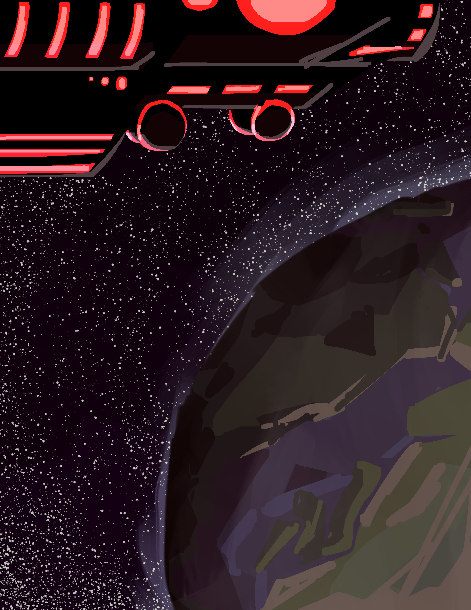

## Prologue
# Eating New People
*never ask a dysphorium about their dietary habits*

The Haelborne’s dimension ship was a grand undertaking, an enormous hunk of metallic material forged and shaped into a habitable vessel. Ritual diagrams shone across its hull, granting it the magic to cross between realities. For now, it was docked atop the sky-dome of Kaaldenvale — a reality encompassing just a single planet — waiting.

This particular mission was quite special. Both in terms of the objective,  and who was involved.

In one of the ship’s lounges sat a fae and a dysphorium.

This particular fae was a relatively recent recruit to the Haelborne faith and came from the world he was about to betray. He announced himself Limril, and proceeded to blunder his way through various social situations with unasked-for factoids.

The fae were the local intelligent species of Kaaldenvale, somewhat resembling the elves of Earth folklore. Evolved from highly predatory mammals, they bore such features as retractable cat-like claws, razor-sharp flexible ears (though now reduced to vestigial eye candy), and jagged rows of teeth.

His company was even stranger.

Its name was Grim, and like all dysphorium, its only goal was to create lasting, devastating change in the cosmos. This dysphorium was a nightmarish concoction. It had serrated blades incorporated into its limbs. Its face was dominated by a wide, ever-grinning mouth of sharp teeth. Its deep blue-grey hair floated in nonexistent wind, more like tentacles than strands.

The two were playing a local board game. Limril was unusually enthused for his nonchalant and apathetic demeanour. Grim was alternately moving pieces and tasting them.

“Damnit,” Limril sighed. “Can you not eat those?”

“I could…” Grim spat a bunch of twisted wooden scraps out of its mouth. “But my contract tells me I have to not eat the people.”

“How is that relevant?”

“Well, I have to feed myself somehow.”

“Such a selfless person.”

Limril sighed again and swept the board and pieces off the table. He waved his hand, and the board hovered its way across the floor and into a cupboard. Eyes dulling, he snatched a can of soda out of nothingness, popping it open and downing a gulp.

“So,” he said between sips. “You ready for dispatch to Javenshard this week?”

“What-shard?” Grim mumbled, its grin fracturing back to a mildly triumphant smile. “What’s to eat there?”

“Javenshard, Grim. A town. In Haelcrien. And you can’t eat anyone until we get scouting done. And then we have to figure out the arrangement with the guild.”

Grim blew a raspberry – which was quite odd looking, because it didn’t have lips, and its tongue looked like a spiked mace made from red flesh.

“Can I go negotiate with those guys? I love eating – I mean EATING new people.”

Limril stared at it.

“Fuck I said it twice. Anyway why’re we going there?”

“The Fundament Glass, Grim. The reason we recruited you in the first place?”

"Recruited me? No, I think I recruited myself.”

“Of course you do. When you get powerful enough, it just seems like everything happens because you’re around.”

“It does because it’s true. So why are we after a piece of glass?”

“If you keep playing dumb, I am going to report you to management.”

“How many calories is one of them worth?”

-   :material-book:{ .lg .middle } __Previous__

    ---

    [:octicons-arrow-left-24: Advent of the Haelborne](index.md)

-   :material-book:{ .lg .middle } __Next__

    ---

    [:octicons-arrow-right-24: Chapter I: Everything Stops](CH1.md)

