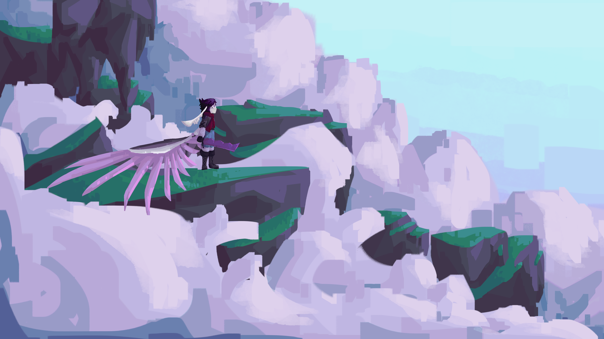

# Chronicles of the Aethein

*A high fantasy LitRPG book series illustrated and written by RatseerOfRattesse*

**Warning for lots of gore, profanity, and edgy jokes :)**

**If you'd like to yell at me, DM ratseerofrattesse on Discord.**

A fun little passion project starring Aryon Hastor, who wants nothing but to maintain her healthy income monster-hunting job. Unfortunately for her, some interdimensional space rats want to harvest her reality's firmamental fabric! And also, they want her spooky hourglass necklace that may or may not be a family heirloom passed down from an Immortal. Don't worry about that though, 'cuz there's way bigger issues to deal with and this Immortal business definitely won't stab us in the back later. Definitely, nope, never.

While Ari's fucking around on Kaaldenvale, the multiverse is experiencing some wacky problems. The Great Immortals haven't answered any prayers in a century, and the churches are being increasingly offensively dogmatic. Meanwhile, the previously dormant spooky shadow demon population are out on the prowl! They're crawling through your voidways, creeping through your backyards, and scrounging through your organs, and nobody has a fucking clue where they came from. What a century, aye?

Read here: [Chronicles of the Aethein](Story/index.md)

## Wiki Conventions

Wiki articles will have various warnings at their heads:

???+ warning ":octicons-pencil-16: Incomplete"

    Article is missing information.

???+ warning ":octicons-trash-16: Deprecated"

    Article is no longer accurate and is kept for archival purposes.

???+ warning ":fontawesome-solid-file-circle-exclamation: Spoiler"

    Articles contains spoilers. For example, if a warning reads 'Spoiler: Bk1Ch12', you are recommended to read to chapter twelve of book one before reading the article.

## Credits

### Writing
- RatseerOfRattesse - Main Author
- idi0cy.inc - Krath's Interview Short Story

### Story
- RatseerOfRattesse - Main Author
- idi0cy.inc - Inspiration
- LivingRiceCooker - Inspiration
- Jarnu47 - Inspiration
- Smileydude23_ - Inspiration
- Lambchops555 - Inspiration

### Artwork
- RatseerOfRattesse - Main Artist

### Inspiration

- [He Who Fights With Monsters](https://hewhofightswithmonsters.com) by Shirtaloon
- Deicidium by idi0cy.inc
- [Murder Drones](https://www.youtube.com/playlist?list=PLHovnlOusNLiJz3sm0d5i2Evwa2LDLdrg), [Black Dogs](https://www.youtube.com/playlist?list=PLRY5gdjkXM_sMchcqhmkw_i0H16le47qe), [C-2 Strain](https://static.wikia.nocookie.net/sstwl-scary-story-time-with-liam/images/f/fc/LiamVickers_C-2_Strain_v38.pdf/revision/latest?cb=20190224212134&format=original), and [PuppetGame](https://www.youtube.com/playlist?list=PLRY5gdjkXM_vzKED1giNFEZNroZblFm5-) by Liam Vickers
- [Autodale](https://www.youtube.com/playlist?list=PLZ5VEKOKH8PCjZJYvjlinBtjjmKV_-dk1) by Dead Sound
- [Blindsight](https://www.goodreads.com/book/show/48484.Blindsight) by Peter Watts
- [Tales from the Loop](https://www.goodreads.com/book/show/27404461-tales-from-the-loop) and [The Labyrinth](https://www.goodreads.com/book/show/55818839-the-labyrinth) by Simon Stalenhag
- [Songs of War S1-3](https://archive.org/details/copy-of-songs-of-war-screenplay) by Arbiter617
- [Arcane](https://www.netflix.com/ca/title/81435684) by Christian Linke and Alex Yee
- [The Debt Collection](https://www.andrewgivler.com/books) by Andrew Givler
- [Project Hail Mary](https://www.goodreads.com/book/show/54493401-project-hail-mary) by Andy Weir
- [Drehmal](https://drehmal.net) by Keeko100 and Rift

## Changelog

### August 2nd 2025 
*suffering builds character*

- Changed changelog update format
- Reformatted character index
- Added page for Krath
- Did some writing on AOH, finally
- AHAHAHAHHA IM ON A ROLL WIHT THE THEMESSSSSSSSSSSS
- Added the Themes page
- Added to Ari and Bia’s characters
- Changed epigraphs in overarching plot and AOH
- Clarified fae beliefs about the afterlife and their scientific ability in the Kaaldenvale article.
- Changed one sentence in Ch2
- There are now canonically six to twelve hells in fae religion (Kaaldenvale article)

### July 4th
*funny plugins*

- Added a ton of plugins that I probably won't use
- Figured out how to nest lists
    - WHY IS IT SO UNINTUITIVE
- Added links to [power scaling](Worldbuilding/Power%20Scaling.md)
- Revised [Haelborne](Worldbuilding/Political%20Entities/Haelborne.md)
- Added reality mining to [Firmament Theory](Worldbuilding/The%20Cosmos/Firmament%20Theory/index.md)
- Added interdimensional law and personal power dynamics to [Interdimensional Society](Worldbuilding/Political%20Entities/Interdimensional%20Society.md)
- Talked about various weaponry in [Aura Mechanics](Worldbuilding/The%20Cosmos/Firmament%20Theory/Aura%20Mechanics.md)

### July 3rd
*READ BLINDSIGHT ITS SO GOOD*

- Compiled everything I did while off in China
- Changed css for lists so that they look prettier
- Changed subtitle of, added links to, and added [Metasphere and Physisphere](Worldbuilding/The%20Cosmos/Firmament%20Theory/Metasphere.md/#metasphere-and-physisphere) section to the [Metasphere](Worldbuilding/The%20Cosmos/Firmament%20Theory/Metasphere.md)
- Revised [The Governance](Worldbuilding/Realities/Kaaldenvale/Magic%20System/index.md)
    - Edited, changed subtitle of, removed incomplete warning, and added links to [The Governance](Worldbuilding/Realities/Kaaldenvale/Magic%20System/index.md)
    - Edited, changed subtitle of, removed incomplete warning, and added links to [Specializations](Worldbuilding/Realities/Kaaldenvale/Magic%20System/Specializations.md)
    - Edited, changed subtitle of, removed incomplete warning, and added links to [Levelling](Worldbuilding/Realities/Kaaldenvale/Magic%20System/Levelling.md)
    - Changed subtitle of, removed incomplete warning, and added links to [Abilities](Worldbuilding/Realities/Kaaldenvale/Magic%20System/Abilities.md)
    - Added [Looting and Currency](Worldbuilding/Realities/Kaaldenvale/Magic%20System/Looting%20and%20Currency.md)
    - Edited, changed subtitle of, removed incomplete warning, and added links to [Settlements](Worldbuilding/Realities/Kaaldenvale/Magic%20System/Settlements.md)
    - Changed subtitle of [Skills](Worldbuilding/Realities/Kaaldenvale/Magic%20System/Skills.md)
    - Changed subtitle of and added links to [Titles](Worldbuilding/Realities/Kaaldenvale/Magic%20System/Titles.md)
- Fleshed out and removed incomplete warning from the [Absolutionists](Worldbuilding/Political%20Entities/Absolutionists.md)
- Clarified the use of [Authority](Worldbuilding/The%20Cosmos/Firmament%20Theory/Authority.md)
- The [Soul](Worldbuilding/The%20Cosmos/Firmament%20Theory/Souls.md) now has anatomy
- Got inspired by Blindsight by Peter Watts
    - Solved sentience in the [Living Cosmos](Worldbuilding/The%20Cosmos/Firmament%20Theory/Living%20Cosmos.md)
    - Explained what transcendence truly is and why mortals nearly always fail to attain it in [Metaphysical Beings](Worldbuilding/The%20Cosmos/Firmament%20Theory/Metaphysical%20Beings.md#transcendence)
- Added an incomplete warning to [Plot](Plot/index.md)
- Explained why the [Verion](Worldbuilding/Political%20Entities/Verion.md) are so warlike
- Clarified government types of interdimensional factions in [Interdimensional Society](Worldbuilding/Political%20Entities/Interdimensional%20Society.md)
- Added [Reality Bending](Worldbuilding/The%20Cosmos/Firmament%20Theory/Reality%20Bending.md)

### June 16-17th
*Existential Bullshit :D*

- Added links to [the Cosmos](Worldbuilding/The%20Cosmos/index.md)
- Edited [Firmament Theory](Worldbuilding/The%20Cosmos/Firmament%20Theory/index.md)
- Added ritual mechanics and potentia to [Aura Mechanics](Worldbuilding/The%20Cosmos/Firmament%20Theory/Aura%20Mechanics.md)
- Edited [Authority](Worldbuilding/The%20Cosmos/Firmament%20Theory/Authority.md)
- Added link to [Domains](Worldbuilding/The%20Cosmos/Firmament%20Theory/Domains.md)
- Edited [Living Cosmos](Worldbuilding/The%20Cosmos/Firmament%20Theory/Living%20Cosmos.md)
- Edited [Metasphere](Worldbuilding/The%20Cosmos/Firmament%20Theory/Metasphere.md)
- Edited [Souls](Worldbuilding/The%20Cosmos/Firmament%20Theory/Souls.md)